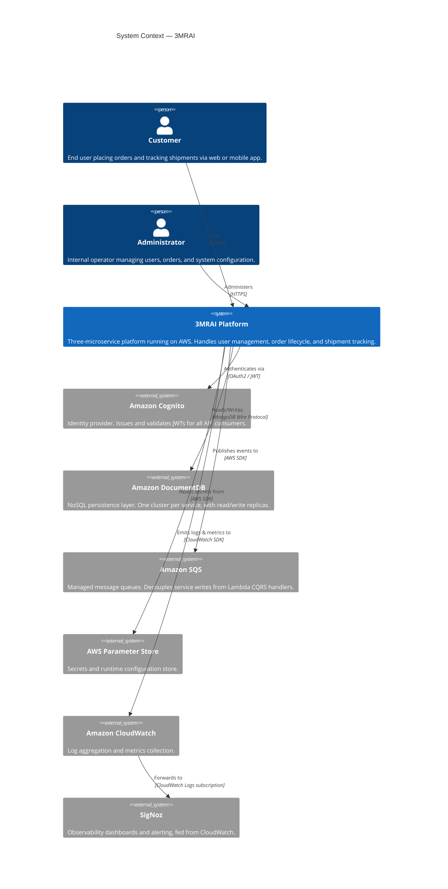

# System Context

C4-style context and container diagrams for the **3MRAI** system. These diagrams answer "what is this system and how does it fit with its environment?" (Level 1) and "what containers make up this system?" (Level 2).

For the detailed runtime architecture (traffic flow, gRPC, SQS/Lambda, DocumentDB) see [[architecture]].

---

## Level 1 — System Context

The system context diagram shows **3MRAI** as a black box and identifies its users and external systems.

> [!note] External Systems
> Amazon Cognito, DocumentDB, SQS, Parameter Store, and CloudWatch are managed AWS services — they are **external** to the 3MRAI application code but **internal** to the AWS account boundary. SigNoz may run as a container within the VPC or as a managed external service depending on deployment configuration.

---

## Level 2 — Containers

The container diagram zooms into the 3MRAI system and shows the independently deployable units.

```mermaid
C4Container
    title Container Diagram — 3MRAI

    Person(customer, "Customer", "Web / Mobile")
    Person(admin, "Administrator", "Internal")

    System_Boundary(aws, "AWS Cloud") {
        Container(apigw, "API Gateway", "AWS API Gateway", "Single HTTPS entry point. Validates Cognito JWTs.")
        Container(alb, "ALB", "AWS Application Load Balancer", "Routes requests to ECS Fargate services by path prefix.")

        Container(users, "Users Service", "Node.js / ECS Fargate", "Manages user accounts, Cognito sync, soft-delete.")
        Container(orders, "Orders Service", "Node.js / ECS Fargate", "Order lifecycle: create, update, cancel. gRPC to Tracking.")
        Container(tracking, "Tracking Service", "Node.js / ECS Fargate", "Shipment location events, gRPC receiver from Orders.")

        Container(lambda_u, "users-write-handler", "AWS Lambda", "CQRS write handler for user domain events.")
        Container(lambda_o, "orders-write-handler", "AWS Lambda", "CQRS write handler for order domain events.")

        ContainerDb(db_u, "Users DB", "DocumentDB", "Write + read replicas for users domain.")
        ContainerDb(db_o, "Orders DB", "DocumentDB", "Write + read replicas for orders domain.")
        ContainerDb(db_t, "Tracking DB", "DocumentDB", "Write + read replicas for tracking domain.")

        Container(sqs_u, "users-events", "SQS Queue", "Domain events from Users Service.")
        Container(sqs_o, "orders-events", "SQS Queue", "Domain events from Orders Service.")
    }

    System_Ext(cognito, "Amazon Cognito", "JWT issuer")
    System_Ext(paramStore, "Parameter Store", "Secrets")
    System_Ext(signoz, "SigNoz", "Observability")

    Rel(customer, apigw, "HTTPS requests")
    Rel(admin, apigw, "HTTPS requests")
    Rel(apigw, cognito, "Validates JWT")
    Rel(apigw, alb, "Forwards authenticated requests")
    Rel(alb, users, "Route /users/*")
    Rel(alb, orders, "Route /orders/*")
    Rel(alb, tracking, "Route /tracking/*")

    Rel(users, orders, "gRPC")
    Rel(orders, tracking, "gRPC")

    Rel(users, sqs_u, "Publishes events")
    Rel(orders, sqs_o, "Publishes events")
    Rel(sqs_u, lambda_u, "Triggers")
    Rel(sqs_o, lambda_o, "Triggers")
    Rel(lambda_u, db_u, "Writes")
    Rel(lambda_o, db_o, "Writes")

    Rel(users, db_u, "Reads (replica)")
    Rel(orders, db_o, "Reads (replica)")
    Rel(tracking, db_t, "Reads/Writes")

    Rel(users, paramStore, "Reads secrets")
    Rel(orders, paramStore, "Reads secrets")
    Rel(tracking, paramStore, "Reads secrets")

    Rel(users, signoz, "Logs & metrics")
    Rel(orders, signoz, "Logs & metrics")
    Rel(tracking, signoz, "Logs & metrics")
```

---

## Container Responsibilities

| Container | Technology | Responsibility |
|---|---|---|
| API Gateway | AWS API Gateway | TLS termination, JWT validation, rate limiting |
| ALB | AWS ALB | Path-based routing to ECS tasks |
| Users Service | Node.js, ECS Fargate | User CRUD, Cognito sync, soft-delete |
| Orders Service | Node.js, ECS Fargate | Order lifecycle, gRPC calls to Tracking |
| Tracking Service | Node.js, ECS Fargate | Shipment events, gRPC receiver |
| users-write-handler | AWS Lambda | CQRS write handler, persists user events to DocumentDB |
| orders-write-handler | AWS Lambda | CQRS write handler, persists order events to DocumentDB |
| users-events / orders-events | SQS | Event buffers between services and Lambda handlers |
| Users/Orders/Tracking DB | DocumentDB | Domain data with read/write replica topology |

---

## Key Design Decisions at a Glance

| Concern | Decision |
|---|---|
| Auth | Cognito JWTs — [[ADR-0010-cognito-auth]] |
| Compute | ECS Fargate — [[ADR-0009-apigw-alb-fargate]] |
| Inter-service calls | gRPC — [[ADR-0003-grpc-inter-service]] |
| Write path | CQRS via SQS + Lambda — [[ADR-0002-cqrs]] |
| Persistence topology | Read/write replicas — [[ADR-0006-read-write-replicas]] |
| Observability | SigNoz via CloudWatch — [[ADR-0011-observability-signoz]] |

---

## Related

- [[architecture]]
- [[index]]
- [[users-service-design]]
- [[orders-service-design]]
- [[tracking-service-design]]
- [[events-pipeline-design]]
- [[ADR-0009-apigw-alb-fargate]]
- [[ADR-0010-cognito-auth]]
- [[ADR-0003-grpc-inter-service]]
- [[ADR-0002-cqrs]]
- [[ADR-0006-read-write-replicas]]
- [[ADR-0011-observability-signoz]]
