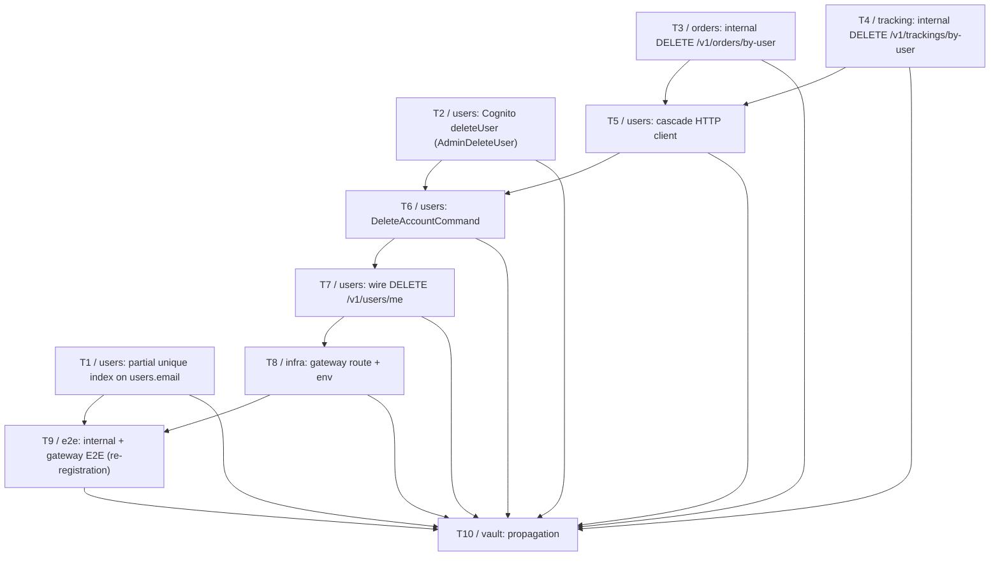

# Account Deletion Milestone

Logical execution plan for the **Account Deletion** milestone. This note tracks the milestone's
task sequence and blocking dependencies. The detailed step-by-step plan lives in
[[2026-08-25-account-deletion]] (superpowers plan); the design in
[[2026-08-25-account-deletion-design]]. This note is the milestone-level map.

> [!info] No Linear milestone yet
> Unlike its sibling notes, this milestone has not yet been created in Linear — no issue IDs
> exist to link. The task numbering below (T1–T10) matches [[2026-08-25-account-deletion]]'s
> task numbering directly. Once the milestone and its issues are proposed and confirmed, this
> note should be updated with `issue/<ID>` tags and inline Linear links per [[linear-references]].

**Feature branch:** `feature/delete-account`.

**Goal:** let a user delete their own account via `DELETE /v1/users/me`, with a synchronous HTTP
cascade to two new **internal** routes — `DELETE /v1/orders/by-user` and
`DELETE /v1/trackings/by-user` — guarded by the shared `GRPC_API_KEY`. A partial unique index on
`users.email` (`WHERE deleted_at IS NULL`) frees the address for re-registration while the old
row is preserved intact, and Cognito `AdminDeleteUser` is the last step, freeing the identity
itself.

## Logical phases

| Phase | Tasks | Description |
|---|---|---|
| Independent foundations | T1, T2, T3, T4 | The partial unique index (Users/Postgres), the Cognito `deleteUser` port + adapter, and the two internal cascade routes (Orders, Tracking). No shared code between them — all four can run in parallel. |
| Cascade wiring | T5, T6, T7 | The `CascadeClient` HTTP client in Users (calls T3 and T4's routes), the `DeleteAccountCommand` orchestrating the four ordered steps (built on T2's `deleteUser` and T5's client), then wiring the public route. |
| Delivery | T8 | Gateway route + env wiring, so the endpoint is reachable from outside the network. |
| Closing | T9, T10 | Three-layer E2E proving the full flow — including re-registration, which is what T1's invariant exists for — and vault propagation of every decision into the organized notes. |

## Task sequence

| # | Task | Deliverable | Spec note |
|---|---|---|---|
| T1 | Partial unique index on `users.email` | Prisma schema change + migration scoping the unique constraint to live rows (`WHERE deleted_at IS NULL`) | [[2026-08-25-account-deletion-design]] |
| T2 | Cognito `deleteUser` | `AuthProvider.deleteUser` port + `CognitoAuthProvider` implementation via `AdminDeleteUserCommand` | [[2026-08-25-account-deletion-design]] |
| T3 | Orders internal route | `DELETE /v1/orders/by-user`, Orders' first inbound `x-api-key` check, cascading to order details and carts | [[2026-08-25-account-deletion-design]] |
| T4 | Tracking internal route | `DELETE /v1/trackings/by-user`, `soft_delete_by_user` matching `cognito_sub` OR `user_id` | [[2026-08-25-account-deletion-design]] |
| T5 | Cascade HTTP client | `CascadeClient` in Users — the service's first plain-HTTP outbound client, calling T3 and T4 | [[2026-08-25-account-deletion]] |
| T6 | `DeleteAccountCommand` | Orchestrates the four ordered steps: cascade to Orders, cascade to Tracking, soft-delete the user row, delete the Cognito user | [[2026-08-25-account-deletion]] |
| T7 | Wire `DELETE /v1/users/me` | The public authenticated route calling T6's command | [[2026-08-25-account-deletion]] |
| T8 | Gateway + env | `infra/modules/api-gateway` route, `ORDERS_BASE_URL`/`TRACKING_BASE_URL` env wiring | [[2026-08-25-account-deletion]] |
| T9 | E2E | Internal + gateway E2E, including the re-registration case that proves T1's invariant | [[testing]] |
| T10 | Vault propagation | Propagate decisions into the three service-design notes and [[soft-delete]] | [[doc-propagation]] |

## Dependencies

### Dependency table

| Task | Blocked by |
|---|---|
| T1 | — |
| T2 | — |
| T3 | — |
| T4 | — |
| T5 | T3, T4 |
| T6 | T2, T5 |
| T7 | T6 |
| T8 | T7 |
| T9 | T8, T1 |
| T10 | T1, T2, T3, T4, T5, T6, T7, T8, T9 |

### Dependency diagram

T1–T4 are fully independent and can run **in parallel** — they touch three different services
(Users/Postgres, Orders, Tracking) with no shared code. T5 depends on T3 and T4 because the
`CascadeClient` calls the routes they build. T6 depends on T2 (the `deleteUser` port it calls)
and T5 (the cascade client it calls). T7 depends on T6, and T8 depends on T7 — the gateway route
has nothing to point at until the endpoint exists. T9 depends on T8, since its gateway E2E needs
the route live to be reachable at all, **and** on T1, since the re-registration case is the
proof that the partial unique index actually does its job. T10 depends on everything, since
propagation covers every decision made across all nine other tasks.

## Stop points (batch review)

Per [[phase-c-review-flow]]:

1. **T1–T4 chained without per-merge prompts**, then batched for review together — they have
   no dependency on each other, so there is no reason to interleave prompts between them.
2. **T5 is a dependency gate**: it cannot start until T3 and T4 are merged. Batch T1–T4's PRs
   for review at this stop point before continuing.
3. **T6 → T7 → T8 chained without per-merge prompts** once T2 and T5 are both merged.
4. **T9 is a dependency gate**: it needs T8 merged (the route must be live) and T1 merged (the
   invariant it proves). This is the milestone's final implementation stop point before T10.
5. **T10 closes the milestone** once T9 is reviewed and merged.

## Related

- [[milestone-plan]] — convention this plan follows.
- [[linear-references]] — Linear reference convention (not yet applicable — no milestone/issues created).
- [[phase-c-review-flow]] — batch-review flow and dependency-gate stop points referenced above.
- [[2026-08-25-account-deletion-design]] — design spec: actor, endpoint, cascade order, and the
  partial-unique-index invariant behind this milestone's scope.
- [[2026-08-25-account-deletion]] — implementation plan with the detailed task-by-task steps.
- [[ADR-0004-soft-delete-only]] — the rule the cascade obeys, and the Cognito boundary where it
  deliberately does not.
- [[soft-delete]] — the per-service primitives reused by T3/T4, extended by T10.
- [[testing]] — the three-layer test convention T9 satisfies.
