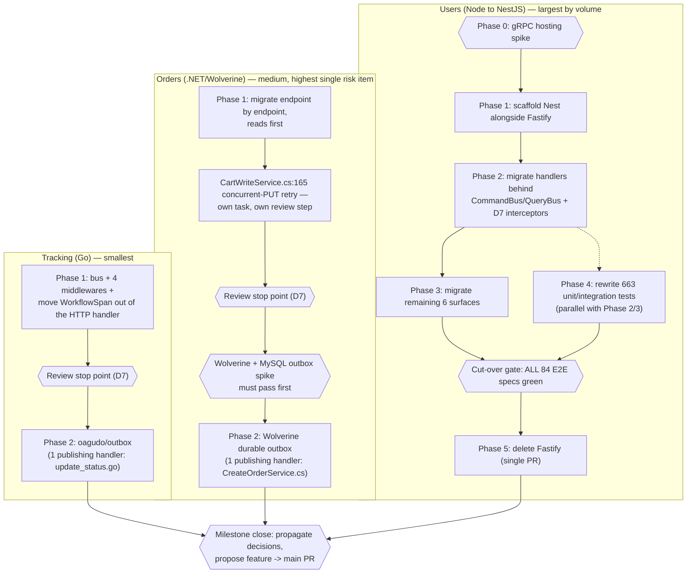

# CQRS Dispatch — All Services Milestone

Logical execution plan for the **CQRS Dispatch — All Services** milestone: workstream sequence,
phases, and the blocking dependency graph. The detailed designs live in
[[2026-09-18-cqrs-dispatch-tracking-orders-design]] (Tracking + Orders) and
[[2026-09-19-users-nestjs-migration-design]] (Users). This note is the milestone-level map.

This is a **milestone plan**, not a task-by-task implementation plan — it sequences three
independent **workstreams** and names their dependencies and stop points; it does not restate the
specs' content. Per-workstream implementation plans (with TDD steps, task-level tables, and
per-issue dependency graphs, matching the granularity of e.g.
[[2026-07-14-orders-service-milestone]] or [[2026-08-27-tracking-go-migration]]) get written later,
one per workstream, via `writing-plans`, when that workstream starts.

> [!info] Standalone handoff
> This note is written for a session that has not seen the conversation that produced it. Every
> claim below is either sourced from the two linked design specs or stated directly here.

> [!info] No Linear milestone yet
> No Linear milestone or issues exist for this work yet — no issue IDs to link. Once the milestone
> and its issues are proposed and confirmed, this note should be updated with `issue/<ID>` tags and
> inline Linear links per [[linear-references]].

**Feature branch:** `feature/cqrs-dispatch-all-services` (already created; currently holds both
design specs uncommitted, plus edits to several propagation targets). Per [[git-workflow]]: task
branches come off this feature branch, task PRs merge into it via the A/B/C/D/E confirmation menu,
and the feature → `main` PR is proposed only at milestone close — the user merges it after review,
never auto-merged.

**Goal:** give all three services a uniform CQRS dispatch pipeline (`tracing -> app_event ->
logging -> validation -> handler`), each implemented **natively** for its own stack — no shared
library across languages, only a shared documented contract ([[cqrs]]) — plus a transactional
outbox where the design calls for one (Tracking and Orders only).

## Logical phases (workstreams)

| Workstream | Stack | Volume | Description |
|---|---|---|---|
| Tracking | Go — hand-rolled `internal/bus/` (~60 LOC) | Smallest | Generic bus + 4 middlewares; moves `tracing.WorkflowSpan(...)` out of the HTTP handler into the tracing middleware; `oagudo/outbox` for the 1 publishing handler. |
| Orders | .NET — Wolverine 6.39.0 | Medium | Endpoint-by-endpoint migration (`WolverineFx.Http` opt-in, coexists with existing `MapGet`/`MapPost`); Wolverine durable outbox for the 1 publishing handler; carries the milestone's single highest-risk item (transactional-middleware conflict). |
| Users | Node — Fastify → NestJS + `@nestjs/cqrs` | Largest: 7,693 src lines, 10,282 test lines, 20 HTTP routes, 7 surfaces | Nest built in parallel with Fastify; cut-over gated on all 84 E2E specs passing; 663 unit/integration tests rewritten under `Test.createTestingModule()`. |

Each workstream's full design — architecture, approved decisions, phases, risks — lives in its
spec (linked per-workstream below). This note only sequences them at the milestone level; it does
not restate their content.

### Tracking → generic bus

Spec: [[2026-09-18-cqrs-dispatch-tracking-orders-design]]. A hand-rolled ~60-line generic bus in
`internal/bus/` (see the spec's Architecture section), four middlewares
(tracing/app_event/logging/validation), migrating the read path so `tracing.WorkflowSpan(...)`
moves **out** of `internal/adapter/http/handler_reads.go` and **into** the tracing middleware —
correcting the layer mismatch the spec's Context/Problem section documents — then manual wiring in
`cmd/server/main.go` (Go has no type-safe auto-registration; D5/Go in the spec). Plus the
`oagudo/outbox` v1.0.1 work for Phase 2 (the outbox).

### Orders → Wolverine 6.39.0

Same spec as Tracking. Migrates **endpoint by endpoint** — `WolverineFx.Http` is opt-in per
endpoint and coexists with the existing `MapGet`/`MapPost` delegates, so the app runs in a mixed
state for the duration and that is expected, not a regression (see the spec's Per-service
migration plan). Carries the milestone's single highest-risk item: the Wolverine
transactional-middleware conflict with Orders' three explicit `BeginTransactionAsync` call sites,
one of which is the concurrent-PUT retry — see Stop points below and the spec's Risks section.

### Users → NestJS

Spec: [[2026-09-19-users-nestjs-migration-design]]. Phases 0–5 are defined in the spec's Migration
plan section: Phase 0 spikes the one unresolved question (gRPC hosting under Nest), Phase 1
scaffolds Nest alongside Fastify, Phase 2 migrates handlers behind `CommandBus`/`QueryBus` with the
D7 interceptors built alongside the first few handlers, Phase 3 migrates the remaining six surfaces
(gRPC, SQS, SNS, WebSocket, metrics, cache), Phase 4 rewrites the 663 unit/integration tests in
parallel with each handler's migration, Phase 5 is the cut-over gate. Definition of done is **all
84 E2E specs green**, and only then is Fastify deleted — a single commit/PR, not a gradual removal.

## Dependencies

### Dependency table

The three workstreams are **structurally independent** — different languages, different services,
no shared code. The table below covers each workstream's *internal* phase dependencies; there is
no cross-workstream blocking row, because none exists.

| Task | Blocked by |
|---|---|
| Tracking Phase 1 (bus + middlewares) | — |
| Tracking review stop point | Tracking Phase 1 |
| Tracking Phase 2 (outbox) | Tracking review stop point |
| Orders Phase 1 (endpoint migration, reads first) | — |
| Orders cart-retry task (`CartWriteService.cs:165`) | Orders Phase 1 |
| Orders review stop point | Orders cart-retry task |
| Orders Wolverine+MySQL outbox spike | Orders review stop point |
| Orders Phase 2 (outbox) | Orders Wolverine+MySQL outbox spike |
| Users Phase 0 (gRPC hosting spike) | — |
| Users Phase 1 (scaffold Nest) | Users Phase 0 |
| Users Phase 2 (handlers behind bus + interceptors) | Users Phase 1 |
| Users Phase 3 (remaining 6 surfaces) | Users Phase 2 |
| Users Phase 4 (rewrite 663 tests) | Users Phase 2 (runs in parallel with Phase 2/3, not strictly after) |
| Users cut-over gate (all 84 E2E green) | Users Phase 3, Users Phase 4 |
| Users Phase 5 (delete Fastify) | Users cut-over gate |
| Milestone close (propagate + propose feature→main PR) | Tracking Phase 2, Orders Phase 2, Users Phase 5 |

### Dependency diagram

No edge crosses between the Tracking, Orders, and Users subgraphs — they converge only at
milestone close. The shared artifact across all three is the documented contract in [[cqrs]]
(tracing → app_event → logging → validation → handler), not code (D1/D2 in
[[2026-09-18-cqrs-dispatch-tracking-orders-design]]).

## Recommended order — and why it is only a recommendation

**Recommended: Tracking first, then Orders, then Users.** The executing session may override this
— there is no dependency edge between workstreams to enforce it.

1. **Tracking first** — smallest workstream, proves the `tracing -> app_event -> logging ->
   validation -> handler` contract end-to-end at the lowest cost. A mistake here is cheap to find
   and fix, and what is learned directly informs the other two.
2. **Orders second** — medium size, carries the milestone's single highest-risk item (the
   Wolverine transactional-middleware conflict, including the concurrent-PUT retry). Benefits from
   the contract already being demonstrated once in Tracking before tackling the harder concurrency
   problem.
3. **Users last** — largest workstream, but shares nothing with the other two (different language,
   different service, no shared code or risk), so it can proceed fully independently at any point
   — including first, or in parallel — without weakening any dependency.

**Honest counter-argument:** if the priority is the NestJS migration itself — what prompted this
milestone — starting with **Users** is perfectly reasonable. This ordering is about managing risk
exposure across the milestone as a whole, not a technical prerequisite. State this explicitly to
the user if the ordering is ever in question during execution.

## Stop points (batch review)

Per [[phase-c-review-flow]] and [[git-workflow]]:

1. **Every commit and PR, in every workstream.** The main session presents the A/B/C/D/E
   confirmation menu via `AskUserQuestion` as an arrow-navigable list before any git write.
   Dispatched implementer agents never run git writes; they leave work in the working tree for the
   main session to commit. Issues within a workstream may be chained without per-merge prompts, but
   PRs are batched for one review, never auto-merged.
2. **Tracking/Orders Phase 1 → Phase 2 review stop point (D7).** A review stop point sits between
   the in-memory-dispatch phase (Phase 1, touches no database) and the outbox phase (Phase 2, the
   only phase that touches a database) in both services. This keeps a large refactor reviewable and
   means a Phase 1 rollback is a code-only revert with no data migration to unwind.
3. **Orders `CartWriteService.cs:165`** gets its own explicit task and its own review step, never
   folded into a larger "migrate CartWriteService" task where it can pass review unnoticed — the
   same class of concurrency requirement [[2026-08-26-spec-said-so-review-checked-the-diff-not-the-spec]]
   documents shipping as an unhandled 500 the first time. Ordinary tests structurally do not
   exercise it, so review must check the diff against the spec's stated requirement, not just
   confirm the code is internally consistent.
4. **Wolverine + MySQL outbox spike (Orders, before Phase 2)** must pass before the rest of the
   Orders outbox work proceeds. If it fails, the documented fallback is the same hand-rolled outbox
   design used for Tracking.
5. **Users Phase 0 gRPC spike** must resolve — whether `@nestjs/microservices`' gRPC transport can
   carry the JE-77 `onReceiveHalfClose` manual-span fix, or whether the gRPC server stays
   hand-built alongside the Nest app — before committing to the full Nest build.
6. **Users cut-over (Phase 5).** Deleting Fastify happens only after **all 84** E2E tests pass
   against Nest, as a single PR. There is no gradual fallback afterward — once Fastify is deleted,
   reverting means reverting that commit/PR wholesale.

## Carry-forward findings — read before writing any pipeline/middleware/interceptor code

Discovered **by measurement** during an earlier Users hand-rolled-bus attempt that was reverted
(superseded by the NestJS migration). Framework-independent — they will recur identically in Go
and .NET, because they are properties of "a generic pipeline stage wraps a handler," not of any
one language or library. Both specs restate these in full; summarized here so this note stands
alone:

1. **Routine vs thrown.** A "not found" is a **routine** outcome: `app_event: <flow>_failed` +
   `reason`, but span status stays `OK`. Only a **thrown** error sets `ERROR`. Flattening this —
   treating every non-happy-path the same way — is an observability regression that passes review
   unnoticed, because the code still "works."
2. **Specific reasons must not be clobbered.** A generic pipeline stage that stamps
   `reason: "unhandled_error"` in its own catch **overwrites** a handler's already-recorded
   specific reason (span-attribute writes are last-write-wins per key — proven empirically). The
   generic stage must defer to an already-recorded specific reason, on both the thrown and the
   non-throwing routine path.
3. **One failure = one `*_failed` log line.** If the handler already logged its specific line, the
   generic pipeline stage suppresses its own rather than double-logging.
4. **Tests that call a handler directly do not prove pipeline behavior.** 709 tests passed green
   while the production path emitted the wrong `reason`, because every test called the handler
   directly instead of going through the bus. Any test asserting on pipeline behavior must go
   through the real bus/pipeline — never a direct call to the handler underneath it.
5. **A green suite is not evidence.** Three vacuous-test traps were found by **mutation testing**,
   never by a passing run — a silent-no-op OTel provider, a db stub forcing tests down an
   unasserted branch, and the reason-clobber above. **Mutate the code and confirm the test fails**
   — explicitly recommended for the Wolverine middleware mapping (Orders) and the Go middleware
   (Tracking).

## Definition of done per workstream

- **Tracking:** the generic bus (`internal/bus/`) and its four middlewares in place;
  `tracing.WorkflowSpan(...)` moved out of `internal/adapter/http/handler_reads.go` into the
  tracing middleware; existing handler tests green unchanged; `oagudo/outbox` working for
  `update_status.go`'s publish path.
- **Orders:** endpoints migrated to Wolverine with `IWorkflowTracer` semantics preserved exactly;
  the `CartWriteService.cs:165` concurrent-PUT retry reviewed and passed as its own explicit step;
  the Wolverine + MySQL outbox spike passed (or its documented fallback adopted) before the rest of
  Phase 2 proceeded.
- **Users:** all 84 E2E specs green against the Nest implementation, and Fastify (`src/server.ts`,
  the Awilix container, Fastify-specific route files) deleted in a single commit/PR; the 663
  unit/integration tests rewritten under `Test.createTestingModule()` with no weakened assertions.

**Milestone done:** all three workstreams individually done, their decisions **propagated** into
the organized vault per [[doc-propagation]] (service behavior into each `-service-design.md`,
cross-cutting rules into `shared/`, etc.), and the feature → `main` PR **proposed** (not merged)
for user review.

## Out of scope

- **The events-pipeline Lambda** — explicitly out of scope in both specs; Nest's cold-start weight
  was judged not worth taking on for a Lambda, and the Lambda keeps its current per-record
  dispatch model regardless of what the three services do.
- **The web app** (`apps/web/`) — untouched.
- **Any change to the three services' external HTTP contracts** — a test that has to change to
  keep passing is a signal of an unintended behavior change, out of scope in both specs.
- **`openapi.yaml` shape changes** beyond regenerating it equivalently under the new stack.
- **Extracting any shared bus code across languages** — rejected explicitly (D2,
  [[2026-09-18-cqrs-dispatch-tracking-orders-design]]). The shared artifact is the vault-documented
  contract ([[cqrs]]), not code.
- **Adopting `go-mink`** for Tracking — evaluated and rejected (Postgres-only, no typed query bus,
  near-zero adoption); flagged as a candidate for a future **new** service wanting event sourcing
  on Postgres, not this one.

## Related

- [[milestone-plan]] — convention this plan follows.
- [[linear-references]] — Linear reference convention (not yet applicable — no milestone/issues
  created).
- [[phase-c-review-flow]] — batch-review flow and dependency-gate stop points referenced above.
- [[git-workflow]] — the A/B/C/D/E confirmation menu and branch flow this milestone's git writes
  follow.
- [[testing]] — the three-layer test convention all three workstreams must satisfy.
- [[cqrs]] — the CQRS pattern; the shared contract this milestone documents once and implements
  three times natively.
- [[2026-09-18-cqrs-dispatch-tracking-orders-design]] — full design for the Tracking (Go) and
  Orders (.NET/Wolverine) workstreams.
- [[2026-09-19-users-nestjs-migration-design]] — full design for the Users (NestJS) workstream.
- [[2026-08-26-spec-said-so-review-checked-the-diff-not-the-spec]] — the lesson behind treating the
  Orders concurrent-PUT retry as its own reviewed task.
- [[doc-propagation]] — the propagation routing table this milestone's decisions must land in at
  close.
