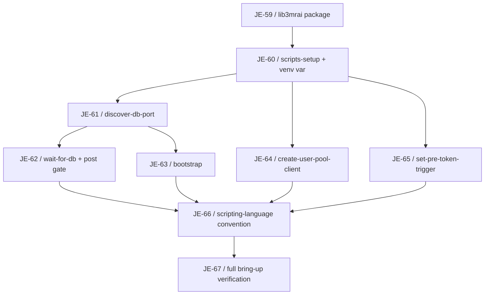
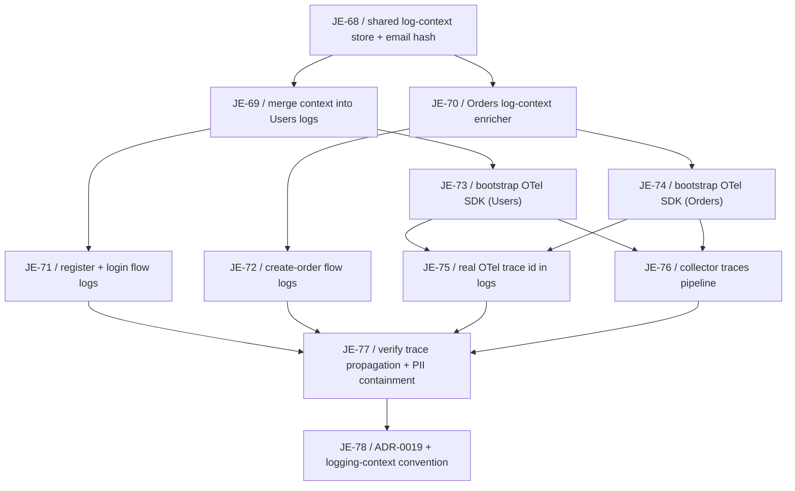
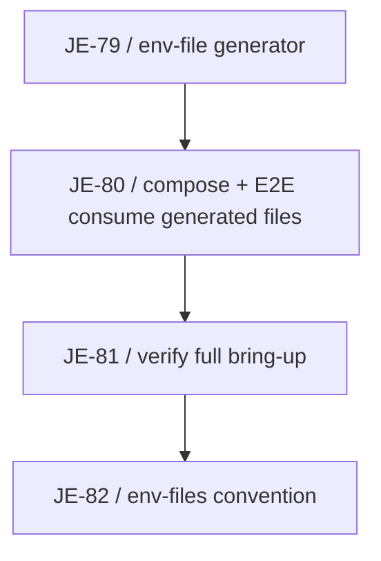

# Developer Experience Milestone

Logical execution plan for the **Developer Experience** milestone (Linear project "3MRAI Company", [milestone](https://linear.app/je-martinez/project/3mrai-company-da39253a1d6f)). This note tracks the milestone's task sequence and blocking dependencies as blocks are specced and their issues created — see the framing note below.

> [!success] Status — 24/24 Done
> All three blocks are implemented on a single branch, `feature/developer-experience`, clean
> working tree, all pushed. **All 24 issues are Done.** The last open issue,
> [JE-77](https://linear.app/je-martinez/issue/JE-77) (cross-service trace propagation), is now
> **fixed and verified** — the create-order flow produces one joined Jaeger trace across Orders
> and Users, not two disjoint ones; see [[#The JE-77 fix — applied and verified]] below for the
> root cause and the fix. Whether to open a PR from `feature/developer-experience` into `main` is
> a decision for the user.

> [!info] Three independent blocks, one milestone
> This milestone groups three independent pieces of developer-experience work under a single Linear milestone, all executed one-shot on the same branch.
>
> - **Block 1 — Scripts to Python** (Done, merged into `feature/developer-experience`). Spec: [[2026-07-19-scripts-to-python-migration-design]]. Plan: [[2026-07-19-scripts-to-python-migration]].
> - **Block 2 — Logging context + distributed tracing** (11/11 Done). Shared cross-service log context (trace/span id, identity, hashed email, domain ids), flow-level logs on register/login/create-order, real distributed tracing over gRPC via the OpenTelemetry SDK. The backend split from the original OpenObserve-only intent — see ADR-0019 and [[#Deviations from the original input]]. JE-77 (cross-service trace propagation) is fixed and verified — see [[#The JE-77 fix — applied and verified]]. Spec: [[2026-07-19-logging-context-and-tracing-design]]. Plan: [[2026-07-19-logging-context-and-tracing]].
> - **Block 3 — Env-file auto-generation** (Done). `make env-file` generates five files from Terraform outputs, split into AUTO-GENERATED (rewritten) and CUSTOM (preserved) boxes per consumer; services consume theirs via compose `env_file:`. Spec: [[2026-07-20-env-file-generation-design]]. Convention: [[env-files]].

## Logical phases

| Phase | Issues | Status | Description |
|---|---|---|---|
| Block 1 — Scripts to Python | JE-59…JE-67 | Done — merged into `feature/developer-experience` | Migrate the repo's 5 remaining bash scripts to Python behind a shared `lib3mrai` package; freeze every script's external interface; wire the Python-first scripting-language convention into both `CLAUDE.md` files. |
| Block 2 — Logging context + tracing | JE-68…JE-78 | 11/11 Done | Shared cross-service log context (trace/span id, identity, hashed email, domain ids) on every log line, flow-level logs on register/login/create-order, real distributed tracing over gRPC via the OpenTelemetry SDK. JE-77 (cross-service trace propagation) is fixed and verified — see [[#The JE-77 fix — applied and verified]]. |
| Block 3 — Env-file auto-generation | JE-79…JE-82 | Done | `make env-file` generates five per-consumer files from Terraform outputs, split AUTO-GENERATED/CUSTOM; services consume theirs via compose `env_file:`. |

## Block 1 — Scripts to Python (Done)

> [!success] Implemented
> All nine issues (JE-59…JE-67) are Done, merged into `feature/developer-experience`.

Migrate the repo's 5 remaining bash scripts to Python behind a shared `lib3mrai` package (boto3 client factory + console helpers + DB discovery), keeping every script colocated with its Terraform module and every external interface frozen (CLI args, stdout contract, exit codes, env vars, state-file shape). Terraform `local-exec` and the Makefile invoke the venv interpreter by absolute path rather than relying on PATH. The durable deliverable is the Python-first scripting-language convention wired into both CLAUDE.md files.

### Task sequence

| # | Issue | Task | Deliverable | Spec note |
|---|---|---|---|---|
| 1 | [JE-59](https://linear.app/je-martinez/issue/JE-59) | `lib3mrai` shared package for Python infra scripts | `infra/scripts/lib3mrai/` (`aws.py`, `console.py`, `db.py`) + `pyproject.toml`/`requirements.txt` | [[2026-07-19-scripts-to-python-migration-design]] |
| 2 | [JE-60](https://linear.app/je-martinez/issue/JE-60) | `make scripts-setup` and venv interpreter variables | `PY`/`VENV` Makefile variables, idempotent `scripts-setup` target | [[2026-07-19-scripts-to-python-migration-design]] |
| 3 | [JE-61](https://linear.app/je-martinez/issue/JE-61) | Port `discover-db-port` to Python with boto3 | `discover_db_port.py`, `lib3mrai.db.discover_port(engine)` | [[2026-07-19-scripts-to-python-migration-design]] |
| 4 | [JE-62](https://linear.app/je-martinez/issue/JE-62) | Port `wait-for-db` to Python and rewire the post gate | `wait_for_db.py`, `lib3mrai.db.wait_for_db(...)`, `gate.tf` rewired | [[2026-07-19-scripts-to-python-migration-design]] |
| 5 | [JE-63](https://linear.app/je-martinez/issue/JE-63) | Port `bootstrap` to Python, dropping superseded app-user steps | `bootstrap.py` (nginx-stable alias step only; dead app-DB-user functions deleted, not ported) | [[2026-07-19-scripts-to-python-migration-design]] |
| 6 | [JE-64](https://linear.app/je-martinez/issue/JE-64) | Port `create-user-pool-client` to Python with boto3 | `create_user_pool_client.py`, `main.tf` provisioner rewired | [[2026-07-19-scripts-to-python-migration-design]] |
| 7 | [JE-65](https://linear.app/je-martinez/issue/JE-65) | Port `set-pre-token-trigger` to Python with boto3 | `set_pre_token_trigger.py`, `main.tf` provisioner rewired, settings-preserving `UpdateUserPool` | [[2026-07-19-scripts-to-python-migration-design]] |
| 8 | [JE-66](https://linear.app/je-martinez/issue/JE-66) | Python-first scripting-language convention | `docs/shared/conventions/scripting-language.md`, root + `infra/CLAUDE.md` updates | [[2026-07-19-scripts-to-python-migration-design]] |
| 9 | [JE-67](https://linear.app/je-martinez/issue/JE-67) | Verify full local bring-up after the Python migration | `make infra-down` → `make bootstrap` → `make env-file` → gateway E2E, plus a re-run proving idempotence | [[2026-07-19-scripts-to-python-migration-design]] |

### Dependencies

#### Dependency table

| Task | Blocked by |
|---|---|
| JE-59 | — |
| JE-60 | JE-59 |
| JE-61 | JE-60 |
| JE-62 | JE-61 |
| JE-63 | JE-61 |
| JE-64 | JE-60 |
| JE-65 | JE-60 |
| JE-66 | JE-62, JE-63, JE-64, JE-65 |
| JE-67 | JE-66 |

#### Dependency diagram

JE-59 → JE-60 is the trunk: the shared package must exist before the Makefile grows a venv-aware interpreter variable. From JE-60, three ports fan out in parallel — JE-61 (DB port discovery), JE-64 (Cognito user-pool client), and JE-65 (Cognito pre-token trigger). JE-61 additionally gates two further ports: JE-62 (wait-for-db, which imports `discover_port`'s sibling helper) and JE-63 (bootstrap, which imports `discover_port` directly). All four leaf ports — JE-62, JE-63, JE-64, JE-65 — converge on JE-66, the scripting-language convention, since it documents the pattern all five migrated scripts now follow. JE-67, the full-cycle verification, closes the block.

### Execution approach

One-shot on a single branch `feature/developer-experience`, one commit per issue, no per-issue branch or PR — the same approach used for the Orders milestone (JE-41…JE-55, see [[orders-service-milestone]]). A single PR opens task→feature at the end of the block.

### Acceptance

Full `make infra-down` → `make bootstrap` → `make env-file` → gateway E2E with a real Cognito JWT, matching the pre-migration result, plus a re-run proving idempotence.

## Block 2 — Logging context + distributed tracing (11/11 Done)

> [!success] JE-77 is fixed and verified
> All of JE-68…JE-78 are Done. [JE-77](https://linear.app/je-martinez/issue/JE-77) (verify
> cross-service trace propagation and PII containment) now passes both halves of its
> acceptance criterion: PII containment passes, and trace propagation joins the two services
> into one trace. See [[#The JE-77 fix — applied and verified]] for the root cause and the fix
> that was applied after this plan note was first written. JE-78 (the ADR + convention note)
> shipped ahead of JE-77's closure — at the time, ADR-0019 recorded the gap as a known
> limitation; ADR-0019 has since been updated to record the fix.

Attach a shared cross-service log context (trace/span id, identity, hashed email, domain ids) to every log line so one user's or order's activity can be filtered end to end; add flow-level start/success/failure logs to the three flows that carry diagnostic value (register, login, create-order); and add real distributed tracing across the gRPC boundary with the OpenTelemetry SDK. The backend split from the original OpenObserve-only intent to Jaeger for traces — see [[ADR-0019-distributed-tracing-opentelemetry]] and [[#Deviations from the original input]]. Structured by LAYER rather than by service, so the shared schema is defined once and both services adopt it together instead of diverging.

### Task sequence

| # | Issue | Task | Layer | Blocked by |
|---|---|---|---|---|
| 1 | [JE-68](https://linear.app/je-martinez/issue/JE-68) | feat(users): shared log-context store and cross-service email hash | Context | — |
| 2 | [JE-69](https://linear.app/je-martinez/issue/JE-69) | feat(users): merge the request log context into every log line | Context | JE-68 |
| 3 | [JE-70](https://linear.app/je-martinez/issue/JE-70) | feat(orders): log-context enricher and matching email hash | Context | JE-68 |
| 4 | [JE-71](https://linear.app/je-martinez/issue/JE-71) | feat(users): register and login flow logs | Flow logs | JE-69 |
| 5 | [JE-72](https://linear.app/je-martinez/issue/JE-72) | feat(orders): create-order flow logs | Flow logs | JE-70 |
| 6 | [JE-73](https://linear.app/je-martinez/issue/JE-73) | feat(users): bootstrap the OpenTelemetry SDK | Tracing | JE-69 |
| 7 | [JE-74](https://linear.app/je-martinez/issue/JE-74) | feat(orders): bootstrap OpenTelemetry tracing | Tracing | JE-70 |
| 8 | [JE-75](https://linear.app/je-martinez/issue/JE-75) | feat(observability): use the real OTel trace id in logs across both services | Tracing | JE-73, JE-74 |
| 9 | [JE-76](https://linear.app/je-martinez/issue/JE-76) | feat(observability): add a traces pipeline to the otel collector | Tracing | JE-73, JE-74 |
| 10 | [JE-77](https://linear.app/je-martinez/issue/JE-77) | test(observability): verify cross-service trace propagation and PII containment — fixed, see [[#The JE-77 fix — applied and verified]] | Verify | JE-75, JE-76, JE-71, JE-72 |
| 11 | [JE-78](https://linear.app/je-martinez/issue/JE-78) | docs(vault): ADR-0019 tracing decision and the logging-context convention | Docs | JE-77 |

### Dependencies

#### Dependency table

| Task | Blocked by |
|---|---|
| JE-68 | — |
| JE-69 | JE-68 |
| JE-70 | JE-68 |
| JE-71 | JE-69 |
| JE-72 | JE-70 |
| JE-73 | JE-69 |
| JE-74 | JE-70 |
| JE-75 | JE-73, JE-74 |
| JE-76 | JE-73, JE-74 |
| JE-77 | JE-75, JE-76, JE-71, JE-72 |
| JE-78 | JE-77 |

#### Dependency diagram

JE-68 is the root: the shared log-context store and the cross-service email-hash contract must exist before either service can adopt it. It forks into JE-69 (Users merges the context into every log line) and JE-70 (Orders' matching enricher). Each service branch then fans out twice — JE-69 gates both JE-71 (Users' register/login flow logs) and JE-73 (bootstrapping the OTel SDK in Users); JE-70 gates JE-72 (Orders' create-order flow logs) and JE-74 (bootstrapping the OTel SDK in Orders). The two tracing bootstraps, JE-73 and JE-74, converge on both JE-75 (replacing the local trace id with the real OTel one in both services) and JE-76 (adding a traces pipeline to the otel collector) — both must exist in both services before either downstream task can be verified. JE-77, the cross-service verification (trace propagation and PII containment), depends on all four leaf tasks — JE-71, JE-72, JE-75, JE-76 — since it exercises both flow logs and tracing together.

> [!note] JE-78 shipped ahead of JE-77's closure
> The diagram's edge JE-77 → JE-78 reflects the planned order, not what happened: ADR-0019 and
> the logging-context convention (JE-78) were written and merged documenting propagation as a
> **known limitation** rather than waiting on JE-77 to pass first. JE-77 has since been fixed
> and verified — see [[#The JE-77 fix — applied and verified]] — and ADR-0019 updated to record
> the resolution.

### Execution

Same one-shot approach as Block 1 — single branch `feature/developer-experience`, one commit per issue.

### Notable

This block reopens a decision [[ADR-0018-observability-openobserve|ADR-0018]] explicitly deferred: distributed tracing was a documented non-goal at the time OpenObserve was chosen as the logs backend. [[ADR-0019-distributed-tracing-opentelemetry|ADR-0019]] (issue JE-78, see [[2026-07-19-logging-context-and-tracing-design]]) records the re-evaluation and is a required deliverable of this block, not paperwork. It is the durable record of why the **traces backend became Jaeger, not OpenObserve as originally intended**: OpenObserve's ingest rejected the collector's OTLP batches with HTTP 400, while a hand-rolled OTLP-JSON POST to the same endpoint returned 206 — so the disagreement was between the collector's serialization and that build's parser, not a route/auth problem. Logs stay in OpenObserve; traces went to Jaeger, which speaks OTLP natively and ships a real waterfall UI.

See [[#Deviations from the original input]] for the three deliberate deviations recorded across this milestone (two from block 2, one from block 3).

## Block 3 — Env-file auto-generation (Done)

> [!success] Implemented
> All four issues (JE-79…JE-82) are Done, merged into `feature/developer-experience`.

`make env-file` generates five files from Terraform outputs — `.env` (only the four vars compose
interpolates: `COGNITO_USER_POOL_ID`, `COGNITO_CLIENT_ID`, `USERS_DB_PORT`, `ORDERS_DB_PORT`),
`.env.local.infra`, `.env.local.users`, `.env.local.orders`, and `.env.local.debug`. Each generated
file carries an AUTO-GENERATED box (rewritten on every run) and a CUSTOM box (preserved across
regeneration). Services consume their file via compose `env_file:` instead of inline
`environment:` lists. Spec: [[2026-07-20-env-file-generation-design]]. Convention: [[env-files]].

### Task sequence

| # | Issue | Task | Deliverable |
|---|---|---|---|
| 1 | [JE-79](https://linear.app/je-martinez/issue/JE-79) | feat(infra): env-file generator producing per-consumer files | `infra/scripts/generate_env_files.py` (or equivalent), five generated files + `.env.example` |
| 2 | [JE-80](https://linear.app/je-martinez/issue/JE-80) | refactor(infra): consume the generated env files from compose and E2E | `docker-compose.yml` migrated to `env_file:`; `playwright.config.ts` loads `.env.local.infra` + `.env.local.users` |
| 3 | [JE-81](https://linear.app/je-martinez/issue/JE-81) | test(infra): verify full bring-up on generated env files | `make infra-down` → `make bootstrap` → gateway E2E passing on generated files; CUSTOM-box preservation confirmed |
| 4 | [JE-82](https://linear.app/je-martinez/issue/JE-82) | docs(vault): env-file convention | [[env-files]] |

### Dependencies

#### Dependency table

| Task | Blocked by |
|---|---|
| JE-79 | — |
| JE-80 | JE-79 |
| JE-81 | JE-80 |
| JE-82 | JE-81 |

#### Dependency diagram

A straight chain: JE-79 must produce the files before JE-80 can wire any consumer to them; JE-80
must land before JE-81 can verify a bring-up that actually depends on the new files (verifying
before the switch would just re-verify the old inline config); JE-82, the convention note, closes
the block once the mechanism is proven.

### Execution

Same one-shot approach as Blocks 1 and 2 — single branch `feature/developer-experience`, one
commit per issue.

## The JE-77 fix — applied and verified

> [!success] JE-77 is Done — this section is now a record of what was fixed, not a to-do
> This section originally read "Resuming this work" and described JE-77 as the one open issue in
> the milestone, ending on a "next candidate to try" that turned out to be the wrong lead. It is
> kept here, corrected, as the historical record of the investigation and the actual fix, so a
> future reader sees what was done rather than a stale to-do.

**What passed before the fix.** Both services exported spans to Jaeger. Every log line carried a
real 32-hex OTel `trace_id` (not the old locally-generated one). The Users gRPC server span
existed (`users.v1.Users/GetUserById`) — earlier in the block this span was missing entirely.

**What failed before the fix.** That Users server span came out a **ROOT span** (`refs=0`):
Jaeger showed two separate traces — one for the Orders HTTP request, one for the Users gRPC call
— instead of one joined trace for what is really a single user-facing flow.

**Hypotheses ruled out earlier in the block (correctly, with evidence):**

- **Instrumentation missing.** It was not; the OTel SDK is loaded in both services.
- **The gRPC call not happening.** It was happening; an Orders trace carried a span for
  `POST http://users:50051/users.v1.Users/GetUserById`, proving the call was made and
  instrumented on the Orders side.
- **ESM hoisting.** This was a real bug and was fixed — the SDK loads via `node --import`
  rather than a top-of-file `import`, which used to let application code run (and create spans)
  before the SDK finished patching modules.
- **The handler being unable to read metadata.** This was a real bug and was fixed —
  `ServerInterceptingCall` consumes the metadata, so the api-key interceptor extracts the W3C
  context from it correctly. Before that fix, the interceptor's metadata access pattern silently
  dropped the incoming context.

**The candidate this note previously proposed next — REFUTED.** The leading hypothesis at the
time this section was written was that Orders was not injecting the `traceparent` header into
the outbound gRPC call, with `OpenTelemetry.Instrumentation.GrpcNetClient` (prerelease-only at
the time) proposed as the fix. A live diagnostic — dumping the inbound gRPC metadata on the Users
side — disproved this directly: the `traceparent` arrived **correct and sampled**
(`00-<traceid>-<spanid>-01`). Orders' `HttpClient` instrumentation was injecting it fine all
along; the prerelease package was never needed.

**The actual root cause — on the Users receive side.** The `x-api-key` gRPC interceptor extracted
the caller's W3C context correctly, but activated it in `onReceiveMetadata` via
`context.with(parent, () => mdNext(metadata))`. That callback returns synchronously, while
grpc-js dispatches the async handler on a **later tick** — so by the time `withGrpcServerSpan`
ran, the AsyncLocalStorage scope had already unwound, leaving the server span parentless. Same
failure family as [[2026-07-12-prisma-lazy-promise-als|the Prisma-lazy-promise/ALS pitfall]]: an
async continuation running outside the context it needs.

**The fix.** Stash the extracted context and re-activate it in `onReceiveHalfClose` — the
continuation that actually dispatches the handler — via
`context.with(parentContext, () => hcNext())`. The propagation logic was extracted into a pure
`extractParentContext(metadata)` helper, covered by unit tests.

**Verification.** Jaeger now shows `users.v1.Users/GetUserById` as a child of the Orders span —
one joined 8-span trace. 188 Users tests (184 baseline + 4 new regression tests), lint, build,
and 17/17 gateway E2E all pass. Fixed and verified in commit `a62c5fb` on
`feature/developer-experience` (pushed).

Full investigation detail — including the exact commands run and Jaeger query results — is in the
JE-77 Linear comments, not duplicated here.

### Operational notes a fresh session needs

- **The observability stack is opt-in.** `jaeger`, `otel-collector`, and `openobserve` all sit
  behind `profiles: [observability]` in `docker-compose.yml`. A plain `docker compose up` does
  **not** start them — the SDKs then fail to export with connection-refused errors that look like
  an instrumentation bug but are actually a missing profile. Bring the stack up with
  `docker compose --profile observability up -d`.
- **Where to look.** Traces live in **Jaeger** at `http://localhost:16686`. Logs live in
  **OpenObserve** at `http://localhost:5080` (`admin@3mrai.local` / `Complexpass#123`). ADR-0019
  explains why they are two separate backends.
- **Verification baseline** (the numbers a regression should be checked against): **35 E2E
  tests**, **184 Users unit tests**. Orders' `dotnet test` has **one pre-existing failure**
  (`RequestLogTests`) that only fails inside the full suite and passes in isolation — it captures
  the global `Console.Out`, and something earlier in the full-suite run leaves that redirected.
  This was confirmed pre-existing by stashing this milestone's changes and re-running; it is not
  caused by this milestone's work.
- **Env files are generated, not hand-edited.** After any `terraform apply`, run `make env-file`.
  Never hand-edit an AUTO-GENERATED box — it is silently overwritten on the next generation; put
  overrides in the CUSTOM box instead. See [[env-files]].

## Deviations from the original input

Three deviations from what `new-milestone.md` originally asked for, each forced by evidence
encountered during implementation rather than a planning oversight. Recorded here because,
without this note, a future reader comparing the original input to what shipped would reasonably
read these as mistakes.

- **`duration_ms`, not `duration_s`** (block 2). It is what both services already emitted before
  this milestone, and it is the unit the OTel HTTP semantic conventions specify — changing it to
  seconds would have meant reformatting a value every consumer already reads correctly.
- **Masked email, not plaintext** (block 2). The original input asked to filter logs by email; at
  the time, no email was logged anywhere. Seeding a real email address across every log line, in
  every backend, is far harder to walk back than to have avoided in the first place — logs
  propagate to backups, dashboards, and exports faster than any redaction effort can chase them.
  Auth flows (register/login) log a masked form (`jo*****e@gmail.com`); every other log line uses
  `email_hash` instead. Related: there is no `SUCCESS` severity in the logging context, because
  OTel does not define one at the severity level — a successful flow is `INFO` plus
  `app_event=*_succeeded`, not a distinct level.
- **One env file per service, not a single `.env.<env>.services`** (block 3). The original input
  asked for one shared services file. `DATABASE_WRITER_URL` exists in both services with
  different values AND different formats — a `postgres://` URL for Users versus an ADO connection
  string (`Server=…;Port=…;`) for Orders — so a single shared file cannot hold both without
  renaming variables the application code already reads. Per-service files sidestep the collision
  entirely and make adding a service (`tracking`, `events-pipeline`) additive rather than a
  rename.

## Related

- [[milestone-plan]] — convention this plan follows.
- [[linear-references]] — Linear reference convention.
- [[phase-c-review-flow]] — batch-review flow and dependency-gate stop points (not triggered here — all three blocks run one-shot on a single branch).
- [[2026-07-19-scripts-to-python-migration-design]] — Block 1 design spec.
- [[2026-07-19-scripts-to-python-migration]] — Block 1 implementation plan with detailed task steps.
- [[2026-07-19-logging-context-and-tracing-design]] — Block 2 design spec.
- [[2026-07-19-logging-context-and-tracing]] — Block 2 implementation plan with detailed task steps.
- [[ADR-0019-distributed-tracing-opentelemetry]] — the tracing-backend decision (Jaeger, not OpenObserve) that came out of block 2, and the record of the JE-77 fix.
- [[2026-07-12-prisma-lazy-promise-als]] — same ALS-scope-unwinding failure family as the JE-77 root cause.
- [[2026-07-20-env-file-generation-design]] — Block 3 design spec.
- [[env-files]] — Block 3 convention: the five generated files, their consumers, and the AUTO-GENERATED/CUSTOM boxes.
- [[orders-service-milestone]] — precedent for the one-shot, single-branch execution approach.
