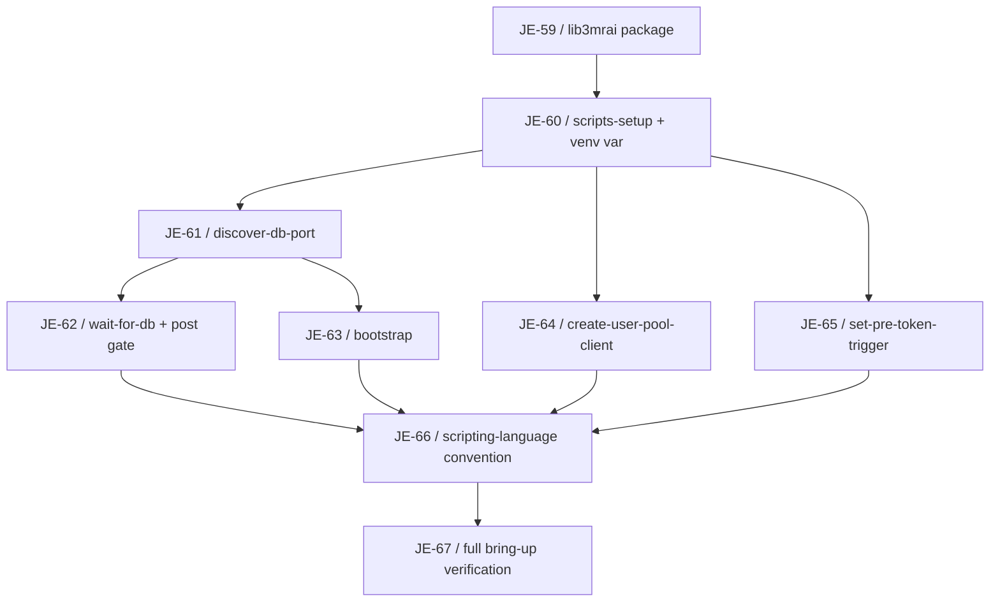
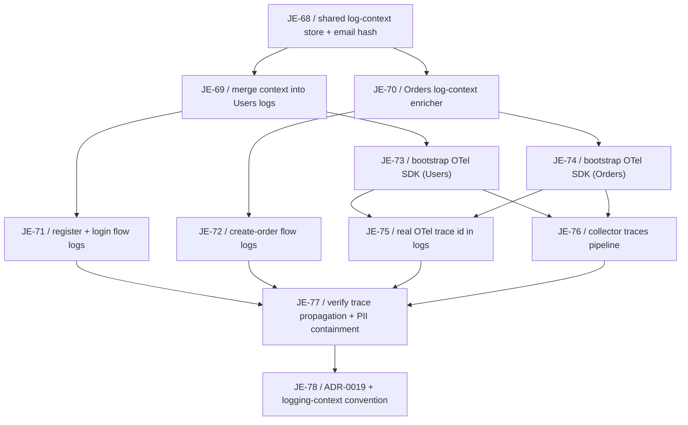

# Developer Experience Milestone

Logical execution plan for the **Developer Experience** milestone (Linear project "3MRAI Company", [milestone](https://linear.app/je-martinez/project/3mrai-company-da39253a1d6f)). This note tracks the milestone's task sequence and blocking dependencies as blocks are specced and their issues created — see the framing note below.

> [!info] Three independent blocks, one milestone
> This milestone groups three independent pieces of developer-experience work under a single Linear milestone. **Block 1 — Scripts to Python** is specced, has issues, is implemented, and is merged into `feature/developer-experience` (JE-59…JE-67, all Done). **Block 2 — Logging context + distributed tracing** is now specced and has issues (JE-68…JE-78). Block 3 is not yet specced; when it is brainstormed and planned, its issues will be added to this **same** milestone and this note will be updated with its own phase, task sequence rows, and dependency edges.
>
> - **Block 1 — Scripts to Python** (implemented, merged into `feature/developer-experience`). Spec: [[2026-07-19-scripts-to-python-migration-design]]. Plan: [[2026-07-19-scripts-to-python-migration]].
> - **Block 2 — Logging context + distributed tracing** (specced, issues created). Shared cross-service log context (trace/span id, identity, hashed email, domain ids), flow-level logs on register/login/create-order, real distributed tracing over gRPC via the OpenTelemetry SDK, OpenObserve kept as the backend. Spec: [[2026-07-19-logging-context-and-tracing-design]]. Plan: [[2026-07-19-logging-context-and-tracing]].
> - **Block 3 — Env-file auto-generation** (not yet specced). Generate `.env.<environment>.services`, `.env.<environment>.infra`, `.env.<environment>.debug` from Terraform discovery, split into AUTO-GENERATED and CUSTOM sections per service, with a committable `.env.example` for custom vars.

## Logical phases

| Phase | Issues | Status | Description |
|---|---|---|---|
| Block 1 — Scripts to Python | JE-59…JE-67 | Done — merged into `feature/developer-experience` | Migrate the repo's 5 remaining bash scripts to Python behind a shared `lib3mrai` package; freeze every script's external interface; wire the Python-first scripting-language convention into both `CLAUDE.md` files. |
| Block 2 — Logging context + tracing | JE-68…JE-78 | Specced, issues created | Shared cross-service log context (trace/span id, identity, hashed email, domain ids) on every log line, flow-level logs on register/login/create-order, real distributed tracing over gRPC via the OpenTelemetry SDK, OpenObserve kept as the backend. |
| Block 3 — Env-file auto-generation | — (not yet specced) | Not started | Generate per-environment `.env.*` files from Terraform discovery, split AUTO-GENERATED/CUSTOM, with a committable `.env.example`. |

## Block 1 — Scripts to Python (Done)

> [!success] Implemented
> All nine issues (JE-59…JE-67) are Done, merged into `feature/developer-experience`.

Migrate the repo's 5 remaining bash scripts to Python behind a shared `lib3mrai` package (boto3 client factory + console helpers + DB discovery), keeping every script colocated with its Terraform module and every external interface frozen (CLI args, stdout contract, exit codes, env vars, state-file shape). Terraform `local-exec` and the Makefile invoke the venv interpreter by absolute path rather than relying on PATH. The durable deliverable is the Python-first scripting-language convention wired into both CLAUDE.md files.

### Task sequence

| # | Issue | Task | Deliverable | Spec note |
|---|---|---|---|---|
| 1 | [JE-59](https://linear.app/je-martinez/issue/JE-59) | `lib3mrai` shared package for Python infra scripts | `infra/scripts/lib3mrai/` (`aws.py`, `console.py`, `db.py`) + `pyproject.toml`/`requirements.txt` | [[2026-07-19-scripts-to-python-migration-design]] |
| 2 | [JE-60](https://linear.app/je-martinez/issue/JE-60) | `make scripts-setup` and venv interpreter variables | `PY`/`VENV` Makefile variables, idempotent `scripts-setup` target | [[2026-07-19-scripts-to-python-migration-design]] |
| 3 | [JE-61](https://linear.app/je-martinez/issue/JE-61) | Port `discover-db-port` to Python with boto3 | `discover_db_port.py`, `lib3mrai.db.discover_port(engine)` | [[2026-07-19-scripts-to-python-migration-design]] |
| 4 | [JE-62](https://linear.app/je-martinez/issue/JE-62) | Port `wait-for-db` to Python and rewire the post gate | `wait_for_db.py`, `lib3mrai.db.wait_for_db(...)`, `gate.tf` rewired | [[2026-07-19-scripts-to-python-migration-design]] |
| 5 | [JE-63](https://linear.app/je-martinez/issue/JE-63) | Port `bootstrap` to Python, dropping superseded app-user steps | `bootstrap.py` (nginx-stable alias step only; dead app-DB-user functions deleted, not ported) | [[2026-07-19-scripts-to-python-migration-design]] |
| 6 | [JE-64](https://linear.app/je-martinez/issue/JE-64) | Port `create-user-pool-client` to Python with boto3 | `create_user_pool_client.py`, `main.tf` provisioner rewired | [[2026-07-19-scripts-to-python-migration-design]] |
| 7 | [JE-65](https://linear.app/je-martinez/issue/JE-65) | Port `set-pre-token-trigger` to Python with boto3 | `set_pre_token_trigger.py`, `main.tf` provisioner rewired, settings-preserving `UpdateUserPool` | [[2026-07-19-scripts-to-python-migration-design]] |
| 8 | [JE-66](https://linear.app/je-martinez/issue/JE-66) | Python-first scripting-language convention | `docs/shared/conventions/scripting-language.md`, root + `infra/CLAUDE.md` updates | [[2026-07-19-scripts-to-python-migration-design]] |
| 9 | [JE-67](https://linear.app/je-martinez/issue/JE-67) | Verify full local bring-up after the Python migration | `make infra-down` → `make bootstrap` → `make env-file` → gateway E2E, plus a re-run proving idempotence | [[2026-07-19-scripts-to-python-migration-design]] |

### Dependencies

#### Dependency table

| Task | Blocked by |
|---|---|
| JE-59 | — |
| JE-60 | JE-59 |
| JE-61 | JE-60 |
| JE-62 | JE-61 |
| JE-63 | JE-61 |
| JE-64 | JE-60 |
| JE-65 | JE-60 |
| JE-66 | JE-62, JE-63, JE-64, JE-65 |
| JE-67 | JE-66 |

#### Dependency diagram

JE-59 → JE-60 is the trunk: the shared package must exist before the Makefile grows a venv-aware interpreter variable. From JE-60, three ports fan out in parallel — JE-61 (DB port discovery), JE-64 (Cognito user-pool client), and JE-65 (Cognito pre-token trigger). JE-61 additionally gates two further ports: JE-62 (wait-for-db, which imports `discover_port`'s sibling helper) and JE-63 (bootstrap, which imports `discover_port` directly). All four leaf ports — JE-62, JE-63, JE-64, JE-65 — converge on JE-66, the scripting-language convention, since it documents the pattern all five migrated scripts now follow. JE-67, the full-cycle verification, closes the block.

### Execution approach

One-shot on a single branch `feature/developer-experience`, one commit per issue, no per-issue branch or PR — the same approach used for the Orders milestone (JE-41…JE-55, see [[orders-service-milestone]]). A single PR opens task→feature at the end of the block.

### Acceptance

Full `make infra-down` → `make bootstrap` → `make env-file` → gateway E2E with a real Cognito JWT, matching the pre-migration result, plus a re-run proving idempotence.

## Block 2 — Logging context + distributed tracing

Attach a shared cross-service log context (trace/span id, identity, hashed email, domain ids) to every log line so one user's or order's activity can be filtered end to end; add flow-level start/success/failure logs to the three flows that carry diagnostic value (register, login, create-order); and add real distributed tracing across the gRPC boundary with the OpenTelemetry SDK, keeping OpenObserve as the backend. Structured by LAYER rather than by service, so the shared schema is defined once and both services adopt it together instead of diverging.

### Task sequence

| # | Issue | Task | Layer | Blocked by |
|---|---|---|---|---|
| 1 | [JE-68](https://linear.app/je-martinez/issue/JE-68) | feat(users): shared log-context store and cross-service email hash | Context | — |
| 2 | [JE-69](https://linear.app/je-martinez/issue/JE-69) | feat(users): merge the request log context into every log line | Context | JE-68 |
| 3 | [JE-70](https://linear.app/je-martinez/issue/JE-70) | feat(orders): log-context enricher and matching email hash | Context | JE-68 |
| 4 | [JE-71](https://linear.app/je-martinez/issue/JE-71) | feat(users): register and login flow logs | Flow logs | JE-69 |
| 5 | [JE-72](https://linear.app/je-martinez/issue/JE-72) | feat(orders): create-order flow logs | Flow logs | JE-70 |
| 6 | [JE-73](https://linear.app/je-martinez/issue/JE-73) | feat(users): bootstrap the OpenTelemetry SDK | Tracing | JE-69 |
| 7 | [JE-74](https://linear.app/je-martinez/issue/JE-74) | feat(orders): bootstrap OpenTelemetry tracing | Tracing | JE-70 |
| 8 | [JE-75](https://linear.app/je-martinez/issue/JE-75) | feat(observability): use the real OTel trace id in logs across both services | Tracing | JE-73, JE-74 |
| 9 | [JE-76](https://linear.app/je-martinez/issue/JE-76) | feat(observability): add a traces pipeline to the otel collector | Tracing | JE-73, JE-74 |
| 10 | [JE-77](https://linear.app/je-martinez/issue/JE-77) | test(observability): verify cross-service trace propagation and PII containment | Verify | JE-75, JE-76, JE-71, JE-72 |
| 11 | [JE-78](https://linear.app/je-martinez/issue/JE-78) | docs(vault): ADR-0019 tracing decision and the logging-context convention | Docs | JE-77 |

### Dependencies

#### Dependency table

| Task | Blocked by |
|---|---|
| JE-68 | — |
| JE-69 | JE-68 |
| JE-70 | JE-68 |
| JE-71 | JE-69 |
| JE-72 | JE-70 |
| JE-73 | JE-69 |
| JE-74 | JE-70 |
| JE-75 | JE-73, JE-74 |
| JE-76 | JE-73, JE-74 |
| JE-77 | JE-75, JE-76, JE-71, JE-72 |
| JE-78 | JE-77 |

#### Dependency diagram

JE-68 is the root: the shared log-context store and the cross-service email-hash contract must exist before either service can adopt it. It forks into JE-69 (Users merges the context into every log line) and JE-70 (Orders' matching enricher). Each service branch then fans out twice — JE-69 gates both JE-71 (Users' register/login flow logs) and JE-73 (bootstrapping the OTel SDK in Users); JE-70 gates JE-72 (Orders' create-order flow logs) and JE-74 (bootstrapping the OTel SDK in Orders). The two tracing bootstraps, JE-73 and JE-74, converge on both JE-75 (replacing the local trace id with the real OTel one in both services) and JE-76 (adding a traces pipeline to the otel collector) — both must exist in both services before either downstream task can be verified. JE-77, the cross-service verification (trace propagation and PII containment), depends on all four leaf tasks — JE-71, JE-72, JE-75, JE-76 — since it exercises both flow logs and tracing together. JE-78, the ADR and convention note, closes the block once verification passes.

### Execution

Same one-shot approach as Block 1 — single branch `feature/developer-experience`, one commit per issue.

### Notable

This block reopens a decision [[ADR-0018-observability-openobserve|ADR-0018]] explicitly deferred: distributed tracing was a documented non-goal at the time OpenObserve was chosen as the logs backend. ADR-0019 (issue JE-78, see [[2026-07-19-logging-context-and-tracing-design]]) records the re-evaluation and is a required deliverable of this block, not paperwork — it is the durable record of why OpenObserve is kept as the trace backend despite its weaker APM UI.

**Three deliberate deviations from the original input**, each recorded in the spec:

- `duration_ms` is kept instead of `duration_s` — it is what both services already emit and is the OTel HTTP-semantic-convention unit.
- `email_hash` rides on every log line; plaintext `email` is confined to login/register only, for PII containment.
- Request-started/completed logs are kept, and Orders is aligned to Users' shape rather than removed — they are the systematic latency/error-rate signal.

## Related

- [[milestone-plan]] — convention this plan follows.
- [[linear-references]] — Linear reference convention.
- [[phase-c-review-flow]] — batch-review flow and dependency-gate stop points (not triggered here — both Block 1 and Block 2 run one-shot on a single branch).
- [[2026-07-19-scripts-to-python-migration-design]] — Block 1 design spec.
- [[2026-07-19-scripts-to-python-migration]] — Block 1 implementation plan with detailed task steps.
- [[2026-07-19-logging-context-and-tracing-design]] — Block 2 design spec.
- [[2026-07-19-logging-context-and-tracing]] — Block 2 implementation plan with detailed task steps.
- [[orders-service-milestone]] — precedent for the one-shot, single-branch execution approach.
