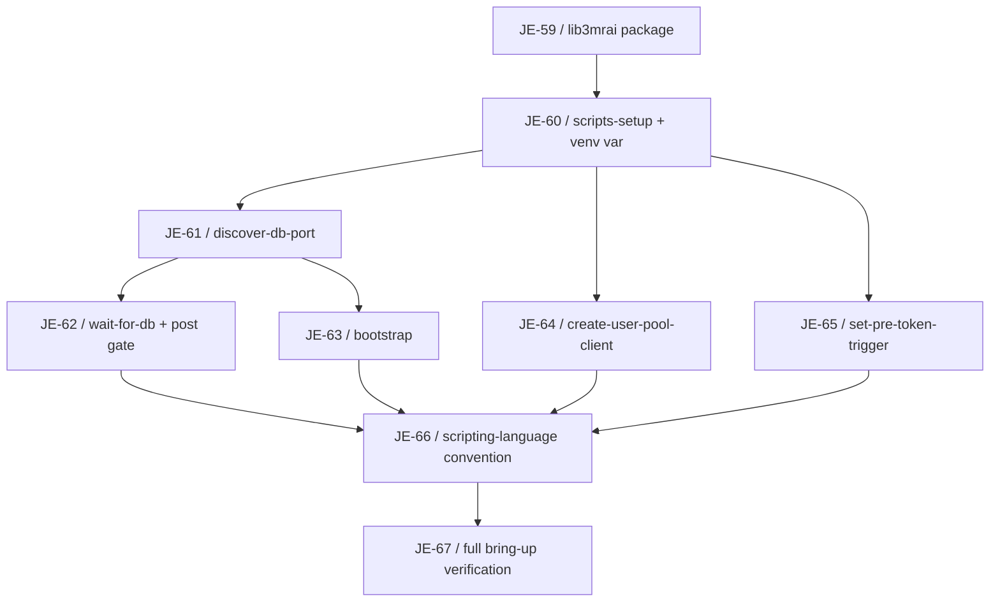

# Developer Experience Milestone

Logical execution plan for the **Developer Experience** milestone (Linear project "3MRAI Company", [milestone](https://linear.app/je-martinez/project/3mrai-company-da39253a1d6f)). This note tracks the milestone's task sequence and blocking dependencies as blocks are specced and their issues created — see the framing note below.

> [!info] Three independent blocks, one milestone
> This milestone groups three independent pieces of developer-experience work under a single Linear milestone. Only **Block 1 — Scripts to Python** is specced and has issues today (JE-59…JE-67). Blocks 2 and 3 are not yet specced; when each is brainstormed and planned, its issues will be added to this **same** milestone and this note will be updated with its own phase, task sequence rows, and dependency edges.
>
> - **Block 1 — Scripts to Python** (specced, issues created). Spec: [[2026-07-19-scripts-to-python-migration-design]]. Plan: [[2026-07-19-scripts-to-python-migration]].
> - **Block 2 — Logging context + distributed tracing** (not yet specced). Shared log context (`user_id`, `cognito_sub`, `email`, `order_id`, `duration_s`), flow-level logs on every endpoint, tracing compatible with the existing OpenObserve setup, standardized across services.
> - **Block 3 — Env-file auto-generation** (not yet specced). Generate `.env.<environment>.services`, `.env.<environment>.infra`, `.env.<environment>.debug` from Terraform discovery, split into AUTO-GENERATED and CUSTOM sections per service, with a committable `.env.example` for custom vars.

## Logical phases

| Phase | Issues | Description |
|---|---|---|
| Block 1 — Scripts to Python | JE-59…JE-67 | Migrate the repo's 5 remaining bash scripts to Python behind a shared `lib3mrai` package; freeze every script's external interface; wire the Python-first scripting-language convention into both `CLAUDE.md` files. |
| Block 2 — Logging context + tracing | — (not yet specced) | Shared log context across services, flow-level logs on every endpoint, tracing compatible with OpenObserve. |
| Block 3 — Env-file auto-generation | — (not yet specced) | Generate per-environment `.env.*` files from Terraform discovery, split AUTO-GENERATED/CUSTOM, with a committable `.env.example`. |

## Block 1 — Scripts to Python

Migrate the repo's 5 remaining bash scripts to Python behind a shared `lib3mrai` package (boto3 client factory + console helpers + DB discovery), keeping every script colocated with its Terraform module and every external interface frozen (CLI args, stdout contract, exit codes, env vars, state-file shape). Terraform `local-exec` and the Makefile invoke the venv interpreter by absolute path rather than relying on PATH. The durable deliverable is the Python-first scripting-language convention wired into both CLAUDE.md files.

### Task sequence

| # | Issue | Task | Deliverable | Spec note |
|---|---|---|---|---|
| 1 | [JE-59](https://linear.app/je-martinez/issue/JE-59) | `lib3mrai` shared package for Python infra scripts | `infra/scripts/lib3mrai/` (`aws.py`, `console.py`, `db.py`) + `pyproject.toml`/`requirements.txt` | [[2026-07-19-scripts-to-python-migration-design]] |
| 2 | [JE-60](https://linear.app/je-martinez/issue/JE-60) | `make scripts-setup` and venv interpreter variables | `PY`/`VENV` Makefile variables, idempotent `scripts-setup` target | [[2026-07-19-scripts-to-python-migration-design]] |
| 3 | [JE-61](https://linear.app/je-martinez/issue/JE-61) | Port `discover-db-port` to Python with boto3 | `discover_db_port.py`, `lib3mrai.db.discover_port(engine)` | [[2026-07-19-scripts-to-python-migration-design]] |
| 4 | [JE-62](https://linear.app/je-martinez/issue/JE-62) | Port `wait-for-db` to Python and rewire the post gate | `wait_for_db.py`, `lib3mrai.db.wait_for_db(...)`, `gate.tf` rewired | [[2026-07-19-scripts-to-python-migration-design]] |
| 5 | [JE-63](https://linear.app/je-martinez/issue/JE-63) | Port `bootstrap` to Python, dropping superseded app-user steps | `bootstrap.py` (nginx-stable alias step only; dead app-DB-user functions deleted, not ported) | [[2026-07-19-scripts-to-python-migration-design]] |
| 6 | [JE-64](https://linear.app/je-martinez/issue/JE-64) | Port `create-user-pool-client` to Python with boto3 | `create_user_pool_client.py`, `main.tf` provisioner rewired | [[2026-07-19-scripts-to-python-migration-design]] |
| 7 | [JE-65](https://linear.app/je-martinez/issue/JE-65) | Port `set-pre-token-trigger` to Python with boto3 | `set_pre_token_trigger.py`, `main.tf` provisioner rewired, settings-preserving `UpdateUserPool` | [[2026-07-19-scripts-to-python-migration-design]] |
| 8 | [JE-66](https://linear.app/je-martinez/issue/JE-66) | Python-first scripting-language convention | `docs/shared/conventions/scripting-language.md`, root + `infra/CLAUDE.md` updates | [[2026-07-19-scripts-to-python-migration-design]] |
| 9 | [JE-67](https://linear.app/je-martinez/issue/JE-67) | Verify full local bring-up after the Python migration | `make infra-down` → `make bootstrap` → `make env-file` → gateway E2E, plus a re-run proving idempotence | [[2026-07-19-scripts-to-python-migration-design]] |

### Dependencies

#### Dependency table

| Task | Blocked by |
|---|---|
| JE-59 | — |
| JE-60 | JE-59 |
| JE-61 | JE-60 |
| JE-62 | JE-61 |
| JE-63 | JE-61 |
| JE-64 | JE-60 |
| JE-65 | JE-60 |
| JE-66 | JE-62, JE-63, JE-64, JE-65 |
| JE-67 | JE-66 |

#### Dependency diagram

JE-59 → JE-60 is the trunk: the shared package must exist before the Makefile grows a venv-aware interpreter variable. From JE-60, three ports fan out in parallel — JE-61 (DB port discovery), JE-64 (Cognito user-pool client), and JE-65 (Cognito pre-token trigger). JE-61 additionally gates two further ports: JE-62 (wait-for-db, which imports `discover_port`'s sibling helper) and JE-63 (bootstrap, which imports `discover_port` directly). All four leaf ports — JE-62, JE-63, JE-64, JE-65 — converge on JE-66, the scripting-language convention, since it documents the pattern all five migrated scripts now follow. JE-67, the full-cycle verification, closes the block.

### Execution approach

One-shot on a single branch `feature/developer-experience`, one commit per issue, no per-issue branch or PR — the same approach used for the Orders milestone (JE-41…JE-55, see [[orders-service-milestone]]). A single PR opens task→feature at the end of the block.

### Acceptance

Full `make infra-down` → `make bootstrap` → `make env-file` → gateway E2E with a real Cognito JWT, matching the pre-migration result, plus a re-run proving idempotence.

## Related

- [[milestone-plan]] — convention this plan follows.
- [[linear-references]] — Linear reference convention.
- [[phase-c-review-flow]] — batch-review flow and dependency-gate stop points (not triggered here — Block 1 runs one-shot on a single branch).
- [[2026-07-19-scripts-to-python-migration-design]] — Block 1 design spec.
- [[2026-07-19-scripts-to-python-migration]] — Block 1 implementation plan with detailed task steps.
- [[orders-service-milestone]] — precedent for the one-shot, single-branch execution approach.
