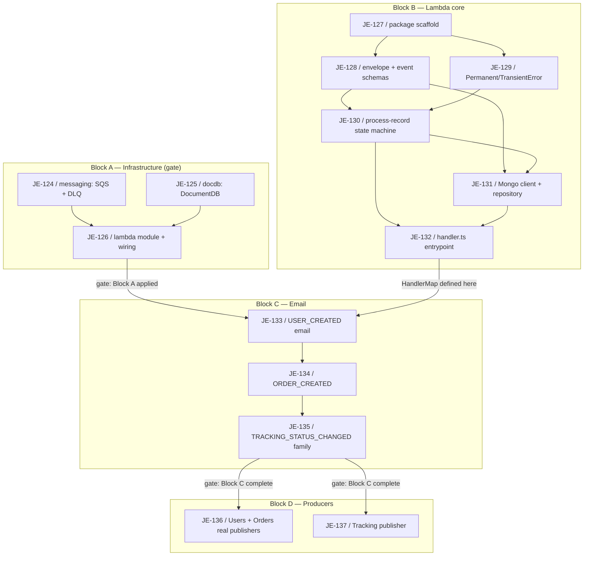

# Events Pipeline Milestone

Logical execution plan for the Events Pipeline milestone: task sequence, phases, and the blocking dependency graph. The detailed step-by-step plan lives in [[2026-08-03-events-pipeline-milestone]] (superpowers plan); the design in [[2026-08-03-events-pipeline-milestone-design]]. This note is the milestone-level map.

> [!info] Milestone complete
> All 14 issues (JE-124 through JE-137) are done on `feature/events-pipeline`; a PR to `main` is about to be proposed. See [[linear-references]] — the vault references Linear via tags and links, it never mirrors issue content.

**Goal (verified):** `POST /v1/users/register` ends up as a `COMPLETED` document in DocumentDB and a "Welcome to 3MRAI" email in Mailpit, and a Tracking delivery-status change ends up as a `COMPLETED` document and a notification email in Mailpit — for all three producers (Users, Orders, Tracking).

## Logical phases

| Block | Issues | Description |
|---|---|---|
| Block A — Infrastructure | JE-124–JE-126 | SQS queue + DLQ (`messaging` module), DocumentDB cluster (`database`, later renamed `docdb`, module), and the `lambda` module (function, IAM role, event source mapping with `ReportBatchItemFailures`), wired into `infra/environments/local`. Dependency gate: must be applied before Block B can be verified end-to-end. |
| Block B — Lambda core (no email yet) | JE-127–JE-132 | Package scaffold, envelope + event document Zod schemas, `PermanentError`/`TransientError` classification, the `process-record.ts` state machine (AWS-SDK-free), Mongo client + events repository, and the Lambda `handler.ts` assembling `batchItemFailures`. |
| Block C — Email | JE-133–JE-135 | `USER_CREATED` handler (react-email + Mailpit + preview server + SES sender identity — first end-to-end email), `ORDER_CREATED` (proves the "one dispatch-map entry" claim), and the `TRACKING_STATUS_CHANGED` template family (one event type, five rendered variants by `payload.status`). |
| Block D — Producers | JE-136–JE-137 | Real SQS publishers replacing `NoopEventPublisher` in Users and Orders (JE-136), and Tracking's new Python/boto3 publisher emitting on every delivery-status transition (JE-137). Independent of each other; both gated on Block C being complete. |

## Task sequence

| # | Issue | Task | Deliverable | Spec note |
|---|---|---|---|---|
| 1 | [JE-124](https://linear.app/je-martinez/issue/JE-124) | `infra/modules/messaging/` — SQS queue + DLQ | `aws_sqs_queue.main` + `aws_sqs_queue.dlq`, `RedrivePolicy` (`maxReceiveCount = 3`), outputs `queue_url`/`queue_arn` | [[2026-08-03-events-pipeline-milestone-design]] |
| 2 | [JE-125](https://linear.app/je-martinez/issue/JE-125) | `infra/modules/database/` (`docdb`) — DocumentDB cluster + instance | `aws_docdb_cluster.this` + `aws_docdb_cluster_instance.this`, credentials to Parameter Store, output `cluster_identifier` | [[2026-08-03-events-pipeline-milestone-design]] |
| 3 | [JE-126](https://linear.app/je-martinez/issue/JE-126) | `infra/modules/lambda/` + wiring | `aws_lambda_function`, IAM exec role, `aws_lambda_event_source_mapping` (`function_response_types = ["ReportBatchItemFailures"]`, set at create time), `environments/local` wired to all three new modules | [[2026-08-03-events-pipeline-milestone-design]] |
| 4 | [JE-127](https://linear.app/je-martinez/issue/JE-127) | Package scaffold | `functions/events-pipeline/package.json`, `tsconfig.json`, `vitest.config.ts`, `#shared`/`#pipeline`/`#domain`/`#email`/`#handlers` subpath imports, pnpm workspace entry | [[2026-08-03-events-pipeline-milestone-design]] |
| 5 | [JE-128](https://linear.app/je-martinez/issue/JE-128) | Envelope + event document schemas | `EnvelopeSchema` (Zod), `EventDocument`/`EventStatus`/`StatusHistoryEntry` types (`src/domain/{envelope,event}.ts`) | [[2026-08-03-events-pipeline-milestone-design]] |
| 6 | [JE-129](https://linear.app/je-martinez/issue/JE-129) | `PermanentError`/`TransientError` classification | `src/pipeline/errors.ts` — `isTransient()`, unclassified errors default to transient | [[2026-08-03-events-pipeline-milestone-design]] |
| 7 | [JE-130](https://linear.app/je-martinez/issue/JE-130) | `process-record.ts` — the state machine | `processRecord()` (STARTED → IN_PROGRESS → COMPLETED/FAILED), `EventsRepositoryPort`, `HandlerMap` — AWS-SDK-free, unit-testable | [[2026-08-03-events-pipeline-milestone-design]] |
| 8 | [JE-131](https://linear.app/je-martinez/issue/JE-131) | Mongo client + events repository | `MongoEventsRepository implements EventsRepositoryPort`, `ensureIndexes()` (unique index on `event_id`), `src/shared/config/env.ts` (Zod-validated) | [[2026-08-03-events-pipeline-milestone-design]] |
| 9 | [JE-132](https://linear.app/je-martinez/issue/JE-132) | `handler.ts` — Lambda entrypoint | Iterates SQS Records, calls `processRecord()`, assembles `batchItemFailures`; defines the `HandlerMap` each Block C handler registers into | [[2026-08-03-events-pipeline-milestone-design]] |
| 10 | [JE-133](https://linear.app/je-martinez/issue/JE-133) | `USER_CREATED` email | react-email template, `src/email/{catalog,renderer,sender}.ts`, Mailpit compose service, preview server (`email dev`), SES sender identity — first end-to-end email | [[2026-08-03-events-pipeline-milestone-design]] |
| 11 | [JE-134](https://linear.app/je-martinez/issue/JE-134) | `ORDER_CREATED` handler | Second catalog entry + dispatch-map entry — proves adding a type costs exactly one entry | [[2026-08-03-events-pipeline-milestone-design]] |
| 12 | [JE-135](https://linear.app/je-martinez/issue/JE-135) | `TRACKING_STATUS_CHANGED` template family + handler | One event type, five catalog entries sharing one `TrackingStatusChangedEmail` component, selected by `payload.status` | [[2026-08-03-events-pipeline-milestone-design]] |
| 13 | [JE-136](https://linear.app/je-martinez/issue/JE-136) | Replace Users/Orders `NoopEventPublisher` with real SQS publishers | Real `EventPublisher`/`IEventPublisher` implementations generating `event_id`, `EVENTS_QUEUE_URL` in generated env files, log-and-swallow publish-failure policy, compose reconciliation | [[2026-08-03-events-pipeline-milestone-design]] |
| 14 | [JE-137](https://linear.app/je-martinez/issue/JE-137) | Tracking publisher — third producer | Python/boto3 `SqsEventPublisher`, emission wired into `update_status.py` (`user_id` from the persisted entity, `event_id` derived from `(order_id, status)`), all five transitions including `DELIVERED` | [[2026-08-03-events-pipeline-milestone-design]] |

## Dependencies

### Dependency table

| Task | Blocked by |
|---|---|
| JE-124 | — |
| JE-125 | — |
| JE-126 | JE-124, JE-125 |
| JE-127 | — |
| JE-128 | JE-127 |
| JE-129 | JE-127 |
| JE-130 | JE-128, JE-129 |
| JE-131 | JE-128, JE-130 |
| JE-132 | JE-130, JE-131 |
| JE-133 | JE-126, JE-132 |
| JE-134 | JE-133 |
| JE-135 | JE-134 |
| JE-136 | JE-135 |
| JE-137 | JE-135 |

### Dependency diagram

Block A is applied first — JE-124 and JE-125 are independent Terraform modules, both feeding JE-126 (the `lambda` module needs the queue ARN and wires all three modules into `environments/local`). Block B's tasks form two short chains off the scaffold (JE-127): schemas/errors (JE-128, JE-129) feed the state machine (JE-130), which feeds both the repository (JE-131) and the handler (JE-132, which also needs the repository). Block C is a sequential chain (JE-133 → JE-134 → JE-135) gated on **both** Block A being applied (a real queue/table/function to invoke against) and JE-132 landing (the `HandlerMap` each handler registers into). Block D's two tasks (JE-136, JE-137) are independent of each other but both gated on Block C being complete — an event only "means" something once it produces a document *and* an email, so publishing before a matching handler exists would dead-end in `FAILED "Unknown event type"`.

## Stop points (batch review)

Per [[phase-c-review-flow]], this milestone had four stop points, matching the four blocks:

1. **Block A → Block B.** Block B's Mongo-repository integration test and the handler (exercised against a real queue) cannot be verified without Block A's `messaging` and `database` modules applied on Floci.
2. **Block B → Block C.** Block C cannot be end-to-end verified (email landing in Mailpit via real handler dispatch) until `handler.ts` and `process-record.ts` are merged — Block C's first handler registers into the `HandlerMap` Block B defines.
3. **Block C → Block D.** JE-136's and JE-137's producers publish envelopes that only mean something once all three handlers (`USER_CREATED`, `ORDER_CREATED`, `TRACKING_STATUS_CHANGED`) exist. JE-137 is sequenced after JE-135 within this same gate even though Tracking's own code has no dependency on JE-136 — both Block D tasks depend on Block C being complete, not on each other.
4. **End of Block D.** The milestone's Definition of Done — `POST /v1/users/register` → Mailpit **and** a Tracking status change → Mailpit (including the four-emails-per-TestMode-run case) — was the final checkpoint before batching the last PRs for review.

## Outcome

- **Follow-up issue [JE-138](https://linear.app/je-martinez/issue/JE-138):** OpenTelemetry instrumentation is **not** part of this milestone — `trace_id`/`span_id` are still absent from the pipeline's logs. Tracked as follow-up work, not silently deferred.
- **Two things shipped after the 14 tasks, on the same branch:**
  - Migration of the pipeline's logging to **pino** structured logging.
  - The envelope's new **`author`** object (`author.actor`, `author.user_id?`, `author.cognito_sub?`) — who *originated* an event, distinct from the root `user_id` field, which is the event's *subject*. `author.actor` becomes the persisted document's `created_by`, carrying the producer's own `AuditActor` value through to the pipeline. See [[events-pipeline-design]] for the full field table.
- **Verification achieved:** 162 unit tests in events-pipeline, 214 in Users, 467 in Tracking, 107 in Orders; 71 E2E tests; a live-stack run producing 139 event documents with 0 `FAILED`, and emails asserted directly in Mailpit (not mocked).

## Related

- [[milestone-plan]] — convention this plan follows.
- [[linear-references]] — Linear reference convention.
- [[phase-c-review-flow]] — batch-review flow and dependency-gate stop points referenced above.
- [[2026-08-03-events-pipeline-milestone]] — the implementation plan with detailed task steps.
- [[2026-08-03-events-pipeline-milestone-design]] — the design spec specifying each deliverable.
- [[events-pipeline-design]] — the vault design note describing what shipped (pino logging, the `author` object, the final data model).
