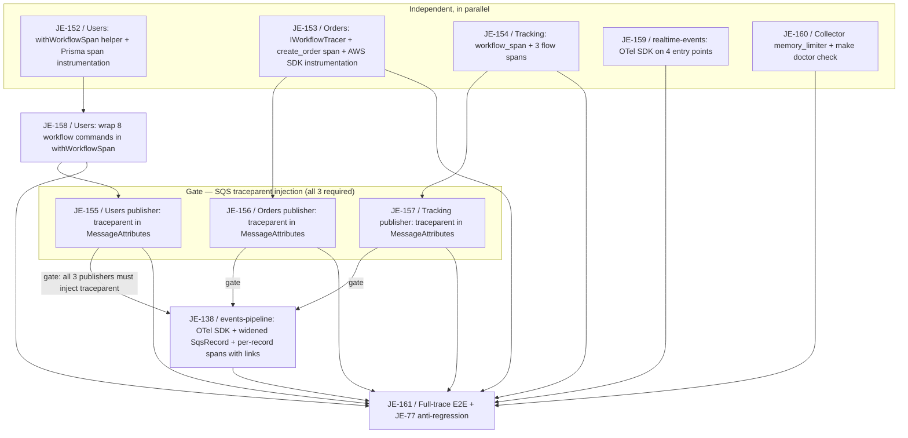

# Observability & Telemetry Milestone

Logical execution plan for the **Observability & Telemetry** milestone (Linear project "3MRAI
Company", team "My Personal Projects"). This note tracks the milestone's task sequence and
blocking dependencies. The detailed step-by-step plan lives in
[[2026-08-18-distributed-tracing-spans]] (superpowers plan); the design in
[[2026-08-18-distributed-tracing-spans-design]]. This note is the milestone-level map.

> [!info] Milestone origin
> The milestone already existed in Linear holding a single follow-up issue,
> [JE-138](https://linear.app/je-martinez/issue/JE-138) (events-pipeline OTel instrumentation,
> deferred out of the Events Pipeline milestone — see [[events-pipeline-milestone#Outcome]]). 10
> new issues covering the full distributed-tracing-spans design were added to it, absorbing
> JE-138's scope into a larger, repo-wide effort. All 11 issues are now created in Linear (see
> [Issues](#issues) below) and sit in **Backlog**.

**Goal:** close the gaps in the tracing cascade — business-level workflow spans on the 11 flows
that already carry a full `app_event` start/succeeded/failed triad across Users, Orders, and
Tracking; the SQS hop into events-pipeline (currently the one broken link — no publisher injects
`traceparent`, and the Lambda has no OTel SDK at all); and OpenTelemetry on the 5 Lambda runtimes
that have none today (events-pipeline plus the 4 realtime-events entry points). No custom
propagation mechanism — everything rides the existing W3C `traceparent` standard, consistent with
[[ADR-0019-distributed-tracing-opentelemetry]] and [[logging-context]].

## Logical phases

| Phase | Issues | Description |
|---|---|---|
| Independent, in parallel | [JE-152](https://linear.app/je-martinez/issue/JE-152), [JE-153](https://linear.app/je-martinez/issue/JE-153), [JE-154](https://linear.app/je-martinez/issue/JE-154), [JE-159](https://linear.app/je-martinez/issue/JE-159), [JE-160](https://linear.app/je-martinez/issue/JE-160) | Five independent workstreams: the Users `withWorkflowSpan` helper and Prisma span instrumentation ([JE-152](https://linear.app/je-martinez/issue/JE-152)); Orders' `IWorkflowTracer` + `create_order` span + AWS SDK instrumentation ([JE-153](https://linear.app/je-martinez/issue/JE-153)); Tracking's `workflow_span` context manager + 3 flow spans ([JE-154](https://linear.app/je-martinez/issue/JE-154)); OTel on all 4 realtime-events entry points ([JE-159](https://linear.app/je-martinez/issue/JE-159)); and the collector's `memory_limiter` + a `make doctor` observability check ([JE-160](https://linear.app/je-martinez/issue/JE-160)). None of these five blocks any other. |
| Users call sites | [JE-158](https://linear.app/je-martinez/issue/JE-158) | Wrap the 8 auth workflow commands in `withWorkflowSpan` — blocked by [JE-152](https://linear.app/je-martinez/issue/JE-152) (same service, needs the helper first). |
| Gate — SQS `traceparent` injection | [JE-155](https://linear.app/je-martinez/issue/JE-155), [JE-156](https://linear.app/je-martinez/issue/JE-156), [JE-157](https://linear.app/je-martinez/issue/JE-157) | The 3 SQS publishers (Users, Orders, Tracking) each inject `traceparent` into `MessageAttributes` — one issue per service, so implementers work in parallel. This is a **dependency gate**: events-pipeline cannot be verified against a real `traceparent` until all three publishers emit one. |
| events-pipeline (JE-138, reused) | [JE-138](https://linear.app/je-martinez/issue/JE-138) | OTel SDK, widened `SqsRecord` type (`messageAttributes` was previously dropped), and per-record spans with links to the N origin traces — blocked by [JE-155](https://linear.app/je-martinez/issue/JE-155), [JE-156](https://linear.app/je-martinez/issue/JE-156), and [JE-157](https://linear.app/je-martinez/issue/JE-157) (the SQS gate above). |
| Closing | [JE-161](https://linear.app/je-martinez/issue/JE-161) | End-to-end verification: one Jaeger trace joining all three services plus events-pipeline for a real `create_order` flow, including the JE-77 anti-regression assertion. Blocked by [JE-152](https://linear.app/je-martinez/issue/JE-152), [JE-153](https://linear.app/je-martinez/issue/JE-153), [JE-154](https://linear.app/je-martinez/issue/JE-154), [JE-155](https://linear.app/je-martinez/issue/JE-155), [JE-156](https://linear.app/je-martinez/issue/JE-156), [JE-157](https://linear.app/je-martinez/issue/JE-157), [JE-158](https://linear.app/je-martinez/issue/JE-158), and [JE-138](https://linear.app/je-martinez/issue/JE-138). |

## Dependency diagram

Five workstreams start in parallel with no dependency on each other: the Users workflow-span
helper [JE-152](https://linear.app/je-martinez/issue/JE-152) (which then gates its own 8 call
sites in [JE-158](https://linear.app/je-martinez/issue/JE-158)), Orders
([JE-153](https://linear.app/je-martinez/issue/JE-153)), Tracking
([JE-154](https://linear.app/je-martinez/issue/JE-154)), realtime-events
([JE-159](https://linear.app/je-martinez/issue/JE-159)), and the collector/doctor check
([JE-160](https://linear.app/je-martinez/issue/JE-160)). The SQS publisher gate is **three
issues**, one per service — [JE-155](https://linear.app/je-martinez/issue/JE-155) (Users, blocked
by [JE-158](https://linear.app/je-martinez/issue/JE-158)),
[JE-156](https://linear.app/je-martinez/issue/JE-156) (Orders, blocked by
[JE-153](https://linear.app/je-martinez/issue/JE-153)), and
[JE-157](https://linear.app/je-martinez/issue/JE-157) (Tracking, blocked by
[JE-154](https://linear.app/je-martinez/issue/JE-154)) — split this way so each service's
implementer can work the publisher change in parallel with the others. The **hard gate** is all
three landing: events-pipeline ([JE-138](https://linear.app/je-martinez/issue/JE-138)) cannot be
meaningfully verified — the whole point of Decision 4 is that the consumer links back to the N
origin traces via the `traceparent` it receives — until every publisher emits one, so JE-138 is
blocked by JE-155, JE-156, and JE-157 together. The closing task,
[JE-161](https://linear.app/je-martinez/issue/JE-161) (full-trace E2E with the JE-77
anti-regression assertion), is blocked by all 8 issues above it — JE-152, JE-153, JE-154, JE-155,
JE-156, JE-157, JE-158, and JE-138 — since it needs workflow spans on all three services, the SQS
hop working, and events-pipeline instrumented, to prove one single Jaeger trace joins all of it.

## Issues

All 11 issues are created in Linear, in the "Observability & Telemetry" milestone (project
3MRAI Company), status **Backlog**.

| Identifier | Title | Area | From plan task |
|---|---|---|---|
| [JE-152](https://linear.app/je-martinez/issue/JE-152) | feat(users): add withWorkflowSpan helper and Prisma span instrumentation | users | Task 1 |
| [JE-158](https://linear.app/je-martinez/issue/JE-158) | feat(users): wrap the eight auth workflow commands in workflow spans | users | Task 2 |
| [JE-153](https://linear.app/je-martinez/issue/JE-153) | feat(orders): add IWorkflowTracer, create_order span, and AWS SDK instrumentation | orders | Task 3 |
| [JE-154](https://linear.app/je-martinez/issue/JE-154) | feat(tracking): add workflow_span context manager and its three flow spans | tracking | Task 4 |
| [JE-155](https://linear.app/je-martinez/issue/JE-155) | feat(users): inject traceparent into SQS MessageAttributes | users | Task 5 (Users) |
| [JE-156](https://linear.app/je-martinez/issue/JE-156) | feat(orders): inject traceparent into SQS MessageAttributes | orders | Task 5 (Orders) |
| [JE-157](https://linear.app/je-martinez/issue/JE-157) | feat(tracking): inject traceparent into SQS MessageAttributes | tracking | Task 5 (Tracking) |
| [JE-138](https://linear.app/je-martinez/issue/JE-138) | feat(events-pipeline): add the OTel SDK with per-record spans linked to origin traces | events-pipeline | Task 6 |
| [JE-159](https://linear.app/je-martinez/issue/JE-159) | feat(events-pipeline): add OTel SDK to the four realtime-events WebSocket Lambdas | events-pipeline | Task 7 |
| [JE-160](https://linear.app/je-martinez/issue/JE-160) | feat(infra): add collector memory_limiter and a make doctor observability check | infra | Task 8 |
| [JE-161](https://linear.app/je-martinez/issue/JE-161) | test(observability): full-trace E2E for create_order with the JE-77 anti-regression assertion | shared | Task 9 |

Task 5 (SQS publishers) was one task in the plan but was split into **3 issues**, one per service
(JE-155, JE-156, JE-157), so each service's implementer can inject `traceparent` in parallel
rather than one issue touching all three services. Together the three form the dependency gate —
see the diagram above.

**Blocked-by relationships, as set in Linear:**

- [JE-158](https://linear.app/je-martinez/issue/JE-158) is blocked by
  [JE-152](https://linear.app/je-martinez/issue/JE-152).
- [JE-138](https://linear.app/je-martinez/issue/JE-138) is blocked by
  [JE-155](https://linear.app/je-martinez/issue/JE-155),
  [JE-156](https://linear.app/je-martinez/issue/JE-156), and
  [JE-157](https://linear.app/je-martinez/issue/JE-157).
- [JE-161](https://linear.app/je-martinez/issue/JE-161) is blocked by
  [JE-152](https://linear.app/je-martinez/issue/JE-152),
  [JE-153](https://linear.app/je-martinez/issue/JE-153),
  [JE-154](https://linear.app/je-martinez/issue/JE-154),
  [JE-155](https://linear.app/je-martinez/issue/JE-155),
  [JE-156](https://linear.app/je-martinez/issue/JE-156),
  [JE-157](https://linear.app/je-martinez/issue/JE-157),
  [JE-158](https://linear.app/je-martinez/issue/JE-158), and
  [JE-138](https://linear.app/je-martinez/issue/JE-138).

## Principal risk — esbuild bundling defeats auto-instrumentation

> [!danger] OTel auto-instrumentation does not survive the Lambda esbuild bundle
> Both `functions/events-pipeline/scripts/build.mjs` and
> `functions/realtime-events/scripts/build.mjs` bundle their handlers with esbuild into
> **single-file CJS bundles** (`bundle: true`, `format: "cjs"`, all dependencies inlined except a
> short list of mongodb's optional native/peer deps). `format: "cjs"` is a hard requirement, not
> a style choice — an ESM bundle fails on the real `nodejs20.x` runtime with
> `ERR_REQUIRE_CYCLE_MODULE` (verified empirically).
>
> OTel auto-instrumentation works by patching a module at its `require`/resolution boundary as it
> loads. Once esbuild has inlined the AWS SDK, `mongodb`, and friends into one file, there is
> **no module boundary left to patch** — `getNodeAutoInstrumentations()` would register cleanly
> and silently produce **zero** spans for DocumentDB, SES, and the WebSocket push, with no error.
> That is the same silent-failure shape [[logging-context]] already documents three times over
> for OTel configuration.
>
> **Consequence:** every internal span in events-pipeline (DocumentDB insert, SES send, WebSocket
> publish) and in all 4 realtime-events entry points is created **manually**, by necessity of the
> packaging strategy — this is Decision 5/6 of the design spec, and the design's own status
> section records that this correction was made *while writing the implementation plan*, after
> the original spec draft had marked those spans `auto-instr.` in error. Alternatives considered
> and rejected: marking the SDK packages `external` and shipping `node_modules` beside the zip
> (inverts the reason the bundler exists, and duplicates the `imports` map by hand); the ADOT
> Lambda layer (one more layer to version, uncertain behavior under Floci). See
> [[2026-08-18-distributed-tracing-spans-design#Decision 5 — events-pipeline: instrument the inside, not just the entry point]]
> and
> [[2026-08-18-distributed-tracing-spans-design#Decision 6 — realtime-events: IN scope]].

## Current status

Design and implementation plan are committed (`d2465d9`) on branch `feat/observability-tracing`.
Implementation has **not started** — all 9 plan tasks are still unchecked. The Linear milestone
holds all 11 issues (JE-138, JE-152 through JE-161), all in **Backlog**.

## Related

- [[milestone-plan]] — convention this plan follows.
- [[linear-references]] — Linear reference convention.
- [[phase-c-review-flow]] — batch-review flow and dependency-gate stop points; the SQS
  `traceparent` gate above is this milestone's one stop point.
- [[2026-08-18-distributed-tracing-spans-design]] — design spec: the 11 decisions behind this
  milestone's scope, including the esbuild/auto-instrumentation risk.
- [[2026-08-18-distributed-tracing-spans]] — implementation plan with the 9 detailed tasks.
- [[ADR-0019-distributed-tracing-opentelemetry]] — the tracing-backend decision (logs →
  OpenObserve, traces → Jaeger) this milestone builds on.
- [[logging-context]] — the shared cross-service log-context convention; workflow spans carry
  the same attributes as today's flow logs.
- [[developer-experience-milestone]] — where the first round of tracing work (JE-73…JE-77)
  landed, including the JE-77 cross-service propagation fix this milestone's E2E re-asserts.
- [[events-pipeline-milestone]] — where JE-138 was originally deferred as follow-up work.
