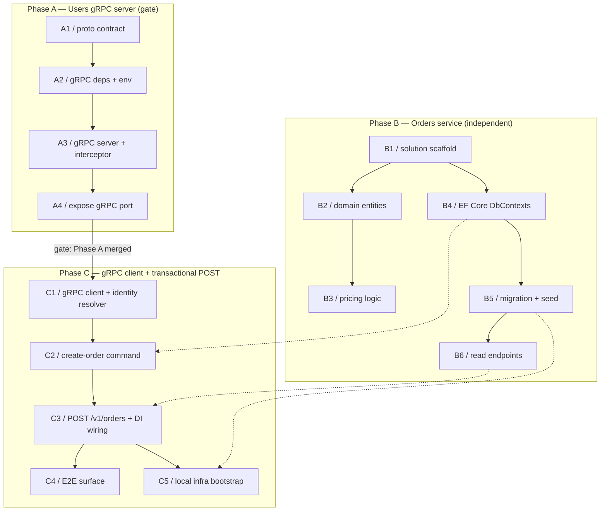

# Orders Service Milestone

Logical execution plan for the Orders Service milestone: task sequence, phases, and the blocking dependency graph. The detailed step-by-step plan lives in [[2026-07-14-orders-service-milestone]] (superpowers plan); the design in [[2026-07-14-orders-service-milestone-design]]. This note is the milestone-level map.

> [!info] Linear IDs linked
> The "Orders Service" milestone (in the 3MRAI Company project) and its 15 issues (A1–C5) are now created in Linear; each task row below links to its issue. See [[linear-references]] — the vault references Linear via tags and links, it never mirrors issue content.

## Logical phases

| Phase | Tasks | Description |
|---|---|---|
| Phase A — Users gRPC server (dependency gate) | A1–A4 | A Users-service leftover completed in this milestone: shared `.proto` contract, gRPC deps/env, gRPC server + `x-api-key` interceptor, expose the port on compose/Floci. MUST be merged before Phase C starts. |
| Phase B — Orders service (independent of the gate) | B1–B6 | Clean Architecture solution, domain entities, pricing logic, EF Core persistence, migration + seed, read endpoints. Parallelizable after B1; does not depend on Phase A. |
| Phase C — Orders gRPC client + transactional POST | C1–C5 | gRPC client + identity resolver, transactional create-order command, `POST /v1/orders` + error mapping, E2E surface, local infra bootstrap. Gated on Phase A being merged. |

## Task sequence

| # | Issue | Task | Deliverable | Spec note |
|---|---|---|---|---|
| 1 | [JE-41](https://linear.app/je-martinez/issue/JE-41) (A1) | Shared `/proto/users.proto` gRPC contract | `proto/users.proto` — `users.v1.Users.GetUserById` | [[2026-07-14-orders-service-milestone-design]] |
| 2 | [JE-42](https://linear.app/je-martinez/issue/JE-42) (A2) | gRPC deps + env in Users | `@grpc/grpc-js`/`@grpc/proto-loader` deps, `GRPC_PORT`/`GRPC_API_KEY` env | [[2026-07-14-orders-service-milestone-design]] |
| 3 | [JE-43](https://linear.app/je-martinez/issue/JE-43) (A3) | gRPC server + `x-api-key` interceptor | `buildGrpcServer`/`startGrpcServer`, constant-time `apiKeyMatches`, bootstrap alongside Fastify | [[2026-07-14-orders-service-milestone-design]] |
| 4 | [JE-44](https://linear.app/je-martinez/issue/JE-44) (A4) | Expose the Users gRPC port | `users:50051` reachable on compose/Floci network | [[2026-07-14-orders-service-milestone-design]] |
| 5 | [JE-45](https://linear.app/je-martinez/issue/JE-45) (B1) | Solution + 5 Clean Architecture projects | `Orders.sln` (Domain/Application/Infrastructure/Api/Tests) | [[2026-07-14-orders-service-milestone-design]] |
| 6 | [JE-46](https://linear.app/je-martinez/issue/JE-46) (B2) | Domain entities, money-in-cents + computed dollars | `Product`, `Order`, `OrderDetail`, `AuditableEntity` | [[2026-07-14-orders-service-milestone-design]] |
| 7 | [JE-47](https://linear.app/je-martinez/issue/JE-47) (B3) | Order pricing domain logic | `OrderPricing.PriceLine` (integer-cents arithmetic) | [[2026-07-14-orders-service-milestone-design]] |
| 8 | [JE-48](https://linear.app/je-martinez/issue/JE-48) (B4) | EF Core DbContexts, snake_case configs, nano-id + audit | `OrdersWriteDbContext`/`OrdersReadDbContext`, entity configs, `NanoId` | [[2026-07-14-orders-service-milestone-design]] |
| 9 | [JE-49](https://linear.app/je-martinez/issue/JE-49) (B5) | Initial migration + Product seed | `Migrations/*InitialCreate*`, `ProductSeed`, verified on real MySQL via Testcontainers | [[2026-07-14-orders-service-milestone-design]] |
| 10 | [JE-50](https://linear.app/je-martinez/issue/JE-50) (B6) | Read endpoints: my-orders, order-by-id, health | `OrderReadService`, `GET /v1/orders/my-orders`, `GET /v1/orders/{order_id}` (ownership-by-filter → 404), `GET /v1/health` | [[2026-07-14-orders-service-milestone-design]] |
| 11 | [JE-51](https://linear.app/je-martinez/issue/JE-51) (C1) | Orders gRPC client + identity resolver | `Grpc.Tools`-generated client, resolver attaching `x-api-key` | [[2026-07-14-orders-service-milestone-design]] |
| 12 | [JE-52](https://linear.app/je-martinez/issue/JE-52) (C2) | Create-order command (transactional) | `FOR UPDATE` stock decrement, `409` on insufficient stock | [[2026-07-14-orders-service-milestone-design]] |
| 13 | [JE-53](https://linear.app/je-martinez/issue/JE-53) (C3) | `POST /v1/orders` + error mapping + DI wiring | Route + `401`/`404`/`409` error mapping, full DI wiring | [[2026-07-14-orders-service-milestone-design]] |
| 14 | [JE-54](https://linear.app/je-martinez/issue/JE-54) (C4) | E2E surface (flag-guarded) | `E2E_TESTING_ENABLED`-guarded endpoints, mirroring Users | [[2026-07-14-orders-service-milestone-design]] |
| 15 | [JE-55](https://linear.app/je-martinez/issue/JE-55) (C5) | Local infra bootstrap | Compose MySQL, real `Dockerfile`, `Makefile` migrate+seed bootstrap | [[2026-07-14-orders-service-milestone-design]] |

## Dependencies

### Dependency table

| Task | Blocked by |
|---|---|
| A1 | — |
| A2 | A1 |
| A3 | A2 |
| A4 | A3 |
| B1 | — |
| B2 | B1 |
| B3 | B2 |
| B4 | B1 |
| B5 | B4 |
| B6 | B5 |
| C1 | A4 |
| C2 | C1, B4 |
| C3 | C2, B6 |
| C4 | C3 |
| C5 | C3, B5 |

### Dependency diagram

Phase A is a sequential chain (A1 → A2 → A3 → A4); A4 is the gate's last step and the sole edge crossing into Phase C. Phase B has two independent chains off B1 (B1 → B2 → B3 and B1 → B4 → B5 → B6); B1 blocks the rest of Phase B, but Phase B as a whole does not depend on Phase A and can proceed in parallel. Phase C is a sequential chain (C1 → C2 → C3 → C4, plus C3 → C5) gated on A4 being merged; C2 additionally depends on B4 (the DbContexts it writes through), C3 on B6 (the read service it composes alongside), and C5 on B5 (the migration/seed bootstrap it wires into local infra).

## Stop points (batch review)

Per [[phase-c-review-flow]]:

1. **After Phase A.** Batch A1–A4's PRs for review/merge before starting C1 — this is the dependency gate.
2. **Phase B proceeds in parallel**, without blocking the Phase A batch — it has no dependency on the gate.
3. **Phase C is the final chain**, gated on Phase A's merge. Chain C1 → C5 without per-merge prompts, then batch its PRs for review at the end (or at the next stop point the milestone requires).

## Related

- [[milestone-plan]] — convention this plan follows.
- [[linear-references]] — Linear reference convention.
- [[phase-c-review-flow]] — batch-review flow and dependency-gate stop points referenced above.
- [[2026-07-14-orders-service-milestone]] — the implementation plan with detailed task steps.
- [[2026-07-14-orders-service-milestone-design]] — the design spec specifying each deliverable.
