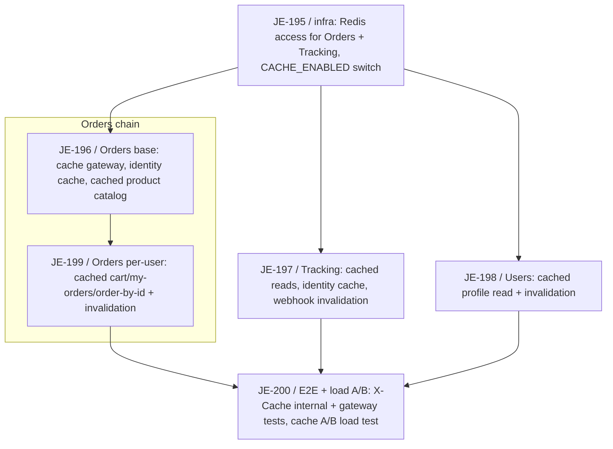

# Response Caching Layer Milestone

Logical execution plan for the **Response Caching Layer** milestone (Linear project "3MRAI
Company", team "My Personal Projects"). This note tracks the milestone's task sequence and
blocking dependencies. The detailed step-by-step plan lives in
[[2026-08-25-response-caching-layer]] (superpowers plan); the design in
[[2026-08-25-response-caching-layer-design]]. This note is the milestone-level map.

**Feature branch:** `feature/response-caching-layer`.

**Goal:** add a Redis-backed HTTP response cache across Users (Fastify), Orders (.NET Minimal
APIs), and Tracking (FastAPI), reporting `HIT`/`MISS`/`BYPASS` via an `X-Cache` response header
(contract: [[x-cache-response-header]]). Reuses the existing `infra/modules/redis` ElastiCache
deployment — no new infrastructure. Fail-open with a 50ms timeout, explicit post-commit
invalidation, and a `CACHE_ENABLED` kill switch per service.

## Logical phases

| Phase | Issues | Description |
|---|---|---|
| Infra gate | [JE-195](https://linear.app/je-martinez/issue/JE-195) | Give Orders and Tracking Redis access and add the `CACHE_ENABLED` kill switch to all three services. Nothing else can start until this merges. |
| Orders chain | [JE-196](https://linear.app/je-martinez/issue/JE-196), [JE-199](https://linear.app/je-martinez/issue/JE-199) | The fail-open cache gateway, identity cache, and cached product catalog ([JE-196](https://linear.app/je-martinez/issue/JE-196)); then the per-user cached reads and their write-path invalidation ([JE-199](https://linear.app/je-martinez/issue/JE-199)), gated on JE-196. |
| Tracking (independent) | [JE-197](https://linear.app/je-martinez/issue/JE-197) | Cache reads, add the identity cache, and invalidate from the carrier webhook — different runtime, no shared code with the Orders chain. |
| Users (independent) | [JE-198](https://linear.app/je-martinez/issue/JE-198) | Cache the profile read and invalidate it on writes — different runtime, no shared code with the Orders chain or Tracking. |
| Closing | [JE-200](https://linear.app/je-martinez/issue/JE-200) | Internal + gateway E2E for `X-Cache`, and the cache A/B load test, across all seven cached endpoints. Blocked by JE-199, JE-197, and JE-198. |

## Task sequence

| # | Issue | Task | Deliverable | Spec note |
|---|---|---|---|---|
| 1 | [JE-195](https://linear.app/je-martinez/issue/JE-195) | Give Orders and Tracking Redis access and add the `CACHE_ENABLED` switch | `REDIS_HOST`/`REDIS_PORT`/`CACHE_ENABLED` in all three generated env files, `StackExchange.Redis` and `redis-py` client deps installed | [[2026-08-25-response-caching-layer-design]] |
| 2 | [JE-196](https://linear.app/je-martinez/issue/JE-196) | Add the fail-open cache gateway, identity cache, and cached product catalog (Orders) | `CacheGateway`, `identity:sub-to-user:v1` cache, `orders:products:v1` cached `GET /v1/products` | [[2026-08-25-response-caching-layer-design]] |
| 3 | [JE-199](https://linear.app/je-martinez/issue/JE-199) | Cache the per-user reads and invalidate them on writes (Orders) | Cached `GET /v1/cart`, `GET /v1/orders/my-orders`, `GET /v1/orders/{orderId}`; `CacheInvalidator` wired into the cart and order-creation write paths | [[2026-08-25-response-caching-layer-design]] |
| 4 | [JE-197](https://linear.app/je-martinez/issue/JE-197) | Cache reads, add the identity cache, and invalidate from the carrier webhook (Tracking) | Cached `GET /v1/trackings/{order_id}` and `GET /v1/trackings`, `identity:sub-to-user:v1` cache, invalidation from `PUT /status` | [[2026-08-25-response-caching-layer-design]] |
| 5 | [JE-198](https://linear.app/je-martinez/issue/JE-198) | Cache the profile read and invalidate it on writes (Users) | Cached `GET /v1/users/me`, invalidation from `PATCH /v1/users/me` and the Cognito webhook | [[2026-08-25-response-caching-layer-design]] |
| 6 | [JE-200](https://linear.app/je-martinez/issue/JE-200) | Add internal + gateway E2E for `X-Cache` and the cache A/B load test | Three-layer test coverage across all seven cached endpoints; `CACHE_ENABLED` A/B Gatling scenario | [[2026-08-25-response-caching-layer]] |

## Dependencies

### Dependency table

| Task | Blocked by |
|---|---|
| JE-195 | — |
| JE-196 | JE-195 |
| JE-199 | JE-196 |
| JE-197 | JE-195 |
| JE-198 | JE-195 |
| JE-200 | JE-199, JE-197, JE-198 |

### Dependency diagram

[JE-195](https://linear.app/je-martinez/issue/JE-195) is the sole dependency gate: nothing else
can start until it merges. Once it does, three branches proceed **in parallel** — the Orders
chain ([JE-196](https://linear.app/je-martinez/issue/JE-196) →
[JE-199](https://linear.app/je-martinez/issue/JE-199)), Tracking
([JE-197](https://linear.app/je-martinez/issue/JE-197)), and Users
([JE-198](https://linear.app/je-martinez/issue/JE-198)). JE-197 and JE-198 are independent of
the Orders chain **and of each other**: different runtimes (FastAPI, Fastify, and .NET Minimal
APIs respectively), no shared code between them beyond the already-merged JE-195 foundation.
Only [JE-199](https://linear.app/je-martinez/issue/JE-199) has an in-branch dependency, on its
own service's [JE-196](https://linear.app/je-martinez/issue/JE-196), because the per-user cached
reads build on the `CacheGateway` that JE-196 introduces. The closing issue,
[JE-200](https://linear.app/je-martinez/issue/JE-200), is blocked by all three branches' final
issues — JE-199, JE-197, and JE-198 — since its E2E and load-test coverage spans all seven
cached endpoints across all three services.

## Stop points (batch review)

Per [[phase-c-review-flow]]:

1. **After JE-195.** Nothing else can start until it merges — this is the milestone's first
   stop point.
2. **JE-196 → JE-199, JE-197, JE-198 chained without per-merge prompts.** JE-199 is gated
   behind JE-196's merge specifically; JE-197 and JE-198 have no gate beyond JE-195 and can run
   fully in parallel with the Orders chain. Batch the resulting open PRs — JE-199, JE-197, and
   JE-198 — for one consolidated review.
3. **JE-200 is the final gate**, blocked by JE-199, JE-197, and JE-200's own — Orders,
   Tracking, and Users — all being merged before its E2E and load-test suite can exercise the
   real cached endpoints end to end.

## Key/TTL table

Reference copy of the cache-key contract from [[2026-08-25-response-caching-layer-design#Cache keys and TTLs]] — the design note is the source of truth; this table exists so the milestone map is self-contained at a glance.

| Key | TTL |
|---|---|
| `orders:products:v1` | 10 min |
| `orders:cart:v1:{sub}:{user_id}` | 60 s |
| `orders:my-orders:v1:{sub}:{user_id}:t{0\|1}` | 2 min |
| `orders:order:v1:{sub}:{user_id}:{orderId}:t{0\|1}` | 2 min |
| `tracking:order:v1:{sub}:{user_id}:{order_id}` | 60 s |
| `tracking:list:v1:{sub}:{user_id}:{hash}` | 60 s |
| `users:me:v1:{sub}:{user_id}` | 5 min |
| `identity:sub-to-user:v1:{cognito_sub}` (Orders + Tracking only) | 1 h |

## Out of scope

An account-deletion endpoint (`DELETE /v1/users/me`) with cascade to Orders and Tracking is
deferred to its own milestone. When it lands it must also invalidate the identity mapping and
the user's response-cache entries via the per-user key index — see
[[2026-08-25-response-caching-layer-design#Out of scope — account-deletion cascade]].

## Corrected premises during planning

Three premises from the original spec draft were corrected while writing the implementation
plan, each worth recording here because it changed the design:

1. **No Cognito user-deletion event.** The Cognito webhook has no user-deletion event, so the
   identity cache ([[2026-08-25-response-caching-layer-design#Fourth component — the identity-mapping cache (Orders and Tracking only)]])
   is TTL-invalidated only, not event-invalidated.
2. **No OTel metrics pipeline in any service.** No service has an OTel metrics pipeline today,
   so the cache metrics go through each service's existing CloudWatch publishers rather than
   through OTel instruments.
3. **Users has no `preHandler`/`onSend` hooks.** Users registers no `preHandler`/`onSend` hook
   today, and `@fastify/otel` nulls the active span inside `onSend` — so the Users cache
   interceptor's spans must be attached via the existing `getHttpServerSpan` helper, never
   `trace.getActiveSpan()`. See
   [[2026-08-25-response-caching-layer-design#Three components per service]].

## Related

- [[milestone-plan]] — convention this plan follows.
- [[linear-references]] — Linear reference convention.
- [[phase-c-review-flow]] — batch-review flow and dependency-gate stop points referenced above.
- [[2026-08-25-response-caching-layer-design]] — design spec: header contract, cache
  components, key/TTL table, and invalidation matrix behind this milestone's scope.
- [[2026-08-25-response-caching-layer]] — implementation plan with the detailed task-by-task
  steps.
- [[x-cache-response-header]] — the `X-Cache` response header contract this milestone
  implements across all three services.
- [[testing]] — the three-test-layer convention (unit/integration, internal E2E, gateway E2E)
  this milestone's JE-200 closes out.
