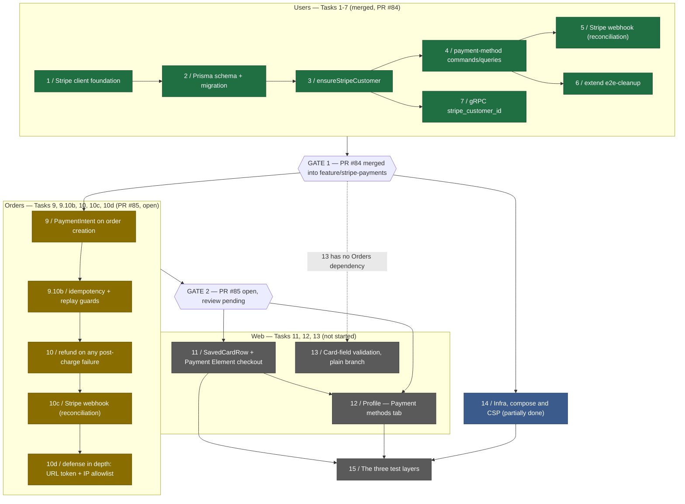

# Stripe Payments Milestone

Logical execution plan for the **Stripe Payments** milestone. This note tracks the milestone's
task sequence, blocking dependencies, PR status, and open gap backlog. The detailed step-by-step
plan lives in [[2026-09-19-stripe-payments]] (superpowers plan); the design in
[[2026-09-19-stripe-payments-design]]. This note is the milestone-level map.

> [!info] No Linear milestone yet
> No Linear milestone or issues exist for this work — task numbering below matches
> [[2026-09-19-stripe-payments]]'s task numbering directly (Tasks 1-15, including the lettered
> sub-tasks 9.10b, 10c, 10d). Once a Linear milestone and issues are proposed and confirmed, this
> note should be updated with `issue/<ID>` tags and inline Linear links per [[linear-references]].

**Feature branch:** `feature/stripe-payments`, fed by `feat/stripe-payments-users` (merged, PR
[#84](https://github.com/je-martinez/3-microservices-running-on-aws-infrastructure/pull/84)) and
`feat/stripe-payments-orders` (open, PR
[#85](https://github.com/je-martinez/3-microservices-running-on-aws-infrastructure/pull/85)).

**Goal:** turn `NG_APP_STRIPE_ENABLED` from a static UI swap into a real integration — saved
cards on Users, real off-session charges on Orders, and a Payment Element checkout flow on the
web app.

## Dependency diagram

## Status table

| Task | Description | Status | PR |
|---|---|---|---|
| 1 | Stripe client foundation in Users | DONE | [#84](https://github.com/je-martinez/3-microservices-running-on-aws-infrastructure/pull/84) |
| 2 | Prisma schema + migration for the Stripe data model | DONE | [#84](https://github.com/je-martinez/3-microservices-running-on-aws-infrastructure/pull/84) |
| 3 | `ensureStripeCustomer` (lazy creation) | DONE | [#84](https://github.com/je-martinez/3-microservices-running-on-aws-infrastructure/pull/84) |
| 4 | Users payment-method commands/queries (CQRS) | DONE | [#84](https://github.com/je-martinez/3-microservices-running-on-aws-infrastructure/pull/84) |
| 5 | Stripe webhook endpoint (reconciliation), Users | DONE | [#84](https://github.com/je-martinez/3-microservices-running-on-aws-infrastructure/pull/84) |
| 6 | Extend `e2e-cleanup` to Stripe | DONE | [#84](https://github.com/je-martinez/3-microservices-running-on-aws-infrastructure/pull/84) |
| 7 | gRPC: `stripe_customer_id` on `UserResponse` | DONE | [#84](https://github.com/je-martinez/3-microservices-running-on-aws-infrastructure/pull/84) |
| — | **GATE 1** — Users merged into `feature/stripe-payments` | PASSED | [#84](https://github.com/je-martinez/3-microservices-running-on-aws-infrastructure/pull/84) |
| 9 | Orders: PaymentIntent on order creation | DONE | [#85](https://github.com/je-martinez/3-microservices-running-on-aws-infrastructure/pull/85) |
| 9.10b | Client-supplied idempotency + replay guards | DONE | [#85](https://github.com/je-martinez/3-microservices-running-on-aws-infrastructure/pull/85) |
| 10 | Orders: refund on any post-charge failure | DONE | [#85](https://github.com/je-martinez/3-microservices-running-on-aws-infrastructure/pull/85) |
| 10c | Orders: Stripe webhook (payment reconciliation) | DONE | [#85](https://github.com/je-martinez/3-microservices-running-on-aws-infrastructure/pull/85) |
| 10d | Webhook defense in depth (URL token + IP allowlist) | DONE | [#85](https://github.com/je-martinez/3-microservices-running-on-aws-infrastructure/pull/85) |
| — | **GATE 2** — Orders → `feature/stripe-payments` | IN REVIEW | [#85](https://github.com/je-martinez/3-microservices-running-on-aws-infrastructure/pull/85) (open) |
| 11 | Web: `SavedCardRow` component + Payment Element checkout flow | NOT STARTED | — |
| 12 | Web: Profile — Payment methods tab | NOT STARTED | — |
| 13 | Card-field validation on the plain branch | NOT STARTED (no Orders dependency — may run in parallel with GATE 2) | — |
| 14 | Infra, compose and CSP | PARTIALLY DONE — env generation, `make stripe-webhook-secret`, gateway routes landed in #84/#85; CSP header, remaining `.env.example` cleanup outstanding | #84, #85 |
| 15 | The three test layers | NOT STARTED (Orders' internal + gateway E2E for the Stripe charge path is the blocking gap — see Gap backlog) | — |

**Deferred to Task 11**, not dropped: the web `NG_APP_*` build args move to the root `.env`'s
CUSTOM box per [[env-files]] (step 11.4b, currently pending), and the web checkout must send an
`Idempotency-Key` header on `POST /v1/orders` per [[2026-09-19-stripe-payments-design]] Decision
7 — Task 11 wires this, it does not exist yet.

## Gap backlog

### P1 — fixed in PR #85

1. Orders answered a wrong webhook token with `404` in a shape distinguishable from an unmapped
   route; now indistinguishable, per Decision 27 — **fixed in PR #85**.
2. A replayed idempotency key with a different request body now answers `422`
   `idempotency_key_mismatch` instead of silently reusing the cached response — **fixed in PR
   #85**.
3. An in-flight concurrent duplicate request now re-checks for the winner's order up to 3 times,
   500 ms apart, and reuses it, or answers `503` with `Retry-After`, logged WARNING
   `idempotency_key_in_flight`, instead of racing to a second charge — **fixed in PR #85**.
4. nginx no longer leaks the webhook URL token in its error log — **fixed in PR #85**.
5. This runbook ([[stripe-sandbox-setup]]) now matches the built two-process `stripe listen`
   shape instead of describing an unbuilt `stripe-cli` compose service.
6. `.env.example` carries every Stripe variable this milestone introduced, including the two URL
   tokens and the allowlist/trusted-hops pair — **fixed in PR #85**.
7. Decision 10 (local webhook delivery) is amended to describe two host-side `stripe listen`
   processes, not a compose service — see the design spec's amendment.
8. Service `CLAUDE.md` Stripe sections and Users' `generate:openapi` are updated for the new
   routes — **fixed in PR #85**.
9. The Stripe.NET API version is pinned by package version, not a per-client option — **fixed in
   PR #85** — see [[2026-09-23-stripe-net-pins-the-api-version-through-the-package]].

### P2/P3 — open, not yet fixed

- **In progress:** identity metadata on every Stripe object (Decision 12, user, 2026-09-23) — Customer,
  PaymentIntent, and Refund carry `user_id`/`cognito_sub` (plus `order_id` on Orders' objects) — is being
  implemented on branch `feat/stripe-metadata-identity`.
- **Blocking (Task 15, three-test-layers rule):** internal E2E and gateway E2E for Orders'
  `POST /v1/orders` Stripe path do not exist yet. Per [[testing]] and the repo's "a new route is
  not done when the service serves it" rule, this milestone is not done without them.
- **Doc propagation** (owed, not yet paid — see [[doc-propagation]]): add
  `[[orders-service-design]]`, `[[users-service-design]]`, `[[testing]]`, `[[logging-context]]`,
  `[[money-representation]]`, `[[local-dev]]`, and `[[env-files]]` (web `NG_APP_*` section, marked
  pending Task 11) to the design spec's `propagates-to:`, and update each target note in turn.
- **Undocumented behaviour** the spec should record but does not yet:
  - The derived order id on the client-keyed idempotent path.
  - Refund-list replay detection (Decision 7's guard against replaying an already-refunded
    PaymentIntent).
  - `charge_already_refunded` as a distinct condition.
  - Dispute `warning_closed` treated as a won dispute.
  - An orphan-refund failure inside the webhook handler answering `503`.
  - The webhook answering `503` when the API key is missing (distinct from the secret-missing
    `503` already documented).
  - `402` reasons `no_saved_payment_method` and `payment_not_completed`.
  - `app_event`s `create_order_replayed`, `payment_status_reconciled`,
    `payment_orphan_refunded_failed`, `payment_method_reconciled` — none is in Decision 25's named
    list yet.
  - `payment_intent_created` is named in Decision 25's flow-log list but is never actually
    emitted by the implementation.
- Orders' `openapi.yaml` is missing error-body shapes and descriptions for the new Stripe-backed
  responses.
- No pre-commit scan yet for `sk_`/`rk_`/`whsec_` literals in source — Decision 15 proposes
  extending the existing comment hook; unowned, not started.
- The allowlist-rejection failure mode differs between services: Users fails to boot, Orders
  answers `503`. Not yet reconciled or explicitly documented as an accepted difference.
- Charge spans are missing the `stripe.customer_id`/`stripe.payment_method_id` tags Decision 25
  specifies.
- Inconsistent naming for the one `503` code across the two services — needs a single agreed
  code name.
- An open ADR question for Decisions 15/27 — whether either graduates to a standalone ADR — is
  unresolved.
- The production trusted-proxy hop count (API Gateway HTTP API → ALB) remains an open item per
  Decision 27; must be verified at deployment time, not guessed.
- Stripe's published webhook IP list must be kept in sync over time — no reminder/automation
  exists yet.
- **14 lesson candidates not yet written:**
  1. Stripe.NET pins its API version through the package, not a per-client option (the one P1
     fix above already has its lesson — [[2026-09-23-stripe-net-pins-the-api-version-through-the-package]] — the other thirteen below remain open).
  2. Stripe's own auth-error message embeds a masked form of the API key.
  3. EF Core's change tracker can serve a pre-read entity ahead of a subsequent `FOR UPDATE`,
     masking a lock that should have blocked it.
  4. Stripe idempotency compares request parameters, and a replay is a snapshot of the first
     response — not a live re-execution.
  5. A shared test fixture's identity can pollute other test classes run in the same process.
  6. In Fastify, Nest-style middleware is not a route-scoped gate the way a guard is.
  7. A secret embedded in a URL path leaks via ASP.NET's `RequestPath` when that path is captured
     by a logging/tracing scope.
  8. ASP.NET request spans are unreliable when asserted inside a full-suite test run.
  9. A wrong-token `404` E2E case needs a mapped-route precondition to be meaningful — otherwise
     it cannot distinguish "wrong token" from "route never existed".
  10. Orders answers `401`, not `404`, for an authenticated-but-unmapped path — worth recording
      as a distinct discovery shape from Users' behaviour.
  11. Nest bootstrapped with `logger: false` exits with code 1 and no output when bootstrap
      fails — the default `abortOnError: true` logs through the now-disabled logger and exits
      before any surrounding `catch` runs. A one-shot script must pass `abortOnError: false`
      explicitly to see why bootstrap failed.
  12. A one-shot script that boots the full Nest `AppModule` (e.g. `pnpm generate:openapi`)
      hangs after finishing its own work, because `app.close()` leaves the ioredis socket
      retrying in the background. Exit explicitly with `process.exit(0)` after writing output
      instead of relying on the process to end on its own.
  13. Guard ordering can leak whether a route exists: an identity guard that runs **after**
      routing and allowlists by route pattern answers `401` for an unmapped path (the guard
      itself runs and rejects), while the handler answers `404` for a wrong webhook token (the
      guard passes, the route resolves, and only then does the handler reject) — two different
      status codes for "this request doesn't get in," distinguishable by an attacker probing
      routes. A test that always sends `x-user-id` hides this, because it never exercises the
      unauthenticated-and-unmapped case the guard-ordering gap actually produces.
  14. Stripe's `409 idempotency_error` means the same idempotency key is currently in flight on
      another request, not that the request body changed — only the `400` variant of
      `idempotency_error` means a genuine mismatch. Mapping both to the same outcome (as an
      earlier draft of this milestone's idempotency handling did) turns an ordinary concurrent
      retry into a spurious client-facing error instead of routing it through the in-flight
      wait/retry path.

## Local environment state

*(operational, dated 2026-09-23 — describes the developer machine's current state, not a durable
convention; superseded the moment the described worktree is deleted or the branch merges)*

- The nginx task currently mounts its config from the `stripe-orders` worktree
  (`.claude/worktrees/stripe-orders`). Re-apply nginx from the **main checkout** after `feature/
  stripe-payments` merges — see [[2026-09-22-terraform-side-files-are-per-checkout]] for why an
  nginx bind-mount is checkout-absolute and does not follow a worktree's deletion.
- The main checkout's `.terraform-cognito` side file is stale. Regenerate it with the Cognito
  provisioning script per [[2026-09-22-terraform-side-files-are-per-checkout]] before applying
  Terraform from the main checkout again.
- The `stripe-users` worktree (used for the now-merged Users work) is obsolete and safe to
  remove.
- The Floci gateway currently has both `{token}` webhook routes
  (`/v1/users/stripe/webhook/{token}`, `/v1/orders/stripe/webhook/{token}`) live.
- Env files (`.env.local.users`, `.env.local.orders`) carry each service's own
  `STRIPE_WEBHOOK_URL_TOKEN` and share one `STRIPE_WEBHOOK_SECRET` (`whsec_...`), per
  `make stripe-webhook-secret`'s behaviour (Decision 10 amendment, below).

## Next steps

1. Review and merge PR #85 (Orders — Tasks 9, 9.10b, 10, 10c, 10d) into `feature/stripe-payments`
   — GATE 2.
2. Re-apply nginx from the main checkout once `feature/stripe-payments` has both services merged,
   per "Local environment state" above.
3. Start Task 13 (card-field validation, plain branch) — no Orders dependency, can run now.
4. Start Task 11 (web checkout flow) once GATE 2 passes; wire the `Idempotency-Key` header and
   move `NG_APP_*` build args per step 11.4b.
5. Task 12 (profile payment methods tab) follows Task 11 (shares `SavedCardRow`).
6. Task 14's remaining pieces: CSP header on `apps/web`'s nginx config, and any `.env.example`
   entries not yet covered by the P1 fix above.
7. Task 15: write Orders' internal E2E and gateway E2E for the Stripe charge path — this is what
   currently blocks calling the milestone done, per [[testing]]'s three-layer gate.
8. Pay down the doc-propagation gap backlog above before proposing the PR that closes this
   milestone, per [[doc-propagation]].
9. Once a Linear milestone exists for this work, backfill `issue/<ID>` tags and inline links here
   per [[linear-references]] and [[milestone-plan]].

## Related

- [[milestone-plan]] — the convention this note follows (task sequence, dependency diagram, phase
  grouping); this note uses a mermaid diagram rather than a `.drawio.svg`, and a PR-linked status
  table rather than a Linear issue table, because no Linear milestone exists yet for this work.
- [[phase-c-review-flow]] — the batch-review/dependency-gate flow this milestone's GATE 1/GATE 2
  stop points follow.
- [[2026-09-19-stripe-payments-design]] — the design spec this plan implements.
- [[2026-09-19-stripe-payments]] — the detailed step-by-step implementation plan.
- [[stripe-sandbox-setup]] — the operator runbook for sandboxes, keys, and local webhook
  delivery.
- [[env-files]] — the AUTO/CUSTOM box convention governing every Stripe env var.
- [[testing]] — the three-layer test gate Task 15 exists to satisfy.
- [[git-workflow]] — the branch/PR flow this milestone's GATE 1/GATE 2 merges follow.
- [[2026-09-22-terraform-side-files-are-per-checkout]] — why the nginx bind-mount and Cognito
  side file are checkout-absolute, referenced in "Local environment state" above.
- [[2026-09-23-stripe-net-pins-the-api-version-through-the-package]] — the P1 lesson fixed in PR
  #85.
