# Tracking Go Migration Milestone

Logical execution plan for the **Tracking Go Migration** milestone. This note tracks the
milestone's task sequence and blocking dependencies. The detailed step-by-step plan lives in
[[2026-08-27-tracking-go-migration]] (superpowers plan); the design in
[[2026-08-27-tracking-go-migration-design]]. This note is the milestone-level map.

> [!info] No Linear milestone yet
> No Linear milestone or issues exist for this work yet — no issue IDs to link. The task
> numbering below (Tasks 1-28) matches [[2026-08-27-tracking-go-migration]]'s task numbering
> directly. Once the milestone and its issues are proposed and confirmed, this note should be
> updated with `issue/<ID>` tags and inline Linear links per [[linear-references]].

**Feature branch:** `feature/tracking-go-migration`.

**Goal:** rebuild the Tracking microservice in Go/Gin at `services/tracking-go/`, behaviourally
identical to the Python/FastAPI service (hexagonal architecture, see
[[ADR-0021-tracking-go-gin-sqlc-stack]]), built and run alongside the untouched Python service
against the same database, so the Python folder can be deleted once a four-part closing gate
proves equivalence.

## Logical phases

| Phase | Tasks | Description |
|---|---|---|
| Wave 0 — Foundations | 1-7 | Sequential, one agent. Project scaffold + goenv, baseline migration, the pure domain (status machine, tracking/history types, ID generation), sqlc data layer, and the `main.go` skeleton with `GET /v1/health`. Gates everything else — nothing in Wave 1 can start until this merges. |
| Wave 1 — Platform | 8-18 | Four parallel agents. Config/DSN, structured logging + request context, OpenTelemetry + CloudWatch metrics, the Redis cache gateway + identity cache, the four auth schemes, the outbound gRPC Users client, and the SQS event publisher. |
| Wave 2 — Endpoints | 19-23 | Five parallel agents. The five HTTP routes (create, the two user-scoped reads, the carrier webhook, delete + e2e-cleanup) plus the generated `openapi.yaml` comparison test. |
| Wave 2.5 — TestMode | 24 | One agent, alone. Automatic status progression, built on both Task 19 (creation) and Task 21 (the carrier webhook's shared transition function) — the only task with a two-task dependency gate. |
| Wave 3 — Verification | 25-27 | Three parallel agents. The three test layers, a measured Gatling performance comparison against the Python service, and observability parity (trace/log parity check). |
| Wave 4 — Cutover | 28 | One agent. The irreversible step: delete `services/tracking/`, gated on all four closing criteria (contract, three-layer tests, performance, observability) passing first. |

## Task sequence

| # | Task | Deliverable | Spec note |
|---|---|---|---|
| 1 | Project scaffold + goenv toolchain | `services/tracking-go/{.go-version,go.mod,Makefile,.golangci.yml}` | [[2026-08-27-tracking-go-migration]] |
| 2 | golang-migrate baseline migration | `services/tracking-go/migrations/000001_baseline.{up,down}.sql` | [[2026-08-27-tracking-go-migration]] |
| 3 | Domain — Status forward-only state machine | `internal/domain/status.go` | [[2026-08-27-tracking-go-migration]] |
| 4 | Domain — Tracking and TrackingHistory types + history ordering | `internal/domain/tracking.go` | [[2026-08-27-tracking-go-migration]] |
| 5 | Domain — ID generation (nano ID + tracking number) | `internal/domain/id.go` | [[2026-08-27-tracking-go-migration]] |
| 6 | sqlc setup + generated data layer | `sqlc.yaml`, `internal/adapter/mysql/{tags.go,queries/tracking.sql}` | [[2026-08-27-tracking-go-migration]] |
| 7 | `main.go` skeleton + `GET /v1/health` | `internal/adapter/http/{health.go,router.go}`, `cmd/server/main.go` | [[2026-08-27-tracking-go-migration]] |
| 8 | Environment configuration and the DSN converter | `internal/platform/config/{config.go,dsn.go}` | [[2026-08-27-tracking-go-migration]] |
| 9 | Structured JSON logging with `log/slog` | `internal/platform/logging/{handler.go,logger.go}` | [[logging-context]] |
| 10 | Request context propagation, request ID, and the `request completed` line | `internal/platform/logging/{context.go,context_handler.go,requestid.go}`, `internal/adapter/http/logcontext_middleware.go` | [[logging-context]] |
| 11 | OpenTelemetry wiring, workflow spans, and trace ids on log lines | `internal/adapter/otel/{provider.go,workflow.go,loghandler.go}` | [[2026-08-27-tracking-go-migration]] |
| 12 | CloudWatch metrics publisher and the periodic ticker | `internal/adapter/cloudwatch/{publisher.go,ticker.go}` | [[2026-08-27-tracking-go-migration]] |
| 13 | Cache key builders | `internal/adapter/redis/keys.go` | [[2026-08-27-tracking-go-migration]] |
| 14 | The cache gateway, the Redis client, and `X-Cache` semantics | `internal/adapter/redis/{gateway.go,client.go}` | [[2026-08-27-tracking-go-migration]] |
| 15 | Identity cache and invalidation | `internal/adapter/redis/{identity.go,invalidation.go}` | [[2026-08-27-tracking-go-migration]] |
| 16 | The four auth schemes and the two request flags | `internal/adapter/http/{auth.go,flags.go}`, `internal/domain/audit/actor.go` | [[two-api-keys-two-trust-domains]] |
| 17 | The outbound gRPC Users client | `internal/adapter/grpcusers/{client.go,target.go}`, `proto/users.proto` | [[2026-08-27-tracking-go-migration]] |
| 18 | The SQS event publisher | `internal/adapter/sqs/{publisher.go,envelope.go,emailhash.go}` | [[2026-08-27-tracking-go-migration]] |
| 19 | `POST /v1/trackings/init-tracking` — creation | `internal/app/create_tracking.go`, `internal/adapter/http/{response.go,errors.go}` | [[2026-08-27-tracking-go-migration]] |
| 20 | The two user-scoped reads | `internal/app/{get_my_tracking.go,list_my_trackings.go}` | [[2026-08-27-tracking-go-migration]] |
| 21 | `PUT /v1/trackings/{order_id}/status` — the carrier webhook | shared transition function + handler (consumed by Task 24) | [[2026-08-27-tracking-go-migration]] |
| 22 | `DELETE /v1/trackings/by-user` + `DELETE /v1/trackings/e2e-cleanup` | `internal/app/delete_by_user.go` + shared soft-delete mechanism | [[2026-08-27-tracking-go-migration]] |
| 23 | `openapi.yaml` generation + comparison test | `internal/openapi/{spec.go,allowlist.go}`, `cmd/genopenapi/main.go` | [[2026-08-27-tracking-go-migration]] |
| 24 | TestMode automatic progression | `internal/app/progression.go`, `internal/adapter/http/progression_hook.go` | [[testmode-in-process-asyncio-task]] |
| 25 | The three test layers | `internal/adapter/mysql/suite_test.go`, `docker-compose.yml` (+`tracking-go` service), nginx switch | [[testing]] |
| 26 | Performance comparison | measured Gatling comparison (`e2e/load-tests/`), vault note via `obsidian-vault` | [[2026-08-27-tracking-go-migration]] |
| 27 | Observability parity | `internal/adapter/otel/propagation_test.go`, vault note via `obsidian-vault` | [[logging-context]] |
| 28 | Delete the Python service | `git rm -r services/tracking`, nginx/Makefile/env-file updates | [[2026-08-27-tracking-go-migration]] |

## Dependencies

### Dependency table

| Task | Blocked by |
|---|---|
| 1 | — |
| 2 | 1 |
| 3 | 1 |
| 4 | 1 |
| 5 | 1 |
| 6 | 2, 3, 4, 5 |
| 7 | 6 |
| 8 | 7 |
| 9 | 7 |
| 10 | 7 |
| 11 | 7 |
| 12 | 7 |
| 13 | 7 |
| 14 | 7 |
| 15 | 7 |
| 16 | 7 |
| 17 | 7 |
| 18 | 7 |
| 19 | 8, 9, 10, 11, 12, 13, 14, 15, 16, 17, 18 |
| 20 | 8, 9, 10, 11, 12, 13, 14, 15, 16, 17, 18 |
| 21 | 8, 9, 10, 11, 12, 13, 14, 15, 16, 17, 18 |
| 22 | 8, 9, 10, 11, 12, 13, 14, 15, 16, 17, 18 |
| 23 | 8, 9, 10, 11, 12, 13, 14, 15, 16, 17, 18 |
| 24 | 19, 21 |
| 25 | 19, 20, 21, 22, 23, 24 |
| 26 | 19, 20, 21, 22, 23, 24 |
| 27 | 19, 20, 21, 22, 23, 24 |
| 28 | 25, 26, 27 |

### Dependency diagram

```mermaid
flowchart TD
    subgraph Wave0["Wave 0 — Foundations (sequential, 1 agent)"]
        T1["1 / scaffold + goenv toolchain"]
        T2["2 / golang-migrate baseline migration"]
        T3["3 / domain: status state machine"]
        T4["4 / domain: tracking + history types"]
        T5["5 / domain: ID generation"]
        T6["6 / sqlc + generated data layer"]
        T7["7 / main.go skeleton + GET /v1/health"]
        T1 --> T2
        T1 --> T3
        T1 --> T4
        T1 --> T5
        T2 --> T6
        T3 --> T6
        T4 --> T6
        T5 --> T6
        T6 --> T7
    end

    subgraph Wave1["Wave 1 — Platform (4 parallel agents)"]
        T8["8 / config + DSN converter"]
        T9["9 / structured logging"]
        T10["10 / request context + request-id"]
        T11["11 / OTel wiring + workflow spans"]
        T12["12 / CloudWatch metrics"]
        T13["13 / cache key builders"]
        T14["14 / cache gateway + Redis client"]
        T15["15 / identity cache + invalidation"]
        T16["16 / four auth schemes + flags"]
        T17["17 / outbound gRPC Users client"]
        T18["18 / SQS event publisher"]
    end

    T7 --> T8
    T7 --> T9
    T7 --> T10
    T7 --> T11
    T7 --> T12
    T7 --> T13
    T7 --> T14
    T7 --> T15
    T7 --> T16
    T7 --> T17
    T7 --> T18

    subgraph Wave2["Wave 2 — Endpoints (5 parallel agents)"]
        T19["19 / POST init-tracking — creation"]
        T20["20 / two user-scoped reads"]
        T21["21 / PUT status — carrier webhook"]
        T22["22 / DELETE by-user + e2e-cleanup"]
        T23["23 / openapi.yaml gen + comparison test"]
    end

    T8 --> T19
    T9 --> T19
    T10 --> T19
    T11 --> T19
    T12 --> T19
    T13 --> T19
    T14 --> T19
    T15 --> T19
    T16 --> T19
    T17 --> T19
    T18 --> T19

    T8 --> T20
    T9 --> T20
    T10 --> T20
    T11 --> T20
    T12 --> T20
    T13 --> T20
    T14 --> T20
    T15 --> T20
    T16 --> T20
    T17 --> T20
    T18 --> T20

    T8 --> T21
    T9 --> T21
    T10 --> T21
    T11 --> T21
    T12 --> T21
    T13 --> T21
    T14 --> T21
    T15 --> T21
    T16 --> T21
    T17 --> T21
    T18 --> T21

    T8 --> T22
    T9 --> T22
    T10 --> T22
    T11 --> T22
    T12 --> T22
    T13 --> T22
    T14 --> T22
    T15 --> T22
    T16 --> T22
    T17 --> T22
    T18 --> T22

    T8 --> T23
    T9 --> T23
    T10 --> T23
    T11 --> T23
    T12 --> T23
    T13 --> T23
    T14 --> T23
    T15 --> T23
    T16 --> T23
    T17 --> T23
    T18 --> T23

    T24["24 / TestMode automatic progression (Wave 2.5, 1 agent alone)"]
    T19 --> T24
    T21 --> T24

    subgraph Wave3["Wave 3 — Verification (3 parallel agents)"]
        T25["25 / the three test layers"]
        T26["26 / performance comparison"]
        T27["27 / observability parity"]
    end

    T19 --> T25
    T20 --> T25
    T21 --> T25
    T22 --> T25
    T23 --> T25
    T24 --> T25

    T19 --> T26
    T20 --> T26
    T21 --> T26
    T22 --> T26
    T23 --> T26
    T24 --> T26

    T19 --> T27
    T20 --> T27
    T21 --> T27
    T22 --> T27
    T23 --> T27
    T24 --> T27

    T28["28 / Wave 4 — delete the Python service (irreversible)"]
    T25 --> T28
    T26 --> T28
    T27 --> T28
```

**Wave 0** is fully sequential and owned by a single agent, because Tasks 2-5 all depend on
Task 1's scaffold, and Task 6 (the generated data layer) needs the migration (2) and every
domain type (3, 4, 5) to exist before it can generate code against them; Task 7's skeleton
needs Task 6's data layer wired in. This wave gates everything downstream — no Wave 1 task can
start until Task 7 merges.

**Wave 1** fans out to four parallel agents once Task 7 merges: each of Tasks 8-18 touches a
distinct platform concern (config, logging, tracing/metrics, caching, auth, the gRPC client,
the SQS publisher) with no shared code between them beyond the Wave 0 foundation.

**Wave 2** fans out to five parallel agents once the full Wave 1 platform is merged: each of
Tasks 19-23 is a distinct HTTP route (or the openapi comparison test) that consumes the
platform layer but not each other — except that Task 21 deliberately owns the reusable
transition function Task 24 will later consume, per [[2026-08-27-tracking-go-migration#Task 21: PUT /v1/trackings/{order_id}/status — the carrier webhook]].

**Wave 2.5** is a single task run alone, not in parallel with anything else in its wave,
because Task 24 (TestMode) has a genuine two-task dependency gate: it needs both Task 19 (the
creation endpoint whose response triggers the progression hook) and Task 21 (the carrier
webhook's shared transition function, reused so TestMode and the carrier can never disagree
about what a transition means).

**Wave 3** fans out to three parallel agents once all of Wave 2 (including Task 24) is merged:
the three test layers, the performance comparison, and the observability parity check are
independent verification concerns that all read the same finished service without touching
each other's files.

**Wave 4** is the single closing task, gated on all three Wave 3 verification tasks passing —
per [[2026-08-27-tracking-go-migration#Task 28: delete the Python service]], the four closing
criteria (contract, three-layer tests, performance, observability) must all be green before the
irreversible `git rm -r services/tracking` runs.

## Stop points (batch review)

Per [[phase-c-review-flow]]:

1. **Wave 0 is the first stop point.** Tasks 1-7 run sequentially on one agent/branch; batch
   the resulting PR for review before Wave 1 can start — nothing in Wave 1 has anywhere to
   attach until Task 7 merges.
2. **Wave 1 chained without per-merge prompts, then batched.** Tasks 8-18 run on four parallel
   agents with no cross-dependencies; batch all resulting PRs for one review before Wave 2
   starts, since every Wave 2 task needs the full platform layer merged.
3. **Wave 2 chained without per-merge prompts, then batched — except Task 24's gate.** Tasks
   19-23 run on five parallel agents; Task 24 (Wave 2.5) cannot start until Task 19 **and**
   Task 21 specifically are merged, so it is a dependency gate within this stop point even
   though the rest of Wave 2 is not blocking it.
4. **Wave 3 chained without per-merge prompts, then batched.** Tasks 25-27 run on three
   parallel agents once all of Wave 2 (through Task 24) is merged; batch all three PRs for one
   review.
5. **Wave 4 (Task 28) is the final gate and the irreversible step.** It does not start until
   Tasks 25, 26, and 27 are all merged and its own four closing criteria are independently
   verified — per [[2026-08-27-tracking-go-migration-design]], this is a **spec said so, review
   the diff against it** case: the closing gate is a checklist, and every item on it must be
   confirmed against the actual diff, not assumed from a green test run alone (see
   [[2026-08-26-spec-said-so-review-checked-the-diff-not-the-spec]]).

## Related

- [[milestone-plan]] — convention this plan follows.
- [[linear-references]] — Linear reference convention (not yet applicable — no milestone/issues
  created).
- [[phase-c-review-flow]] — batch-review flow and dependency-gate stop points referenced above.
- [[2026-08-27-tracking-go-migration-design]] — design spec: hexagonal architecture, the
  wire-contract invariants, and the four-part closing gate behind this milestone's scope.
- [[2026-08-27-tracking-go-migration]] — implementation plan with the detailed task-by-task
  steps (28 tasks across 6 waves) this milestone map summarizes.
- [[ADR-0021-tracking-go-gin-sqlc-stack]] — the stack decision (Gin + sqlc + golang-migrate)
  the whole milestone builds against.
- [[testing]] — the three-layer test convention Task 25 closes out for the new service.
