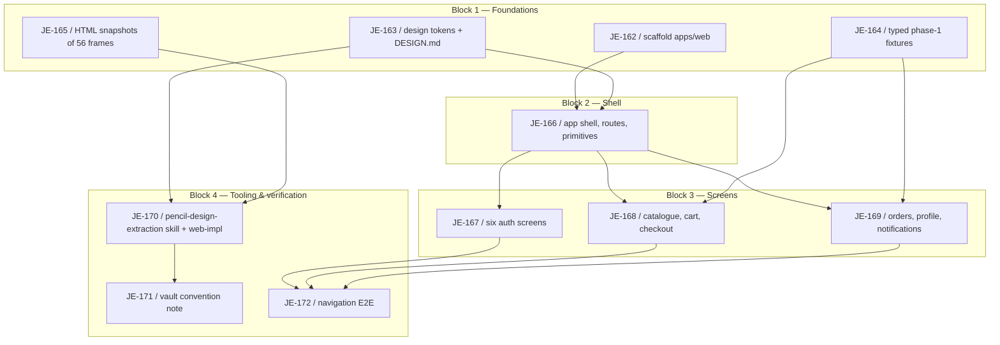

# Web App Foundation Milestone

Logical execution plan for the [Web App Foundation](https://linear.app/je-martinez/project/3mrai-company-da39253a1d6f) milestone: task sequence, phases, and the blocking dependency graph. The detailed step-by-step plan lives in [[2026-08-18-web-app-foundation]] (superpowers plan); the design in [[2026-08-17-web-app-foundation-design]]. This note is the milestone-level map.

> [!warning] Milestone in progress
> Work is underway on `feature/web-app-foundation`. JE-162 and JE-163 are implemented and reviewed but **not yet committed** — nothing on this branch is merged. See [[linear-references]] — the vault references Linear via tags and links, it never mirrors issue status.

**Goal:** build `apps/web/` — an Angular + NgRx + Tailwind application where all 18 designed screens (36 frames, desktop + mobile) are laid out and reachable by routing — plus the `pencil-design-extraction` skill, the `web-impl` agent, and the convention note that make the design reproducible. **Phase 1 builds screens, not behaviour:** no gateway calls, no NgRx effects issuing HTTP, auth structured but not wired.

## Logical phases

| Block | Issues | Description |
|---|---|---|
| Block 1 — Foundations | JE-162–JE-165 | Angular 21 + Tailwind 4 + env-config scaffold, the 26 design tokens distilled into `DESIGN.md`, typed phase-1 fixtures from the service contracts, and committed HTML snapshots of the 56 design frames. Independent of each other. |
| Block 2 — Shell | JE-166 | App shell, route map, and shared UI primitives — the vocabulary every screen issue composes. |
| Block 3 — Screens | JE-167–JE-169 | The 18 designed screens laid out across three issues (auth; catalogue/cart/checkout; orders/profile/notifications), independent of each other once Block 2 lands. |
| Block 4 — Tooling & verification | JE-170–JE-172 | The `pencil-design-extraction` skill + `web-impl` agent, the vault convention note recording the extraction rules, and navigation E2E covering every phase-1 route. |

## Task sequence

| # | Issue | Task | Deliverable | Spec note |
|---|---|---|---|---|
| 1 | [JE-162](https://linear.app/je-martinez/issue/JE-162) | Scaffold `apps/web` | Angular 21 + Tailwind 4 + env config (`@ngx-env/builder`) app skeleton | [[2026-08-17-web-app-foundation-design]] |
| 2 | [JE-163](https://linear.app/je-martinez/issue/JE-163) | Distil `web-app.pen` into design tokens and `DESIGN.md` | 26 Tailwind `@theme` tokens read via Pencil MCP `GetVariables()`, `apps/web/DESIGN.md` | [[2026-08-17-web-app-foundation-design]] |
| 3 | [JE-164](https://linear.app/je-martinez/issue/JE-164) | Typed phase-1 fixtures from the service contracts | Fixture data typed against the Users/Orders/Tracking `openapi.yaml` contracts | [[2026-08-17-web-app-foundation-design]] |
| 4 | [JE-165](https://linear.app/je-martinez/issue/JE-165) | Commit HTML snapshots of the 56 design frames | `apps/web/design/exports/<screen>.html` — reference only, never imported by production code | [[2026-08-17-web-app-foundation-design]] |
| 5 | [JE-166](https://linear.app/je-martinez/issue/JE-166) | App shell, route map and shared UI primitives | Route map covering all phase-1 screens, shared components (buttons, inputs, cards) built off the Block 1 tokens | [[2026-08-17-web-app-foundation-design]] |
| 6 | [JE-167](https://linear.app/je-martinez/issue/JE-167) | Lay out the six auth screens | Sign-up, sign-in, forced password reset, and related auth frames, both breakpoints | [[2026-08-17-web-app-foundation-design]] |
| 7 | [JE-168](https://linear.app/je-martinez/issue/JE-168) | Catalogue, cart drawer and checkout layout | Product catalogue, cart-as-overlay, and both checkout paths (Stripe behind `NG_APP_STRIPE_ENABLED`, neither submitting) | [[2026-08-17-web-app-foundation-design]] |
| 8 | [JE-169](https://linear.app/je-martinez/issue/JE-169) | Orders, profile and notification screens | Order history/detail, profile, and notifications-as-overlay screens | [[2026-08-17-web-app-foundation-design]] |
| 9 | [JE-170](https://linear.app/je-martinez/issue/JE-170) | `pencil-design-extraction` skill and the `web-impl` agent | New skill + agent turning Pencil frames into Angular components per the D1–D8 decisions | [[2026-08-17-web-app-foundation-design]] |
| 10 | [JE-171](https://linear.app/je-martinez/issue/JE-171) | Record the Pencil design-extraction convention | New note under `docs/shared/conventions/` | [[2026-08-17-web-app-foundation-design]] |
| 11 | [JE-172](https://linear.app/je-martinez/issue/JE-172) | Navigation E2E covering every phase-1 route | Playwright suite asserting every route in the Block 2 route map is reachable | [[2026-08-17-web-app-foundation-design]] |

## Dependencies

### Dependency table

| Task | Blocked by |
|---|---|
| JE-162 | — |
| JE-163 | — |
| JE-164 | — |
| JE-165 | — |
| JE-166 | JE-162, JE-163 |
| JE-167 | JE-166 |
| JE-168 | JE-166, JE-164 |
| JE-169 | JE-166, JE-164 |
| JE-170 | JE-163, JE-165 |
| JE-171 | JE-170 |
| JE-172 | JE-167, JE-168, JE-169 |

### Dependency diagram

Block 1's four issues are independent Terraform-of-the-frontend groundwork: the Angular scaffold (JE-162), the token distillation (JE-163), typed fixtures (JE-164), and the HTML snapshots (JE-165) can run in any order relative to each other. Block 2 (JE-166) needs both the scaffold and the tokens before an app shell and shared primitives can exist. Block 3's three screen issues (JE-167, JE-168, JE-169) all compose the Block 2 shell; JE-168 and JE-169 additionally need the Block 1 fixtures for their catalogue/order data. Block 4 is split: the skill and agent (JE-170) depend on the tokens (JE-163) and the committed snapshots (JE-165) — both are inputs the extraction workflow reads — while the convention note (JE-171) documents what JE-170 built, and the navigation E2E (JE-172) is gated on all three screen issues landing, since it asserts every phase-1 route is reachable.

## Stop points (batch review)

Per [[phase-c-review-flow]], this milestone has three stop points, matching the block boundaries:

1. **Block 1 → Block 2.** Tokens and fixtures are the vocabulary every later issue consumes — a rename afterwards means touching every component. JE-166 cannot start meaningfully until the scaffold and tokens are reviewed.
2. **Block 2 → Block 3.** The three screen issues (JE-167, JE-168, JE-169) all compose the shell and shared primitives JE-166 delivers; they are batched for review together once built.
3. **Block 3 → Block 4.** The final batch — skill/agent, convention note, and navigation E2E — is reviewed together as the milestone's closing set.

## Outcome

> [!info] Not yet closed
> This section will be completed once the milestone's issues are implemented and merged. As of 2026-08-18, only JE-162 and JE-163 have implementation work done (uncommitted, on `feature/web-app-foundation`); no PRs have been opened.

## Related

- [[milestone-plan]] — convention this plan follows.
- [[linear-references]] — Linear reference convention.
- [[phase-c-review-flow]] — batch-review flow and dependency-gate stop points referenced above.
- [[2026-08-18-web-app-foundation]] — the implementation plan with detailed task steps.
- [[2026-08-17-web-app-foundation-design]] — the design spec specifying each deliverable.
