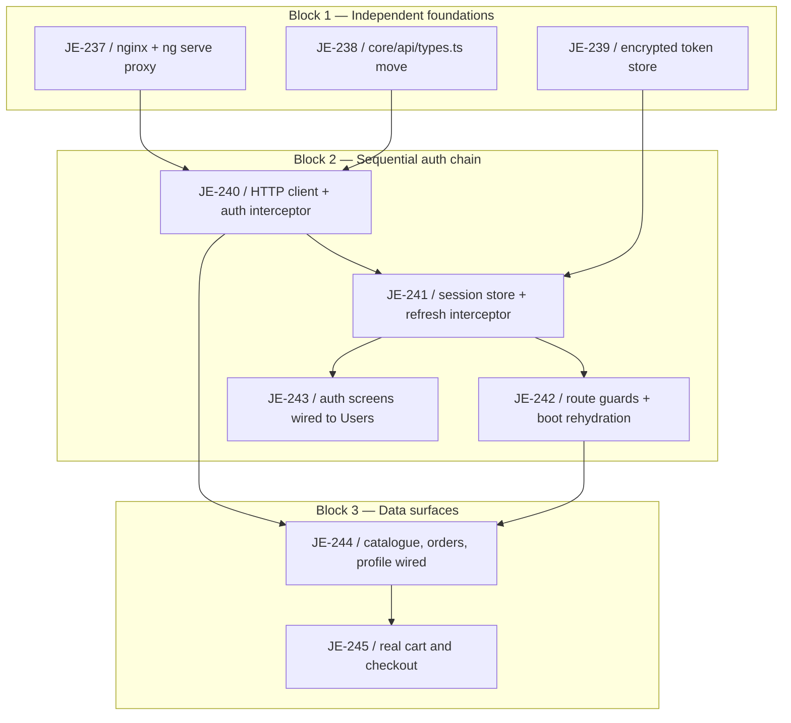

# Web Gateway Integration Milestone

Logical execution plan for the **Web Gateway Integration** milestone: task sequence, phases,
and the blocking dependency graph. The detailed design lives in
[[2026-09-04-web-gateway-integration-design]] (superpowers spec). This note is the
milestone-level map, per [[milestone-plan]].

> [!warning] Implemented and committed, PR not yet open — stacked on an unmerged branch
> All 9 issues (JE-237 through JE-245) are implemented, one commit each, on
> `feature/web-gateway-integration`, cut from `feature/web-app-foundation` (not `main` — this
> milestone continues phase 1, not a fresh branch). [PR #76](https://github.com/je-martinez/3-microservices-running-on-aws-infrastructure/pull/76)
> for `feature/web-app-foundation` → `main` is still **open**, so this branch's own PR
> (`feature/web-gateway-integration` → `feature/web-app-foundation`) depends on #76 merging
> first — it cannot be opened against a moving base in the meantime. **Nothing from this
> milestone is merged yet.** A tenth issue, JE-246, was filed as a **backend bug** found during
> implementation rather than implemented here — see the Outcome section. See
> [[linear-references]] — the vault references Linear via tags and links, it never mirrors
> issue status.

**Goal:** replace phase 1's 100%-fixture `apps/web/` with real API Gateway calls: a same-origin
nginx/`ng serve` proxy (not CORS), an encrypted-IndexedDB token store, a deduped refresh
interceptor, route guards, and a server-backed cart — without redesigning any of the 18 screens
phase 1 laid out.

## Logical phases

| Block | Issues | Description |
|---|---|---|
| Block 1 — Independent foundations | JE-237, JE-238, JE-239 | Gateway proxy wiring (nginx + `ng serve` + `NG_APP_API_GATEWAY_URL` + `make env-file`), the `core/api/types.ts` move plus `CartDto`/`Money`, and the encrypted IndexedDB token store. Independent of each other. |
| Block 2 — Sequential auth chain | JE-240 → JE-241 → JE-242 + JE-243 | HTTP client + auth interceptor, then the session store + deduped refresh interceptor, then route guards/boot rehydration and the auth screens wired to Users (JE-242, JE-243 both build on JE-241 and can run in parallel once it lands). |
| Block 3 — Data surfaces | JE-244 → JE-245 | Catalogue/orders/profile wired with fixtures deleted, then the real server-backed cart and checkout. |

## Task sequence

| # | Issue | Task | Deliverable | Spec note |
|---|---|---|---|---|
| 1 | [JE-237](https://linear.app/je-martinez/issue/JE-237) | nginx + `ng serve` proxy wiring | `apps/web/nginx.conf` as an envsubst template, `apps/web/proxy.conf.mjs` (gitignored, originally JSON — converted to an ES module 2026-09-07) + `apps/web/proxy.conf.example.mjs` (committed contract), `NG_APP_API_GATEWAY_URL`, `make env-file` wiring | [[2026-09-04-web-gateway-integration-design]] |
| 2 | [JE-238](https://linear.app/je-martinez/issue/JE-238) | `core/api/types.ts` move + extension | `fixtures/api-types.ts` moved to `core/api/types.ts`, extended with `CartDto`, `CartLineDto`, `Money` | [[2026-09-04-web-gateway-integration-design]] |
| 3 | [JE-239](https://linear.app/je-martinez/issue/JE-239) | Encrypted token store | `core/auth/token-store.ts` — AES-GCM with a non-extractable `CryptoKey` in IndexedDB | [[2026-09-04-web-gateway-integration-design]] |
| 4 | [JE-240](https://linear.app/je-martinez/issue/JE-240) | HTTP client + auth interceptor | `core/http/api-client.ts`, `core/auth/auth-interceptor.ts` — needs 1, 2 | [[2026-09-04-web-gateway-integration-design]] |
| 5 | [JE-241](https://linear.app/je-martinez/issue/JE-241) | Session store + refresh interceptor | `core/auth/session-store.ts`, `core/auth/refresh-interceptor.ts` sharing one in-flight refresh across concurrent 401s — needs 3, 4 | [[2026-09-04-web-gateway-integration-design]] |
| 6 | [JE-242](https://linear.app/je-martinez/issue/JE-242) | Route guards + boot rehydration | `core/auth/guards.ts` (`authGuard`, `guestGuard`), async rehydration awaited before a route decision — needs 5 | [[2026-09-04-web-gateway-integration-design]] |
| 7 | [JE-243](https://linear.app/je-martinez/issue/JE-243) | Auth screens wired to Users | Password, OTP, and reset screens calling the real Users API — needs 5 | [[2026-09-04-web-gateway-integration-design]] |
| 8 | [JE-244](https://linear.app/je-martinez/issue/JE-244) | Catalogue, orders, profile wired; fixtures deleted | `core/api/*.ts` domain services; `catalogue.fixture.ts`, `orders.fixture.ts`, `user.fixture.ts` deleted (`notifications.fixture.ts` stays, marked `CONTRACT:`) — needs 4, 6 | [[2026-09-04-web-gateway-integration-design]] |
| 9 | [JE-245](https://linear.app/je-martinez/issue/JE-245) | Real cart and checkout | `GET`/`PUT`/`DELETE /v1/cart` wired into `cart-drawer.ts`, serialized mutations — needs 8 | [[2026-09-04-web-gateway-integration-design]] |

Issues 1–3 (JE-237, JE-238, JE-239) are independent and parallelizable; from JE-240 onward the
chain is sequential, with JE-242 and JE-243 branching in parallel off JE-241.

## Dependencies

### Dependency table

| Task | Blocked by |
|---|---|
| JE-237 | — |
| JE-238 | — |
| JE-239 | — |
| JE-240 | JE-237, JE-238 |
| JE-241 | JE-239, JE-240 |
| JE-242 | JE-241 |
| JE-243 | JE-241 |
| JE-244 | JE-240, JE-242 |
| JE-245 | JE-244 |

### Dependency diagram

Block 1's three issues are independent groundwork: the gateway proxy (JE-237), the type move
(JE-238), and the encrypted token store (JE-239) can run in any order relative to each other.
Block 2 is a sequential chain — the HTTP client (JE-240) needs the proxy and the types; the
session store and refresh interceptor (JE-241) need both the token store and the HTTP client;
route guards (JE-242) and the auth screens (JE-243) both build on the session store and can
proceed in parallel once JE-241 lands. Block 3 needs the HTTP client and the guards before
wiring the remaining screens (JE-244), and the real cart (JE-245) is the last issue, needing
JE-244's wired API services.

## Stop points (batch review)

Per [[phase-c-review-flow]], this milestone has two stop points, matching the block boundaries:

1. **Block 1 → Block 2.** The proxy wiring, the type move, and the token store are the
   foundation every later issue builds on — JE-240 cannot start meaningfully until all three
   land.
2. **Block 2 → Block 3.** JE-242 and JE-243 both depend on JE-241's session store and refresh
   interceptor; once both land, they are batched for review together before Block 3's screens
   and cart wiring proceed.

## What each issue delivered

- **JE-237** — resolved the `$default` literal trap in `proxy_pass` (percent-encoded as
  `%24default`; every other escape attempt fails against a real nginx), the resolver pattern for
  per-request Docker DNS, and the container-vs-host Floci address split.
- **JE-238** — `core/api/types.ts` now carries `CartDto`, `CartLineDto`, and `Money`
  (`{cents, amount, formatted, currency}`), read directly per [[money-representation]] rather
  than re-rounded client-side.
- **JE-239** — the `CryptoKey` is generated `extractable: false` and stored in IndexedDB; key
  bytes are never readable from JS, blocking storage scraping and devtools dumps (not an active
  XSS calling `decrypt()` in-page — no SPA design stops that).
- **JE-240** — `provideHttpClient(withInterceptors(...))` plus a typed `ApiError`; the auth
  interceptor skips public routes (`login`, `register`, `refresh`, `otp/*`, `password/forgot`,
  `password/confirm`).
- **JE-241** — the refresh interceptor shares one in-flight refresh across concurrent 401s
  (`shareReplay`); `/v1/users/refresh` returns only `idToken` + `accessToken` and does not
  rotate the refresh token.
- **JE-242** — `authGuard` awaits IndexedDB rehydration before deciding; `guestGuard` bounces an
  authenticated user away from `/login`.
- **JE-243** — password, OTP, and reset screens now call the real Users endpoints.
- **JE-244** — catalogue, orders, and profile screens wired to their real APIs;
  `catalogue.fixture.ts`, `orders.fixture.ts`, `user.fixture.ts` deleted.
- **JE-245** — `cart-drawer.ts` is server-backed (`GET`/`PUT`/`DELETE /v1/cart`); mutations are
  serialized in the store since `PUT` replaces the whole cart.

## Verification totals

- **175 Vitest** unit tests (refresh interceptor including the concurrent case, encrypted token
  store, guards, and the rest of the new `core/` surface).
- **16 Playwright E2E specs** in `e2e/tests/web/` (real login through the gateway, session
  surviving a reload, eviction on expiry), **32 runs under `--repeat-each=2`, zero flakes**.
- Typecheck, lint, and build all clean.
- Vault validator green.

## Outcome

> [!info] JE-246 filed as a backend bug, not implemented on this branch
> A backend defect surfaced during implementation was filed as **JE-246** rather than fixed
> here — this milestone's scope is the web app, not the services it calls. See
> [[2026-09-04-web-gateway-integration-design]] for what phase 2 covers; JE-246 is tracked and
> resolved independently in Linear per [[linear-references]].

> [!warning] Not yet mergeable — dependency on PR #76
> As of 2026-09-04, all 9 issues are implemented and committed on
> `feature/web-gateway-integration`. [PR #76](https://github.com/je-martinez/3-microservices-running-on-aws-infrastructure/pull/76)
> (`feature/web-app-foundation` → `main`) is still open; this branch's own PR depends on #76
> merging first, since it is stacked on top of it. This section will be completed once both
> PRs merge.

## Related

- [[milestone-plan]] — convention this plan follows.
- [[linear-references]] — Linear reference convention.
- [[phase-c-review-flow]] — batch-review flow and dependency-gate stop points referenced above.
- [[2026-09-04-web-gateway-integration-design]] — the design spec specifying each deliverable.
- [[web-app-foundation-milestone]] — the phase-1 milestone this one continues, and the branch
  it is stacked on.
- [[testing]] — the three-layer testing convention adapted for the web app's Vitest + gateway
  Playwright specs.
- [[angular-component-authoring]] — component conventions the new `core/` code follows.
- [[env-files]] — `.env.local.web` and `apps/web/proxy.conf.mjs` generation this milestone
  established (the proxy started as JSON, converted to an ES module 2026-09-07 by
  [[2026-09-06-address-geocoding-proxy-design]]).
- [[2026-09-06-address-geocoding-proxy-design]] — converted this milestone's `ng serve` proxy
  from JSON to an ES module to serve `/geocode/` alongside `/v1`.
