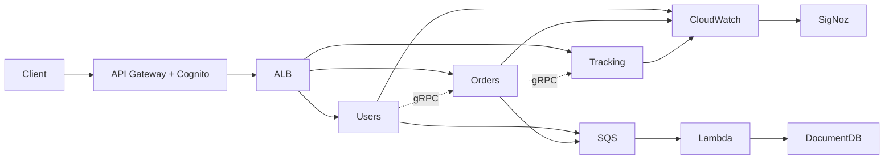

# 3MRAI Documentation Vault Implementation Plan

> **For agentic workers:** REQUIRED SUB-SKILL: Use superpowers:subagent-driven-development (recommended) or superpowers:executing-plans to implement this plan task-by-task. Steps use checkbox (`- [ ]`) syntax for tracking.

**Goal:** Build the Obsidian documentation vault under `docs/` for the 3MRAI project — folder skeleton, templates, cross-cutting notes, ADRs, four service specs, infrastructure docs, and Bases.

**Architecture:** Hybrid domain+type layout. Cross-cutting rules live once in `shared/` and are referenced by wikilink from service specs. ADRs are global and numbered in `shared/decisions/`. Navigation via a root MOC + Obsidian Bases. This is a documentation deliverable: "tests" are structural validations (valid YAML frontmatter, no broken wikilinks among seeded notes, Bases load).

**Tech Stack:** Obsidian (Markdown + YAML frontmatter, wikilinks, Mermaid, Bases `.base` YAML). No application code.

## Global Constraints

- Vault root is `docs/` (existing Obsidian vault — has `.obsidian/`).
- Node is pinned by `.nvmrc` (24.18.0). Run `nvm use` before any Node command (e.g. `nvm use && node scripts/validate-vault.mjs`).
- Content language: **English**.
- Date for all `created`/`updated` frontmatter and dated filenames: **2026-06-26**.
- Filenames: evergreen notes `kebab-case.md`; ADRs `ADR-NNNN-title-kebab.md`; dated notes `YYYY-MM-DD-short-title.md`.
- Every note has YAML frontmatter with: `title`, `type`, `area`, `status`, `created`, `updated`, `tags`, and (where applicable) `related`.
- `type` ∈ {spec, adr, runbook, convention, pattern, lesson, retro, plan}. `area` ∈ {users, orders, tracking, events-pipeline, infra, shared}. `status` ∈ {draft, active, accepted, superseded}.
- Tags are folder-style: `area/<x>`, `type/<x>`, `status/<x>`.
- Cross-cutting rules are defined once in `shared/` and linked — never duplicated in service specs.
- Each note ends with a `## Related` section listing outgoing wikilinks.
- Source of truth for all technical content: `first-prompt-en.md`.

## File Structure

Folders (created in Task 1):
```
docs/00-overview/ docs/domains/{users,orders,tracking,events-pipeline}/{specs,decisions,runbooks,testing}/
docs/infrastructure/{specs,decisions,runbooks}/ docs/shared/{decisions,patterns,conventions,observability}/
docs/lessons/ docs/retros/ docs/ideas/ docs/plans/archive/ docs/templates/
```

Validation helper (created in Task 1, used after every task): `scripts/validate-vault.mjs`.

---

### Task 1: Folder skeleton + validation script + cleanup

**Files:**
- Create (dirs): all folders listed in File Structure above
- Create: `scripts/validate-vault.mjs`
- Delete: `docs/Welcome.md`
- Modify: `README.md` (replace default with vault navigation guide)
- Create: `docs/.gitkeep` files where needed so empty folders are tracked

**Interfaces:**
- Produces: `node scripts/validate-vault.mjs` — exits 0 if every `.md` under `docs/` (excluding `.obsidian/`) has frontmatter with required keys and no wikilink points to a missing note; exits 1 and prints offenders otherwise. Later tasks run this as their test.

- [ ] **Step 1: Create the folder skeleton**

```bash
mkdir -p docs/00-overview \
  docs/domains/users/{specs,decisions,runbooks,testing} \
  docs/domains/orders/{specs,decisions,runbooks,testing} \
  docs/domains/tracking/{specs,decisions,runbooks,testing} \
  docs/domains/events-pipeline/{specs,decisions,runbooks,testing} \
  docs/infrastructure/{specs,decisions,runbooks} \
  docs/shared/{decisions,patterns,conventions,observability} \
  docs/lessons docs/retros docs/ideas docs/plans/archive docs/templates
# keep empty folders in git
find docs -type d -empty -exec touch {}/.gitkeep \;
```

- [ ] **Step 2: Write the validation script**

```javascript
// scripts/validate-vault.mjs
// Validates every markdown note under docs/ (excluding .obsidian, superpowers/).
// Checks: (1) YAML frontmatter present with required keys; (2) every [[wikilink]]
// resolves to an existing note basename. Exits 1 with a report on any failure.
import { readdirSync, readFileSync, statSync } from "node:fs";
import { join, basename, extname } from "node:path";

const ROOT = "docs";
const SKIP = new Set([".obsidian", "superpowers", ".trash"]);
const REQUIRED = ["title", "type", "area", "status", "created", "updated", "tags"];

function walk(dir) {
  const out = [];
  for (const entry of readdirSync(dir)) {
    if (SKIP.has(entry)) continue;
    const p = join(dir, entry);
    if (statSync(p).isDirectory()) out.push(...walk(p));
    else if (extname(p) === ".md") out.push(p);
  }
  return out;
}

function frontmatter(text) {
  const m = text.match(/^---\n([\s\S]*?)\n---/);
  if (!m) return null;
  const obj = {};
  for (const line of m[1].split("\n")) {
    const mm = line.match(/^([A-Za-z_-]+):\s*(.*)$/);
    if (mm) obj[mm[1]] = mm[2];
  }
  return obj;
}

const files = walk(ROOT);
const noteNames = new Set(files.map((f) => basename(f, ".md")));
const errors = [];

for (const f of files) {
  const text = readFileSync(f, "utf8");
  const fm = frontmatter(text);
  if (!fm) { errors.push(`${f}: missing frontmatter`); continue; }
  for (const k of REQUIRED) {
    if (!(k in fm)) errors.push(`${f}: missing frontmatter key '${k}'`);
  }
  for (const link of text.matchAll(/\[\[([^\]|#]+)(?:[|#][^\]]*)?\]\]/g)) {
    const target = link[1].trim();
    if (!noteNames.has(target)) errors.push(`${f}: broken wikilink [[${target}]]`);
  }
}

if (errors.length) {
  console.error(`Vault validation FAILED (${errors.length}):`);
  for (const e of errors) console.error("  " + e);
  process.exit(1);
}
console.log(`Vault validation passed: ${files.length} notes OK.`);
```

- [ ] **Step 3: Delete the default Welcome note**

```bash
git rm docs/Welcome.md
```

- [ ] **Step 4: Replace the root README with a navigation guide**

```markdown
# 3 Microservices Running on AWS Infrastructure (3MRAI)

Project knowledge base. The documentation lives in the Obsidian vault at [`docs/`](docs/).

## Start here
- [`docs/00-overview/index.md`](docs/00-overview/index.md) — root map of content
- [`docs/00-overview/architecture.md`](docs/00-overview/architecture.md) — global architecture
- [`docs/shared/decisions/`](docs/shared/decisions/) — architecture decision records (ADRs)

## Layout
- `docs/domains/` — one folder per service: users, orders, tracking, events-pipeline
- `docs/infrastructure/` — Terraform, networking, AWS resources
- `docs/shared/` — cross-cutting conventions, patterns, observability, ADRs
- `docs/templates/` — note templates
- `docs/superpowers/` — design specs & implementation plans for this documentation effort

## Validate
`nvm use && node scripts/validate-vault.mjs` — checks frontmatter and wikilinks.
```

- [ ] **Step 5: Run validation (no notes yet → trivially passes)**

Run: `nvm use && node scripts/validate-vault.mjs`
Expected: `Vault validation passed: 0 notes OK.` (the validator skips `superpowers/`)

- [ ] **Step 6: Commit**

```bash
git add docs README.md scripts/validate-vault.mjs
git commit -m "chore: scaffold docs vault skeleton and validation script"
```

---

### Task 2: Note templates

**Files:**
- Create: `docs/templates/spec-template.md`, `adr-template.md`, `runbook-template.md`, `convention-template.md`, `pattern-template.md`, `lesson-template.md`, `retro-template.md`, `plan-template.md`

**Interfaces:**
- Produces: the canonical frontmatter shape every later note copies. ADR template defines fields `id`, `deciders`, `supersedes`, `superseded-by`. Runbook template defines `integration-status`, `verified-on`, `verified-by`.

- [ ] **Step 1: Write `spec-template.md`**

```markdown
---
title: <Title>
type: spec
area: <users|orders|tracking|events-pipeline|infra|shared>
status: draft
created: 2026-06-26
updated: 2026-06-26
tags: [type/spec, area/<x>, status/draft]
related: []
---

# <Title>

## Summary

## Stack & Data Store

## API / Endpoints

## gRPC Methods

## Data Model

## Events

## Cross-cutting rules

## Related
```

- [ ] **Step 2: Write `adr-template.md`**

```markdown
---
title: <ADR-NNNN: Title>
type: adr
area: shared
status: accepted
id: ADR-NNNN
created: 2026-06-26
updated: 2026-06-26
deciders: [Jose E. Martinez]
supersedes: null
superseded-by: null
tags: [type/adr, area/shared, status/accepted]
related: []
---

# ADR-NNNN: <Title>

## Context

## Decision

## Consequences

## Related
```

- [ ] **Step 3: Write `runbook-template.md`**

```markdown
---
title: <Title>
type: runbook
area: <x>
status: active
created: 2026-06-26
updated: 2026-06-26
integration-status: n/a
verified-on: null
verified-by: null
tags: [type/runbook, area/<x>, status/active]
related: []
---

# <Title>

## When to run this

## Steps

## Verification

## Related
```

- [ ] **Step 4: Write the remaining four templates**

`convention-template.md` (type: convention), `pattern-template.md` (type: pattern), `lesson-template.md` (type: lesson, adds `tags: [..., severity/<low|medium|high>]`), `retro-template.md` (type: retro), `plan-template.md` (type: plan). Each has frontmatter matching the Global Constraints plus a minimal body (`# <Title>` + `## Related`). Concretely, `convention-template.md`:

```markdown
---
title: <Title>
type: convention
area: shared
status: active
created: 2026-06-26
updated: 2026-06-26
tags: [type/convention, area/shared, status/active]
related: []
---

# <Title>

## Rule

## Rationale

## Related
```

`pattern-template.md` is identical with `type: pattern`, `tags: [type/pattern, ...]`, and body sections `## Pattern` / `## How we apply it` / `## Related`. `lesson-template.md`: `type: lesson`, `tags: [type/lesson, area/<x>, status/active, severity/<low|medium|high>]`, body `## What happened` / `## Lesson` / `## Related`. `retro-template.md`: `type: retro`, body `## What went well` / `## What to improve` / `## Actions` / `## Related`. `plan-template.md`: `type: plan`, body `## Goal` / `## Tasks` / `## Related`.

- [ ] **Step 5: Validate**

Run: `nvm use && node scripts/validate-vault.mjs`
Expected: `Vault validation passed: 8 notes OK.`

- [ ] **Step 6: Commit**

```bash
git add docs/templates
git commit -m "docs: add Obsidian note templates"
```

---

### Task 3: Shared conventions, patterns & observability notes

These are the cross-cutting rules that service specs link to. Write them first so service-spec wikilinks resolve.

**Files:**
- Create: `docs/shared/conventions/{audit-fields,nano-id,soft-delete,db-naming,versioning}.md`
- Create: `docs/shared/patterns/{cqrs,screaming-architecture,dependency-injection}.md`
- Create: `docs/shared/observability/signoz-cloudwatch.md`

**Interfaces:**
- Produces: note basenames `audit-fields`, `nano-id`, `soft-delete`, `db-naming`, `versioning`, `cqrs`, `screaming-architecture`, `dependency-injection`, `signoz-cloudwatch` — referenced as `[[name]]` by service specs and ADRs.

- [ ] **Step 1: Write the five conventions**

Use `convention-template.md` for each. Content (concise, from `first-prompt-en.md`):
- `audit-fields.md` — every entity carries `createdBy`, `createdAt`, `updatedBy`, `updatedAt`, `deletedBy`, `deletedAt`, plus a computed `isDeleted` (true when `deletedAt` is set). Links `[[soft-delete]]`.
- `nano-id.md` — entity IDs are `prefix_nanoid`, Stripe-style (e.g. `ord_wldA4A0WwZAKUm`). Prefix per entity. Applies to relational DBs and the events `friendlyId`.
- `soft-delete.md` — no hard deletes anywhere. The DB write user has no `DELETE` privilege. Delete = set `deletedAt`/`deletedBy`. Override ORM delete methods to soft-delete. Links `[[audit-fields]]`.
- `db-naming.md` — DB columns are `snake_case`; application/domain attributes are mapped via aliases to `PascalCase`. Indexes added for query performance.
- `versioning.md` — every service exposes versioned APIs (e.g. `/v1/...`); gRPC contracts versioned too.

- [ ] **Step 2: Write the three patterns**

Use `pattern-template.md`:
- `cqrs.md` — commands and queries separated; each command/event type maps to its own handler. Used by services and by the events pipeline (`TYPE => TypeHandler`).
- `screaming-architecture.md` — folder structure screams the domain (use-cases as first-class folders), not the framework.
- `dependency-injection.md` — all services use DI for wiring (handlers, repositories, clients).

- [ ] **Step 3: Write the observability note**

`signoz-cloudwatch.md` (use `convention-template.md`, area `shared`): logs/traces captured via AWS CloudWatch and forwarded to a SigNoz instance (https://signoz.io/docs/introduction/).

- [ ] **Step 4: Validate**

Run: `nvm use && node scripts/validate-vault.mjs`
Expected: passes; note count = 8 (templates) + 9 = 17.

- [ ] **Step 5: Commit**

```bash
git add docs/shared/conventions docs/shared/patterns docs/shared/observability
git commit -m "docs: add shared conventions, patterns and observability notes"
```

---

### Task 4: ADRs (ADR-0001 … ADR-0014)

**Files:**
- Create: `docs/shared/decisions/ADR-0001-terraform-cloudposse-naming.md` through `ADR-0014-env-validation-zod.md` (14 files)

**Interfaces:**
- Consumes: `[[soft-delete]]`, `[[nano-id]]`, `[[cqrs]]`, `[[screaming-architecture]]`, `[[dependency-injection]]`, `[[signoz-cloudwatch]]`, `[[audit-fields]]` (from Task 3).
- Produces: ADR note basenames referenced by service specs and overview.

- [ ] **Step 1: Write ADR-0001 … ADR-0007**

Use `adr-template.md`. Each: set `id`, `title`, fill Context / Decision / Consequences concisely from `first-prompt-en.md`, and link the relevant convention/pattern in `## Related`.
1. `ADR-0001-terraform-cloudposse-naming.md` — Terraform with custom modules; resource naming via `cloudposse/label/null`.
2. `ADR-0002-cqrs.md` — CQRS across services and the events pipeline. Links `[[cqrs]]`.
3. `ADR-0003-grpc-inter-service.md` — gRPC for inter-service comms (vs REST). Links `[[versioning]]`.
4. `ADR-0004-soft-delete-only.md` — soft-delete only; DB write user lacks `DELETE`. Links `[[soft-delete]]`.
5. `ADR-0005-nano-id-prefixed.md` — prefixed nano-id entity IDs. Links `[[nano-id]]`.
6. `ADR-0006-read-write-replicas.md` — one read replica + one write replica per database.
7. `ADR-0007-secrets-parameter-store.md` — secrets in Secret Manager, config in Parameter Store; `.env` only syncs locally.

- [ ] **Step 2: Write ADR-0008 … ADR-0014**

8. `ADR-0008-screaming-arch-di.md` — screaming architecture + DI. Links `[[screaming-architecture]]`, `[[dependency-injection]]`.
9. `ADR-0009-apigw-alb-fargate.md` — API Gateway → ALB → ECS Fargate (prod); Docker Watch locally.
10. `ADR-0010-cognito-auth.md` — AWS Cognito for authN/authZ.
11. `ADR-0011-observability-signoz.md` — CloudWatch → SigNoz. Links `[[signoz-cloudwatch]]`.
12. `ADR-0012-ministack-local.md` — Ministack for local AWS emulation (https://ministack.org/docs/).
13. `ADR-0013-api-versioning.md` — versioning across all services. Links `[[versioning]]`.
14. `ADR-0014-env-validation-zod.md` — env var validation with a Zod-style schema per service.

- [ ] **Step 3: Validate**

Run: `nvm use && node scripts/validate-vault.mjs`
Expected: passes; note count = 17 + 14 = 31.

- [ ] **Step 4: Commit**

```bash
git add docs/shared/decisions
git commit -m "docs: add ADR-0001 through ADR-0014"
```

---

### Task 5: Users service spec

**Files:**
- Create: `docs/domains/users/specs/users-service-design.md`

**Interfaces:**
- Consumes: `[[soft-delete]]`, `[[nano-id]]`, `[[audit-fields]]`, `[[db-naming]]`, `[[cqrs]]`, `[[versioning]]`, `[[ADR-0010-cognito-auth]]`.

- [ ] **Step 1: Write the spec**

Use `spec-template.md`, area `users`. Fill from `first-prompt-en.md`:
- **Stack & Data Store:** Fastify; Aurora Postgres (read + write replica).
- **Endpoints:** `[POST] /users/register` (emits SQS `USER_CREATED`), `[POST] /users/login`, `[GET/PATCH] /users/me`.
- **gRPC Methods:** `GetUserById`.
- **Data Model:** `Users(id, email, fullName, address JSONB, phone_number, + audit fields)`. Note `snake_case` columns mapped to `PascalCase` via `[[db-naming]]`.
- **Events:** `USER_CREATED` on register.
- **Cross-cutting rules:** link `[[soft-delete]]`, `[[nano-id]]`, `[[audit-fields]]`, `[[cqrs]]`, `[[versioning]]`, Cognito via `[[ADR-0010-cognito-auth]]`.

- [ ] **Step 2: Validate**

Run: `nvm use && node scripts/validate-vault.mjs`
Expected: passes; note count = 32.

- [ ] **Step 3: Commit**

```bash
git add docs/domains/users/specs/users-service-design.md
git commit -m "docs: add users service design spec"
```

---

### Task 6: Orders service spec

**Files:**
- Create: `docs/domains/orders/specs/orders-service-design.md`

**Interfaces:**
- Consumes: `[[soft-delete]]`, `[[nano-id]]`, `[[audit-fields]]`, `[[db-naming]]`, `[[cqrs]]`, `[[versioning]]`.

- [ ] **Step 1: Write the spec**

Use `spec-template.md`, area `orders`. From `first-prompt-en.md`:
- **Stack & Data Store:** .NET Core 10 Minimal APIs; Aurora MySQL (read + write replica).
- **Endpoints:** `[POST] /orders` (emits SQS `ORDER_CREATED`), `[GET] /orders/my-orders`, `[GET] /orders/{order_id}` (verify the order belongs to the requesting user).
- **gRPC Methods:** `GetOrderById`.
- **Data Model:** `Product(id, name, description, unit_price, units_in_stock, + audit)`, `Order(id, user_id, subtotal, tax, total, + audit)`, `OrderDetails(id, product_id, user_id, quantity, subtotal, tax, total, + audit)`.
- **Events:** `ORDER_CREATED`.
- **Cross-cutting rules:** link `[[soft-delete]]`, `[[nano-id]]`, `[[audit-fields]]`, `[[db-naming]]`, `[[cqrs]]`, `[[versioning]]`.

- [ ] **Step 2: Validate**

Run: `nvm use && node scripts/validate-vault.mjs`
Expected: passes; note count = 33.

- [ ] **Step 3: Commit**

```bash
git add docs/domains/orders/specs/orders-service-design.md
git commit -m "docs: add orders service design spec"
```

---

### Task 7: Tracking service spec

**Files:**
- Create: `docs/domains/tracking/specs/tracking-service-design.md`

**Interfaces:**
- Consumes: `[[soft-delete]]`, `[[nano-id]]`, `[[audit-fields]]`, `[[db-naming]]`, `[[versioning]]`.

- [ ] **Step 1: Write the spec**

Use `spec-template.md`, area `tracking`. From `first-prompt-en.md`:
- **Stack & Data Store:** FastAPI; Aurora MySQL (read + write replica).
- **Endpoints:** `[POST] /trackings`, `[PUT] /trackings/{order_id}/status`.
- **gRPC Methods:** `GetTrackingByOrderId`, `GetTrackingsByOrderIds` (list).
- **Data Model:** `Tracking(id, user_id, order_id, status, datetime, + audit)`; `Tracking_History(tracking_id, user_id, order_id, status [composite PK], datetime, + audit)`.
- **Events:** none emitted (consumer/updater).
- **Cross-cutting rules:** link `[[soft-delete]]`, `[[nano-id]]`, `[[audit-fields]]`, `[[db-naming]]`, `[[versioning]]`.

- [ ] **Step 2: Validate**

Run: `nvm use && node scripts/validate-vault.mjs`
Expected: passes; note count = 34.

- [ ] **Step 3: Commit**

```bash
git add docs/domains/tracking/specs/tracking-service-design.md
git commit -m "docs: add tracking service design spec"
```

---

### Task 8: Events pipeline spec

**Files:**
- Create: `docs/domains/events-pipeline/specs/events-pipeline-design.md`

**Interfaces:**
- Consumes: `[[cqrs]]`, `[[nano-id]]`, `[[audit-fields]]`, `[[soft-delete]]`.

- [ ] **Step 1: Write the spec**

Use `spec-template.md`, area `events-pipeline`. From `first-prompt-en.md`:
- **Stack & Data Store:** SQS → single Lambda; DocumentDB + schema.
- **Dispatch:** CQRS map by event `type` (e.g. `ORDER_CREATED => OrderCreatedHandler`), all in one Lambda. Link `[[cqrs]]`.
- **Status machine:** message saved as `STARTED` → `IN_PROGRESS` on dispatch → `COMPLETED` on success, `FAILED` (with error stored) on exception.
- **Data Model:** `Events(friendlyId [prefix_nanoid], order_id, user_id, type, source, payload object, status_history array, + audit fields)`. Link `[[nano-id]]`, `[[audit-fields]]`.
- **Cross-cutting rules:** link `[[soft-delete]]`.

- [ ] **Step 2: Validate**

Run: `nvm use && node scripts/validate-vault.mjs`
Expected: passes; note count = 35.

- [ ] **Step 3: Commit**

```bash
git add docs/domains/events-pipeline/specs/events-pipeline-design.md
git commit -m "docs: add events pipeline design spec"
```

---

### Task 9: Infrastructure specs & runbooks

**Files:**
- Create: `docs/infrastructure/specs/{terraform-modules,networking,aws-resources}.md`
- Create: `docs/infrastructure/runbooks/{local-dev-ministack,secret-rotation}.md`

**Interfaces:**
- Consumes: `[[ADR-0001-terraform-cloudposse-naming]]`, `[[ADR-0009-apigw-alb-fargate]]`, `[[ADR-0012-ministack-local]]`, `[[ADR-0007-secrets-parameter-store]]`, `[[read-write-replicas]]` via `[[ADR-0006-read-write-replicas]]`.

- [ ] **Step 1: Write the three infra specs**

Use `spec-template.md`, area `infra`:
- `terraform-modules.md` — custom Terraform modules; naming via `cloudposse/label/null`. Links `[[ADR-0001-terraform-cloudposse-naming]]`.
- `networking.md` — API Gateway → ALB → ECS Fargate (prod) / Docker Watch (local); Route 53 names; shared network/connectivity. Links `[[ADR-0009-apigw-alb-fargate]]`.
- `aws-resources.md` — ECS/ECR, RDS Aurora (Postgres + MySQL, read/write replicas), SQS, Lambda, DocumentDB, Cognito, Secret Manager, Parameter Store. Links `[[ADR-0006-read-write-replicas]]`, `[[ADR-0007-secrets-parameter-store]]`, `[[ADR-0010-cognito-auth]]`.

- [ ] **Step 2: Write the two runbooks**

Use `runbook-template.md`, area `infra`:
- `local-dev-ministack.md` — spin up local AWS via Ministack; services run in Docker with Docker Watch; sync params/secrets locally. Links `[[ADR-0012-ministack-local]]`.
- `secret-rotation.md` — DB users created with no DELETE privilege; on creation, store credentials as a Secret Manager secret. Links `[[ADR-0007-secrets-parameter-store]]`, `[[soft-delete]]`.

- [ ] **Step 3: Validate**

Run: `nvm use && node scripts/validate-vault.mjs`
Expected: passes; note count = 40.

- [ ] **Step 4: Commit**

```bash
git add docs/infrastructure
git commit -m "docs: add infrastructure specs and runbooks"
```

---

### Task 10: Overview notes (MOC, architecture, context, glossary)

Write these last so every `[[link]]` from the index resolves to an existing note.

**Files:**
- Create: `docs/00-overview/{index,architecture,system-context,glossary}.md`

**Interfaces:**
- Consumes: all service-spec, ADR, and convention basenames created above.

- [ ] **Step 1: Write `index.md` (root MOC)**

Use `spec-template.md` frontmatter but `type: spec`, area `shared`, title "3MRAI — Index". Body links: the four service specs (`[[users-service-design]]`, `[[orders-service-design]]`, `[[tracking-service-design]]`, `[[events-pipeline-design]]`), `[[architecture]]`, `[[system-context]]`, `[[glossary]]`, the infra specs, and a list of all ADRs.

- [ ] **Step 2: Write `architecture.md`**

Area `shared`. Prose + a Mermaid diagram showing: client → API Gateway (Cognito auth) → ALB → ECS Fargate services (users/orders/tracking) communicating via gRPC; services emit SQS → Lambda (CQRS handlers) → DocumentDB; each service has read/write replica DBs; CloudWatch → SigNoz. Link the relevant ADRs.



- [ ] **Step 3: Write `system-context.md`**

Area `shared`. C4 level 1 (system context) + level 2 (containers) as Mermaid. Link `[[architecture]]`.

- [ ] **Step 4: Write `glossary.md`**

Area `shared`. Define: nano-id, soft-delete, audit fields, isDeleted, CQRS, screaming architecture, read/write replica, friendlyId, Ministack, SigNoz. Each term links its source note where one exists (`[[nano-id]]`, `[[soft-delete]]`, etc.).

- [ ] **Step 5: Validate**

Run: `nvm use && node scripts/validate-vault.mjs`
Expected: passes; note count = 44.

- [ ] **Step 6: Commit**

```bash
git add docs/00-overview
git commit -m "docs: add overview MOC, architecture, context and glossary"
```

---

### Task 11: Obsidian Bases

**Files:**
- Create: `docs/00-overview/{adrs,specs,runbooks}.base`

**Interfaces:**
- Consumes: frontmatter keys `type`, `area`, `status`, `integration-status` across all notes.

- [ ] **Step 1: Write `adrs.base`**

A Base filtering `type == "adr"`, a table view with columns `title`, `status`, `id`, grouped by `status`. (Use the obsidian-bases skill for exact `.base` YAML.)

- [ ] **Step 2: Write `specs.base`**

Filter `type == "spec"`, table view columns `title`, `area`, `status`, grouped by `area`.

- [ ] **Step 3: Write `runbooks.base`**

Filter `type == "runbook"`, table columns `title`, `area`, `integration-status`, `verified-on`.

- [ ] **Step 4: Validate**

Run: `nvm use && node scripts/validate-vault.mjs` (`.base` files are skipped — they are not `.md`)
Expected: passes; note count = 44 unchanged.

- [ ] **Step 5: Manual check in Obsidian**

Open the vault in Obsidian; confirm the three Bases load and group rows by their frontmatter. Confirm the graph view shows no orphan service specs (each links shared notes).

- [ ] **Step 6: Commit**

```bash
git add docs/00-overview
git commit -m "docs: add Obsidian Bases for ADRs, specs and runbooks"
```

---

## Self-Review

**1. Spec coverage** (checked against `2026-06-26-3mrai-docs-vault-design.md`):
- Vault structure → Task 1. Templates → Task 2. Conventions/patterns/observability → Task 3. 14 ADRs → Task 4. Four service specs → Tasks 5–8. Infrastructure → Task 9. Overview (index/architecture/context/glossary) → Task 10. Bases → Task 11. Cleanup (Welcome/README) → Task 1. All spec sections map to a task. ✓
- Empty per-domain `decisions/`/`runbooks/`/`testing/` folders are created in Task 1 (kept via `.gitkeep`) and seeded only where the spec calls for content — intentional, matches the design.

**2. Placeholder scan:** No "TBD/TODO/implement later". Each note's content is specified by exact fields and source lines from `first-prompt-en.md`. ✓

**3. Type consistency:** Validation function is `node scripts/validate-vault.mjs` throughout. ADR basenames are referenced identically in producing (Task 4) and consuming (Tasks 5–10) tasks (e.g. `[[ADR-0010-cognito-auth]]`). Convention basenames (`soft-delete`, `nano-id`, `audit-fields`, `db-naming`, `versioning`, `cqrs`) are consistent between Task 3 (produces) and Tasks 4–10 (consume). ✓

## Related

- [[2026-06-26-3mrai-docs-vault-design]]
- Source requirements: `first-prompt-en.md`
