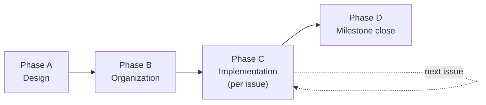

# 3MRAI Implementation Workflow — Design

## Summary

This spec designs the **workflow and agent topology for implementing the 3MRAI microservices** — Users, Orders, Tracking, the SQS→Lambda events pipeline, and the AWS infrastructure. It is **not** about the documentation vault; that is the sibling spec [[2026-06-26-3mrai-docs-vault-design]], which designs the knowledge base. This spec picks up where that one leaves off: it defines **two layers of agents**, a planner/coordinator agent (`solutions-architect`), and the **end-to-end flow** from superpowers design output (spec + plan) all the way to merged code.

The source requirements that the implementation must satisfy live in `first-prompt-en.md` (plain requirements file, not a vault note).

## Two layers of agents

The agent fleet splits into two orthogonal layers. The **tool layer** is horizontal: each agent is the single writer of one external tool. The **domain layer** is vertical: agents that reason about a service or coordinate the whole effort, but never write to a tool directly.

> [!info] One writer per tool — the load-bearing invariant
> Every external surface (the vault, Linear, git/GitHub) has exactly **one** agent allowed to write to it. Domain-layer agents and the architect **propose**; the specialized "hands" in the tool layer **execute**. This keeps the repo's propose→confirm rule intact no matter how many new agents we add.

### Tool layer (horizontal, already exists)

| Agent | Sole writer of | Role |
|---|---|---|
| `obsidian-vault` | `docs/` (the Obsidian vault) | Creates/edits notes, normalizes superpowers output, enforces frontmatter/tags/wikilinks. |
| `linear-pm` | Linear | Milestones, issues, labels, comments, status transitions, reporting. |
| `github-ops` | git / GitHub (optional) | Optional helper for complex git batches — branches, commits, PRs, merges, cleanup. The main session may also run git directly (see [[git-workflow]]). |

### Domain layer (vertical, new)

| Agent | Writes to | Role |
|---|---|---|
| `solutions-architect` | **nothing** | Planner/coordinator. Reads raw superpowers specs/plans, analyzes them against the domain structure, returns a **Coordination Plan**. Does not write to any tool and does not implement code. |
| `users-impl` | source code only | Implements the Users service. |
| `orders-impl` | source code only | Implements the Orders service. |
| `tracking-impl` | source code only | Implements the Tracking service. |
| `events-pipeline-impl` | source code only | Implements the SQS→Lambda events pipeline. |
| `infra-impl` | source code only | Implements the Terraform/AWS infrastructure. |

The five implementers write **only source code** — they never touch git or Linear. When their work is done they leave it in the working tree for the **main session** to commit (optionally delegating a complex git batch to `github-ops`). The architect writes nothing at all; it only reasons and returns a plan.

```mermaid
graph TD
    subgraph Domain["Domain layer (vertical — reason / propose)"]
        SA[solutions-architect]
        U[users-impl]
        O[orders-impl]
        T[tracking-impl]
        E[events-pipeline-impl]
        I[infra-impl]
    end
    subgraph Tool["Tool layer (horizontal — docs/ + Linear single-writer; git optional via github-ops)"]
        OV[obsidian-vault → docs/]
        LP[linear-pm → Linear]
        GO[github-ops → git/GitHub (optional)]
    end
    P((parent / main session))
    P --> SA
    P --> U & O & T & E & I
    P --> OV & LP & GO
    class SA,U,O,T,E,I,OV,LP,GO,P internal-link;
```

## End-to-end flow (Phases A–D)

The flow runs once per subsystem/milestone. The **parent (main session)** is the message bus throughout: it carries the architect's plan to each hand and sequences the phases.



### Phase A — Design (per subsystem/milestone)

- `brainstorming` → produces a **spec** in `docs/superpowers/specs/`.
- `writing-plans` → produces a **plan** in `docs/superpowers/plans/`.

These are raw superpowers outputs; they are not yet normalized to vault conventions.

### Phase B — Organization

1. **parent → `solutions-architect`** — the architect reads the raw spec/plan and returns a **Coordination Plan**: the domain→area mapping, the vault notes/wikilinks/indexes that need to exist, and the milestone + issue list.
2. **parent → `obsidian-vault`** — normalizes the superpowers output and creates/updates notes and indexes **per the Coordination Plan**.
3. **parent → `linear-pm`** — proposes the milestone + issues from the plan; the **user confirms**, then `linear-pm` creates them.

### Phase C — Implementation (per issue)

For each issue, in order:

1. **parent → `linear-pm`** — move the issue to **In Progress**.
2. **main session (or, optionally, `github-ops`)** — create the task branch off the milestone's feature branch, confirming via the A/B/C/D/E menu (see [[git-workflow]]).
3. **parent → `<svc>-impl`** — implement: the agent reads `services/<svc>/CLAUDE.md` for stack/conventions, reads the vault spec note for the design, and **writes only source code**.
4. **main session (or, optionally, `github-ops`)** — commit and open a PR (task → feature), confirming via the A/B/C/D/E menu.
5. **parent → `linear-pm`** — after the PR merges, move the issue to **Done**.

### Phase D — Milestone close

When all task PRs for the milestone are merged, the **main session (or, optionally, `github-ops`) proposes a PR feature → `main`**. The **user reviews and merges** it — no auto-merge.

## The solutions-architect agent

The `solutions-architect` is the **brain** of the implementation workflow.

- **It IS a planner/coordinator.** It reads the raw superpowers specs/plans, analyzes them against the domain structure (the four services + infra + shared), and produces a **Coordination Plan**.
- **It is NOT a writer.** It never writes to `docs/`, Linear, or git, and it never implements code. It only reads and reasons.

### Coordination Plan format

The Coordination Plan has three sections, each addressed to a different hand (or to the parent):

> [!example] Coordination Plan — three-section shape
> **Vault (for `obsidian-vault`)**
> - Notes to normalize (raw superpowers spec/plan → required frontmatter, tags, `## Related`).
> - Indexes to update (e.g. `docs/00-overview/index.md`, `docs/plans/index.md`).
> - Domain notes and wikilinks affected (which service spec/decision notes gain links).
>
> **Linear (for `linear-pm`)**
> - The milestone.
> - The issues — each with title, area, the linked vault note, and label.
>
> **Implementation (for the parent, Phase C)**
> - Suggested issue **order**.
> - Which `<svc>-impl` agent takes each issue.

### Why the parent routes, not the architect

In Claude Code, **a subagent cannot spawn another subagent** — only the main session can. So the architect cannot hand work directly to the vault/Linear/impl agents. Instead:

- The **architect is the brain**: it returns the Coordination Plan.
- The **parent is the message bus**: it carries the plan's instructions to each hand.

```text
parent → solutions-architect → (Coordination Plan) → parent
       → obsidian-vault   (Vault section)
       → linear-pm        (Linear section)
       → <svc>-impl        (Implementation section, Phase C)
```

## Physical files

### New agents (`.claude/agents/`)

| File | Tools | Notes |
|---|---|---|
| `solutions-architect.md` | Read, Grep, Glob | Read + reason only. **No** Write/Bash/MCP — it cannot write to any tool. |
| `users-impl.md` | Read, Write, Edit, Bash, Glob, Grep | **No** git push, **no** Linear MCP. |
| `orders-impl.md` | Read, Write, Edit, Bash, Glob, Grep | Same constraints. |
| `tracking-impl.md` | Read, Write, Edit, Bash, Glob, Grep | Same constraints. |
| `events-pipeline-impl.md` | Read, Write, Edit, Bash, Glob, Grep | Same constraints. |
| `infra-impl.md` | Read, Write, Edit, Bash, Glob, Grep | Same constraints. |

Each implementer is **thin**. Its prompt says, in effect: *"Your stack and conventions live in `services/<svc>/CLAUDE.md` — read it, read the vault spec note, implement the task, do not touch git or Linear, and leave your work in the working tree."*

### Nested CLAUDE.md — source of truth for each service's stack

Created when each service folder exists:

| File | Stack |
|---|---|
| `services/users/CLAUDE.md` | Fastify, Aurora Postgres |
| `services/orders/CLAUDE.md` | .NET Core 10 Minimal APIs, Aurora MySQL |
| `services/tracking/CLAUDE.md` | FastAPI, Aurora MySQL |
| `services/events-pipeline/CLAUDE.md` | SQS→Lambda, DocumentDB |
| `infra/CLAUDE.md` | Terraform, cloudposse, AWS |

### Root CLAUDE.md update

Add a new **"Implementation agents & flow"** section documenting:

- the two layers (tool + domain),
- the `solutions-architect` (brain, no writes),
- the **"implementers don't touch git/Linear"** rule, and
- the Phase A–D flow.

## Creation order

The `services/<svc>/CLAUDE.md` files only make sense **once each service folder exists** — and creating a service scaffold is itself an implementation output. Therefore:

- **Now:** create the **6 new agents** (`solutions-architect` + the 5 implementers) and update the **root CLAUDE.md**.
- **At the start of each service milestone:** create that service's nested `CLAUDE.md`. Creating the scaffold **and** its `CLAUDE.md` can be the **first issue** of each milestone.

## Design decisions

| Topic | Decision |
|---|---|
| Implementer autonomy | **Code only** — git and Linear stay with `github-ops`/`linear-pm` via the parent. |
| Implementer granularity | **One per service + infra** — 5 specialists. |
| Source of truth for service stack/conventions | **Nested `CLAUDE.md`** — the agent is thin and defers to it. |
| Orchestration | **Superpowers plan per service** + a dedicated `solutions-architect` that organizes superpowers output and tells the vault/Linear hands what to write (via the Coordination Plan the parent routes). |

## Related

- [[2026-06-26-3mrai-docs-vault-design]] — the sibling spec: design of the documentation vault.
- [[index]] — root Map of Content for the vault.
- [[linear-references]] — how the vault references Linear work (tags + links, never mirrors).
- [[git-workflow]] — git conventions and the confirmation menu; git is optional via `github-ops`, the main session may run it directly.
- `first-prompt-en.md` — source requirements file for the 3MRAI implementation (plain file, not a vault note).
